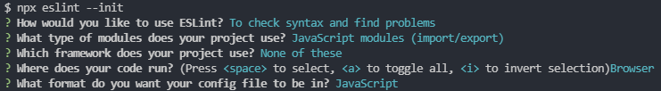

## 编写loader

### 基本示例

自定义loader，将js中的 'this' 都转为 'that'

    // 1、入口文件src/index.js
    console.log("What's this?");
    console.log("Emmmmm...");
    console.log("Who is she?");
    console.log("XXX");
    
    // 2、根目录下新建loaders文件夹，新建replace.loader.js
    module.exports = function(source) {
        // source为源代码，即index.js里的内容，是个字符串
        // 将字符串里的 'this' 改为 'that'
        return source.replace(/this/g, 'that');
    }
    
    // 3、配置webpack.config.js
    const path = require('path');
    const { CleanWebpackPlugin } = require('clean-webpack-plugin')
    
    module.exports = {
        mode: "development",
        entry: {
            index: './src/index.js',
        },
        output: {
            path: path.resolve(__dirname, 'dist'),
            filename: '[name].js',
        },
        resolve: {
            extensions: ['.js'],
        },
        module: {
            rules: [
                {
                    test: /\.js$/,
                    exclude: /node_modules/,
                    use: path.resolve(__dirname, './loaders/replace.loader.js'), // 使用我们的自定义loader
                },
            ]
        },
        plugins: [
            new CleanWebpackPlugin(),
        ]
    }
    
    // 4、配置package.json
    "scripts": {
        "build": "webpack --progress --config webpack.confg.js"
    },

    执行npm run build
    

### options配置

    // 1、修改webpack.config.js
    const path = require('path');
    const { CleanWebpackPlugin } = require('clean-webpack-plugin')
    
    module.exports = {
        mode: "development",
        entry: {
            index: './src/index.js',
        },
        output: {
            path: path.resolve(__dirname, 'dist'),
            filename: '[name].js',
        },
        resolve: {
            extensions: ['.js'],
        },
        module: {
            rules: [
                {
                    test: /\.js$/,
                    exclude: /node_modules/,
                    use: [
                        {
                            loader: path.resolve(__dirname, './loaders/replace.loader.js'),
                            options: {
                                name: 'karloy', // 传递参数name
                            }
                        }
                    ],
                },
            ]
        },
        plugins: [
            new CleanWebpackPlugin(),
        ]
    }
    
    // 2、修改loaders/replace.loader.js
    module.exports = function(source) {
        // this.query接收options对象
        // 将JS中的 'XXX' 改为options的name配置
        return source
            .replace(/this/g, 'that')
            .replace(/XXX/g, this.query.name || 'kealm');
    }
    
    执行npm run build
    

如果**options不是一个对象**，而是按字符串的形式，可能会产生一些问题

官方推荐使用**loader-utils**来获取options，而不是使用this.query

    // 1、安装依赖
    npm i loader-utils --save-dev
    
    // 2、修改loaders/replace.loader.js
    const loaderUtils = require('loader-utils')
    
    module.exports = function(source) {
        // 获取options对象
        const options = loaderUtils.getOptions(this)
        return source
            .replace(/this/g, 'that')
            .replace(/XXX/g, options.name || 'kealm');
    }
    
    执行npm run build，可以看到效果是一样的
    
    
    