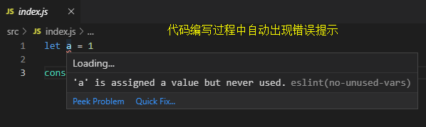
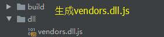
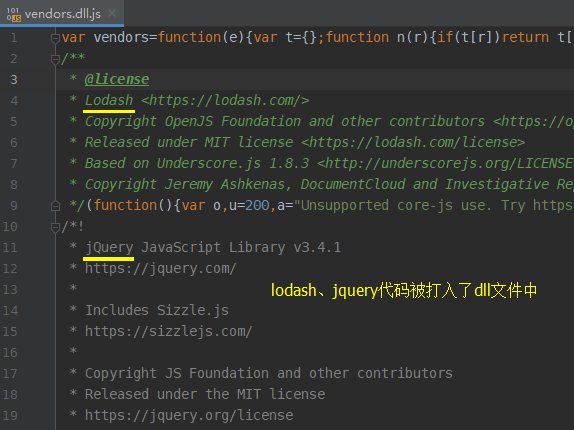
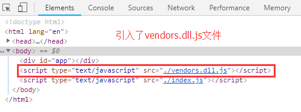
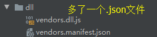
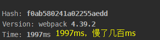

## 编写loader

[编写一个loader](https://webpack.docschina.org/contribute/writing-a-loader)

### 基本示例

自定义loader，将js中的 'this' 都转为 'that'

```js
// 1、入口文件src/index.js
console.log("What's this?");
console.log("Emmmmm...");
console.log("Who is she?");
console.log("XXX");

// 2、根目录下新建loaders文件夹，新建replace-loader.js
module.exports = function(source) {
    // source为源代码，即index.js里的内容，是个字符串
    // 将字符串里的 'this' 改为 'that'
    return source.replace(/this/g, 'that');
}

// 3、配置webpack.config.js
const path = require('path');
const { CleanWebpackPlugin } = require('clean-webpack-plugin')

module.exports = {
    mode: "development",
    entry: {
        index: './src/index.js',
    },
    output: {
        path: path.resolve(__dirname, 'dist'),
        filename: '[name].js',
    },
    resolve: {
        extensions: ['.js'],
    },
    module: {
        rules: [
            {
                test: /\.js$/,
                exclude: /node_modules/,
                use: path.resolve(__dirname, './loaders/replace-loader.js'), // 使用我们的自定义loader
            },
        ]
    },
    plugins: [
        new CleanWebpackPlugin(),
    ]
}

// 4、配置package.json
"scripts": {
    "build": "webpack --progress --config webpack.config.js"
},

执行npm run build
```
    


### resolveLoader

可以看到，配置loader时需要加上path.resolve(__dirname, ...)，很不方便

配置**resolveLoader**可以解决这个问题

```js
module.exports = {
    ...
    resolve: {
        extensions: ['.js'],
    },
    resolveLoader: {
        modules: ['node_modules', './loaders'], // 当使用loader时，先去node_modules找，再去./loaders下找
    },
    module: {
        rules: [
            {
                test: /\.js$/,
                exclude: /node_modules/,
                use: 'replace-loader', // 使用我们的自定义loader
            },
        ]
    },
    plugins: [
        new CleanWebpackPlugin(),
    ]
}
```

### options配置

```js
// 1、修改webpack.config.js
const path = require('path');
const { CleanWebpackPlugin } = require('clean-webpack-plugin')

module.exports = {
    mode: "development",
    entry: {
        index: './src/index.js',
    },
    output: {
        path: path.resolve(__dirname, 'dist'),
        filename: '[name].js',
    },
    resolve: {
        extensions: ['.js'],
    },
        resolveLoader: {
        modules: ['node_modules', './loaders'], // 当使用loader时，先去node_modules找，再去./loaders下找
    },
    module: {
        rules: [
            {
                test: /\.js$/,
                exclude: /node_modules/,
                use: [
                    {
                        loader: 'replace-loader',
                        options: {
                            name: 'karloy', // 传递参数name
                        }
                    }
                ],
            },
        ]
    },
    plugins: [
        new CleanWebpackPlugin(),
    ]
}

// 2、修改loaders/replace-loader.js
module.exports = function(source) {
    // this.query接收options对象
    // 将JS中的 'XXX' 改为options的name配置
    return source
        .replace(/this/g, 'that')
        .replace(/XXX/g, this.query.name || 'kealm');
}

执行npm run build
```
    


如果**options不是一个对象**，而是按字符串的形式，可能会产生一些问题

官方推荐使用**loader-utils**来获取options，而不是使用this.query

```js
// 1、安装依赖
npm i loader-utils --save-dev

// 2、修改loaders/replace-loader.js
const loaderUtils = require('loader-utils')

module.exports = function(source) {
    // 获取options对象
    const options = loaderUtils.getOptions(this)
    return source
        .replace(/this/g, 'that')
        .replace(/XXX/g, options.name || 'kealm');
}

执行npm run build，可以看到效果是一样的
```
    
### this.callback

当我们想传递更多的参数时，return就不适用了

官方给我们提供了**this.callback**这个API解决这个问题

用法如下:

```js
this.callback(
    err: Error | null,
    content: string | Buffer,
    sourceMap?: SourceMap, // 此模块可解析的源映射
    meta?: any, // 可以是任何内容，例如一些元数据
)
```
    
这里不详谈全部参数，我们用callback来实现之前的示例:

```js
const loaderUtils = require('loader-utils')

module.exports = function(source, map, meta) {
    const options = loaderUtils.getOptions(this)
    const result =  source
        .replace(/this/g, 'that')
        .replace(/XXX/g, options.name || 'kealm');
    this.callback(null, result, map, meta);
    // 当使用callback时要返回undefined来告诉webpacck返回从callback取而不是return
    return;
}

执行npm run build，打包后可以看到效果是一样的
```
    
### this.async

当在loader中写异步代码，单纯的使用this.callback是会报错的

官方提供**this.async**来实现loader中的异步操作，async是一个封装后的this.callback

```js
// 1、新增loaders/translate-loader.js
module.exports = function(source) {
    const callback = this.async(); // 使用async实现异步操作
    setTimeout(() => {
        callback(null, source.replace(/Emmmmm/g, '嗯...'))
    }, 2000);
}

// 2、配置webpack.config.js
const path = require('path');
const { CleanWebpackPlugin } = require('clean-webpack-plugin')

module.exports = {
    mode: "development",
    entry: {
        index: './src/index.js',
    },
    output: {
        path: path.resolve(__dirname, 'dist'),
        filename: '[name].js',
    },
    resolve: {
        extensions: ['.js'],
    },
    resolveLoader: {
        modules: ['node_modules', './loaders']
    },
    module: {
        rules: [
            {
                test: /\.js$/,
                exclude: /node_modules/,
                use: [
                    'translate-loader', // 配置多个loader，加载顺序是从下往上，从右往左，这里是: replace => translate
                    {
                        loader: 'replace-loader',
                        options: {
                            name: 'karloy', // 传递参数name
                        }
                    }
                ],
            },
        ]
    },
    plugins: [
        new CleanWebpackPlugin(),
    ]
}

执行npm run build
```
    


## 编写plugins

### 基本示例

```js
// 1、在根目录新建plugins文件夹，新建plugins/kealm-webpack-plugin.js文件
一般plugins都用 XXX-webpack-plugin命名
plugin是一个类，需要有apply方法，安装插件时会被调用

class KealmWebpackPlugin {
    constructor() {
        console.log('插件被使用');
    }
    apply(compiler) {
    }
}

// 2、配置webpack.config.js
const path = require('path');
const { CleanWebpackPlugin } = require('clean-webpack-plugin')
const KealmWebpackPlugin = require('./plugins/kealm-webpack-plugin')

module.exports = {
    mode: "development",
    entry: {
        index: './src/index.js',
    },
    output: {
        path: path.resolve(__dirname, 'dist'),
        filename: '[name].js',
    },
    resolve: {
        extensions: ['.js'],
    },
    module: {
        rules: [
            {
                test: /\.js$/,
                exclude: /node_modules/,
                loader: 'babel-loader'
            },
        ]
    },
    plugins: [
        new CleanWebpackPlugin(),
        new KealmWebpackPlugin(), // 用new的方式引用，因为是个类
    ]
}

// 3、配置package.json
"scripts": {
    "build": "webpack --progress --config webpack.config.js",
},

执行npm run build
```
    


### options配置
    
```js
// webpack.config.js
plugins: [
    ...
    new KealmWebpackPlugin({
        name: 'karmiy',
    }),
]

// plugins/kealm-webpack-plugin.js
class KealmWebpackPlugin {
    constructor() {
        console.log('options = ', options);
    }
    apply(compiler) {
    }
}

执行npm run build
```
    


### compiler、compilation

- compiler可以看做是webpack的实例，该对象在webpack开始执行就被创建，代表的是不变的webpack环境，在运行时Compier会根据各种事件钩子，从而触发插件的注册函数

- compilation 对象针对的是随时可变的项目文件，只要文件有改动，compilation就会被重新创建

### 事件钩子

compiler对象提供了**事件钩子**，与Vue、React、Angular等框架的生命周期类似，可以在不同的时机触发并执行回调

有如下用法:

- compiler.plugin(event, callback)

- compiler.hooks

#### 基本示例

```js
// plugins/kealm-webpack-plugin.js
class KealmWebpackPlugin {
    apply(compiler) {
        compiler.plugin('done', () => {
            console.log('finished.......');
        });
    }
}

执行npm run build
```
    


也可以用**hooks**形式书写:
    
```js
// plugins/kealm-webpack-plugin.js
class KealmWebpackPlugin {
    apply(compiler) {
        // .hooks的属性对应钩子的事件名，如这里是 'done'
        // 第一个参数是我们plugin类名
        compiler.hooks.done.tap('KealmWebpackPlugin', () => {
            console.log('finished.......');
        })
    }
}

执行npm run build，效果是一样的
```
    
#### 实现基本的文件生成

在apply中操作生成一个.txt文件:

- 'compilation' 钩子是在生成好了compilation对象，可以操作时触发
- 'compilation.assets' 是整个打包流程最终要输出的文件，是个对象，key是文件名

```js
// plugins/kealm-webpack-plugin.js
class KealmWebpackPlugin {
    apply(compiler) {
        compiler.plugin("compilation", (compilation) => {
            // 给'compilation.assets'添加一个key ‘sync.txt’作为文件名，value是个对象，指代文件内容
            compilation.assets['sync.txt'] = {
                source: function() {
                    return 'sync.............' // 文件里的内容
                },
                size: function() {
                    return 17 // 上面 source 返回的字符长度
                }
            }
        });
    }
}

执行npm run build，可以看到生成了sync.txt，且内容是: sync.............
```



**注:**

compilation钩子中，compilation.assets获取不到打包入口文件index.js

其他钩子如**emit**可以获取到index.js

#### 异步钩子

**emit**是最常用的异步钩子，在将内存中assets内容写到磁盘文件夹之前触发

**1、compiler.plugin写法:**
    
```js
// plugins/kealm-webpack-plugin.js
class KealmWebpackPlugin {
    apply(compiler) {
        compiler.plugin("emit", function(compilation, cb) {
            console.log(compilation.assets);
            // 通过回调cb的形式执行异步操作
            setTimeout(() => {
                compilation.assets['async.txt'] = {
                    source: function() {
                        return 'async.............'
                    },
                    size: function() {
                        return 18
                    }
                }
                cb()
            }, 1000)
        });
    }
}

执行npm run build
```




**2、hooks的tapAsync写法:**

```js
// plugins/kealm-webpack-plugin.js
// 注意异步需要用tapAsync而不是tap
class KealmWebpackPlugin {
    apply(compiler) {
        compiler.hooks.emit.tapAsync(
            'CopyWebpackPlugin',
            (compilation, cb) => {
                setTimeout(() => {
                    compilation.assets['async.txt'] = {
                        source: function() {
                            return 'async.............'
                        },
                        size: function() {
                            return 18 // 上面 source 返回的字符长度
                        }
                    }
                    cb()
                }, 1000)
            }
        )
    }
}

执行npm run build，效果是一样的
```
    
**3、hooks的tapPromise写法:**

```js
// plugins/kealm-webpack-plugin.js
class KealmWebpackPlugin {
    apply(compiler) {
        compiler.hooks.emit.tapPromise(
            'CopyWebpackPlugin',
            async compilation => {
                await new Promise(resolve => {
                    setTimeout(() => {
                        compilation.assets['async.txt'] = {
                            source: function() {
                                return 'async.............'
                            },
                            size: function() {
                                return 18 // 上面 source 返回的字符长度
                            }
                        }
                        resolve()
                    }, 1000)
                })
            }
        )
    }
}
```
    
### 其他hooks


[官方文档 - compiler 钩子](https://webpack.docschina.org/api/compiler-hooks/)
    
### 实现plugin去除js中的console打印

```js
// src/index.js
console.log("What's this?");
console.log("Emmmmm...");
console.log("Who is she?");
console.log("XXX");
alert('.....')

执行npm run build
```
    


- 'compilation.chunks' 是entry的每个配置项，chunk.modules是每个配置项所包含的模块以及模块所依赖的模块，chunk.files是每个配置项最后输出的结果文件，值可以从compilation.assets获得

```js
// 修改plugins/kealm-webpack-plugin.js
class KealmWebpackPlugin {
    apply(compiler) {
        compiler.hooks.emit.tapPromise(
            'CopyWebpackPlugin',
            async compilation => {
                compilation.chunks.forEach(chunk => {
                    chunk.files.forEach(filename => {
                        let source = compilation.assets[filename].source();
                        const consoleNames = ['console', 'window.console'];
                        const consoleTypes = ['log', 'info', 'warn', 'error', 'assert', 'count', 'clear',
                            'group', 'groupEnd', 'groupCollapsed', 'trace', 'debug', 'dir', 'dirxml',
                            'profile', 'profileEnd', 'time', 'timeEnd', 'timeStamp', 'table', 'exception']
                        const consoleExp = new RegExp("(" + consoleNames.join("|")
                            + ")"
                            + ".(?:"
                            + consoleTypes.join("|")
                            + ")\\s{0,}\\([^;]*\\)(?!\\s*[;,]?\\s*\\/\\*\\s*NotClearConsole\\s*\\*\\/)\\s{0,};?", "gi");
                        source = source.replace(consoleExp, function() {
                            return source.replaceWith || "";
                        });
                        compilation.assets[filename] = {
                            source: function () {
                                return source;
                            },
                            size: function () {
                                return source.length;
                            }
                        }
                    })
                })
            }
        )
    }
}

执行npm run build
```

