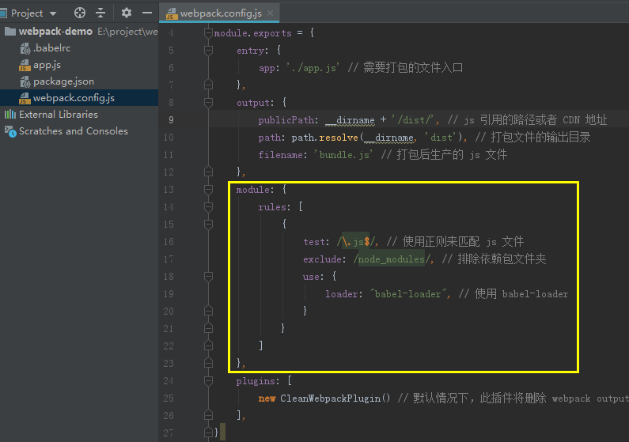
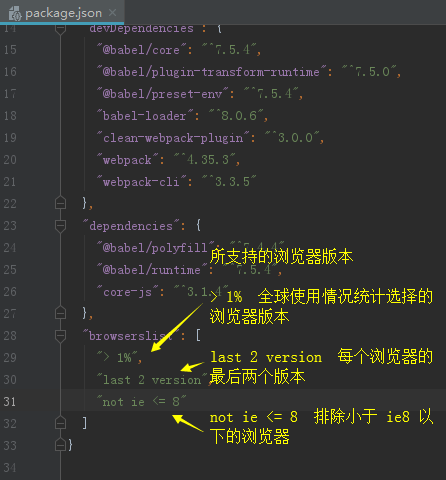

## Babel7转译ES6

### 了解Babel

现代 Javascript 主要是用 ES6 编写的。但并非每个浏览器都知道如何处理 ES6。 我们需要某种转换，这个转换步骤称为 transpiling(转译)。transpiling(转译) 是指采用 ES6 语法，转译为旧浏览器可以理解的行为

Webpack并不知道如何转换，但是可以使用loader

**babel-loader**是一个webpack的loader，用于将ES6及以上版本转化ES5

使用需要安装一些依赖项，以Babel7为主

- @babel/core: 核心库
- @babel/preset-env: 包含 ES6、7 等版本的语法转化规则
- @babel/plugin-transform-runtime: 避免 polyfill 污染全局变量，减小打包体积
- @babel/polyfill: ES6 内置方法和函数转化垫片
- babel-loader: 负责 ES6 语法转化

> 要安装@babel/core、@babel/preset-env 和 @babel/plugin-transform-runtime，而不是 babel-core、babel-preset-env 和 babel-plugin-transform-runtime，这些是babel6的

> @babel/plugin-transform-runtime 的作用：Babel 使用非常小的助手来完成常见功能。默认情况下，这将添加到需要它的每个文件中。这种重复有时是不必要的，尤其是当你的应用程序分布在多个文件上的时候。 transform-runtime 可以重复使用 Babel 注入的程序代码来节省代码，减小体积

> @babel/polyfill 的作用：Babel 默认只转换新的 JavaScript 句法（syntax），而不转换新的 API，比如 Iterator、Generator、Set、Maps、Proxy、Reflect、Symbol、Promise 等全局对象，以及一些定义在全局对象上的方法（比如 Object.assign）都不会转码。必须使用 @babel/polyfill，为当前环境提供一个垫片。所谓垫片也就是垫平不同浏览器或者不同环境下的差异
     

### 安装依赖与配置
    
    // 1、安装依赖
    npm i @babel/core babel-loader @babel/preset-env @babel/plugin-transform-runtime --save-dev
    npm i @babel/polyfill @babel/runtime
    
    // 2、根目录新建.babelrc文件配置Babel
    {
      "presets": ["@babel/preset-env"],
      "plugins": ["@babel/plugin-transform-runtime"]
    }
    
    注：如果遇到错误
    WARNING: We noticed you're using the `useBuiltIns` option without declaring a core-js version. Currently, we assume version 2.x when no version is passed. Since this default version will likely change in future versions of Babel, we recommend explicitly setting the core-js version you are using via the `corejs` option. 
     
    You should also be sure that the version you pass to the `corejs` option matches the version specified in your `package.json`'s `dependencies` section. If it doesn't, you need to run one of the following commands: 
     
      npm install --save core-js@2    npm install --save core-js@3 
      yarn add core-js@2              yarn add core-js@3
        
    则修改安装npm install --save core-js@3，并配置：
    {
     "presets": [
       [
         "@babel/preset-env",
         {
           "useBuiltIns": "usage",
           "corejs": 3
         }
       ]
     ],
     "plugins": ["@babel/plugin-transform-runtime"]
    }
    
    // 3、webpack配置loader
    module: {
      rules: [
        {
          test: /\.js$/, // 使用正则来匹配 js 文件
          exclude: /node_modules/, // 排除依赖包文件夹
          use: {
            loader: 'babel-loader', // 使用 babel-loader
          }
        }
      ]
    }
    

    // 4、app.js 全局引入@babel/polyfill，使用ES6语法，npm run build打包
    import '@babel/polyfill'
    
    // ES6 扩展运算符...
    console.log(...[1, 2, 3]);
    
    // ES6 Promise
    new Promise(resolve => {
        setTimeout(resolve, 2000);
    }).then(() => console.log('support'))
    

    // 5、更改.babelrc配置
    原因：全局import '@babel/polyfill'，会导入不需要的polyfill，使得打包体积大，时间长
    
    更改.babelrc:
    {
      "presets": [
        [
          "@babel/preset-env",
          {
            "useBuiltIns": "usage",
            "corejs": 3
          }
        ]
      ],
      "plugins": ["@babel/plugin-transform-runtime"]
    }
    
    去除app.js的import '@babel/polyfill':
    // import '@babel/polyfill'
        
    // ES6 扩展运算符...
    console.log(...[1, 2, 3]);
    
    // ES6 Promise
    new Promise(resolve => {
        setTimeout(resolve, 2000);
    }).then(() => console.log('support'))
    

### .browserslistrc配置文件

browserslistrc 用于在不同前端工具之间共享目标浏览器和 Node.js 版本的配置

可以看看 browserslist [兼容浏览器的页面](https://browserl.ist/)

    // 在我们在package.json添加以下内容时，所有工具都会自动找到目标浏览器
    "browserslist": [
      "> 1%",
      "last 2 version",
      "not ie <= 8"
    ]

    也可以单独创建 .browserslistrc 文件单独写配置
    

    