## Code Splitting

**注：**
为了更好的示例Code Splitting，先把babel代码与配置移除，入口改为src/index.js，之后每一个新功能点可能都会这样处理

### 常规打包结果

    // 1、安装loadsh(项目开发中一般用lodash-es，这里我们以lodash为示例)
    npm i lodash --save
    
    // 2、src/index.js中使用lodash
    import _ from 'lodash'
    
    console.log(_.join(['a', 'b', 'c']))
    
    // 3、配置webpack.config.js，运行npm run build
    const path = require('path')
    const { CleanWebpackPlugin } = require('clean-webpack-plugin')
    
    module.exports = {
        entry: {
            main: './src/index.js' // 需要打包的文件入口
        },
        output: {
            publicPath: __dirname + '/dist/', // js 引用的路径或者 CDN 地址
            path: path.resolve(__dirname, 'dist'), // 打包文件的输出目录
            filename: '[name].bundle.js', // 代码打包后的文件名
            chunkFilename: '[name].js' // 代码拆分后的文件名
        },
        plugins: [
            new CleanWebpackPlugin() // 默认情况下，此插件将删除 webpack output.path目录中的所有文件，以及每次成功重建后所有未使用的 webpack 资产。
        ],
    }
    
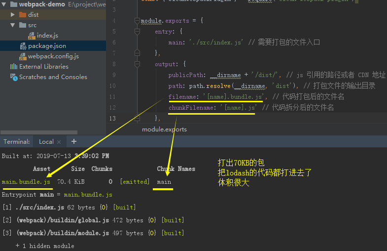

### 存在的问题

**将第三方包与我们业务代码一起打包，会有什么问题？**

假如lodash 1M，业务代码1M，打包后2M

浏览器每次打开页面，都要先加载2M的文件，才能显示业务逻辑，导致加载时间长

业务代码更新较为频繁，但第三方代码基本不会改变，浏览器是有缓存的，如果第三方代码没有改动，这部分代码不发起HTTP请求，而是从缓存中获取，这样体验会更友好，可以在刷新或第二次进去入页面时加快网页加载速度

webpack4之前使用**commonsChunkPlugin**拆分公共代码，现在使用**splitChunksPlugins**

### splitChunksPlugins拆分出第三方库vendors包
    
    // src/index.js
    import _ from 'lodash'
        
    console.log(_.join(['a', 'b', 'c']))
    
    // 给webpack.config.js添加 optimization 配置
    
    const path = require('path')
    const { CleanWebpackPlugin } = require('clean-webpack-plugin')
    
    module.exports = {
        entry: {
            main: './src/index.js' // 需要打包的文件入口
        },
        output: {
            publicPath: __dirname + '/dist/', // js 引用的路径或者 CDN 地址
            path: path.resolve(__dirname, 'dist'), // 打包文件的输出目录
            filename: '[name].bundle.js', // 代码打包后的文件名
            chunkFilename: '[name].js' // 代码拆分后的文件名
        },
        optimization: {
            splitChunks: {
                chunks: 'all'
            }
        },
        plugins: [
            new CleanWebpackPlugin() // 默认情况下，此插件将删除 webpack output.path目录中的所有文件，以及每次成功重建后所有未使用的 webpack 资产。
        ],
    }
    
上方**optimization**处的配置，表示要做代码分割，**chunks: 'all'** 是分割所有代码，包括同步、异步代码，webpack默认是 **chunks: 'async'** 分割异步

    // 执行npm run dev(dev下代码不压缩，方便查看)
    
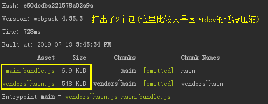

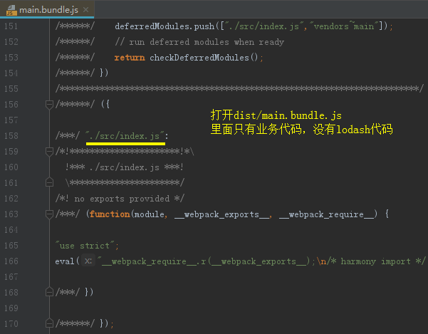

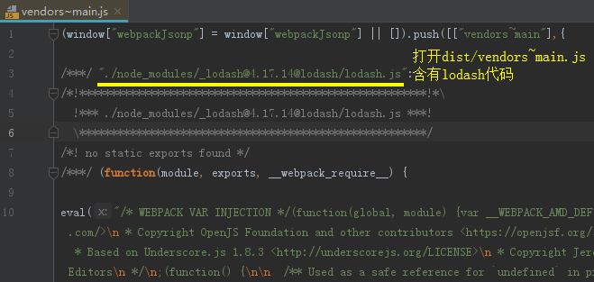

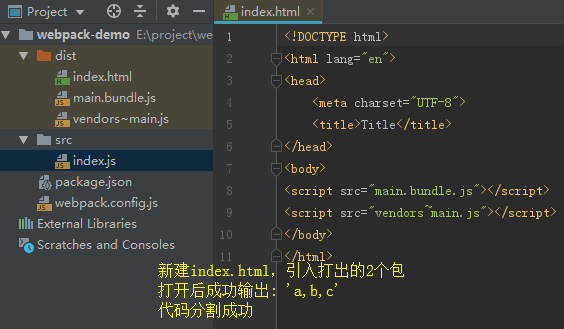

**为什么打出的包名是vendors~main:**

webpack默认在cacheGroups中有vendors组，这个组匹配的是node_modules第三方库，都会打在这个组中

而vendors组默认没有加name名称，因为lodash在index.js中引入的，index.js作为入口打出的是main.bundle.js，所以衔接在一起是**vendors~main**

下面我们修改vendors组的name:

    // 配置打出来的vendor包的名称
    optimization: {
        splitChunks: {
            chunks: 'all',
            cacheGroups: {
                vendors: {
                    name: 'vendors'
                }
            }
        }
    },
    
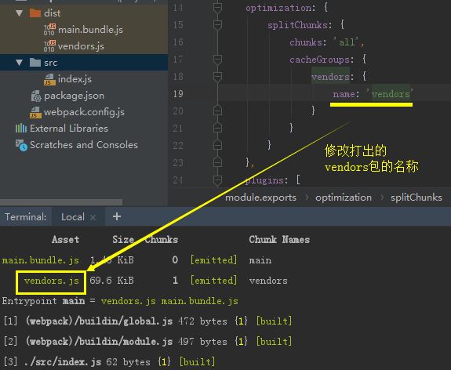

### splitChunks cacheGroups默认配置异步chunks

cacheGroups 的默认配置会定义 vendors 和 default，下图是splitChunks的默认配置:

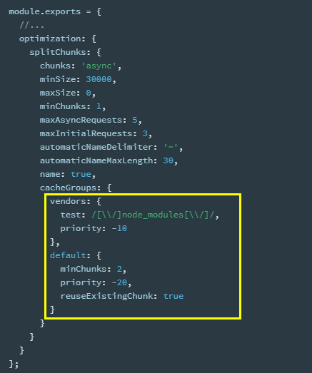

这里我们先不看其他配置，主要看chunks: 'async'和vendors组部分

vendors组的 test: /[\\\\/]node_modules[\\\\/]/ 是正则过滤，表示只有node_modules引入的第三方库会被分割
    
并且我们看到splitChunks下的chunks是'async'，表示只有异步才会被分割，为了验证，我们去除webpack.config.js中splitChunks下的内容(去除后会使用默认配置)，运行npm run build
    
    // src/index.js
    import _ from 'lodash'
    
    console.log(_.join(['a', 'b', 'c']))
    
    // webpack.config.js
    
    const path = require('path')
    const { CleanWebpackPlugin } = require('clean-webpack-plugin')
    
    module.exports = {
        entry: {
            main: './src/index.js' // 需要打包的文件入口
        },
        output: {
            publicPath: __dirname + '/dist/', // js 引用的路径或者 CDN 地址
            path: path.resolve(__dirname, 'dist'), // 打包文件的输出目录
            filename: '[name].bundle.js', // 代码打包后的文件名
            chunkFilename: '[name].js' // 代码拆分后的文件名
        },
        optimization: {
            splitChunks: { // 去除splitChunks下的内容
            }
        },
        plugins: [
            new CleanWebpackPlugin() // 默认情况下，此插件将删除 webpack output.path目录中的所有文件，以及每次成功重建后所有未使用的 webpack 资产。
        ],
    }
    
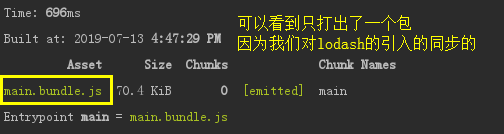

这时我们改用异步引入的方式，npm run dev

    // src/index.js
    import('lodash').then(({ default: _ }) => {
        // 使用 异步的形式导入 lodash，default: _ 表示用 _ 代指 lodash
        console.log(_.join(['hello', 'world'], '-'));
    })
    
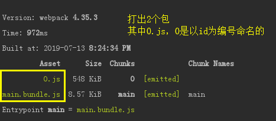

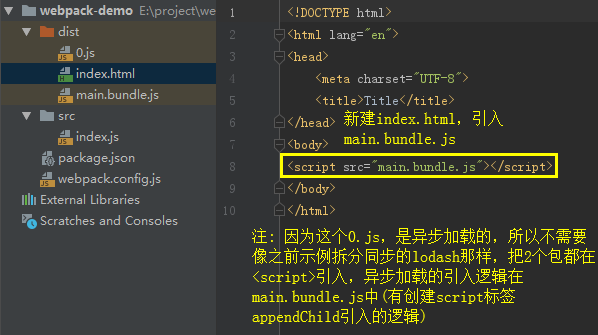

### webpackChunkName修改dynamicImport打包的包名

因为异步import，默认是以id为名打出包的，可以看到，上例中打出了0.js

我们可以通过注释的方式手动修改异步import打出的包名:
    
    // 以/* webpackChunkName: 'lodash'*/为前缀注释，webpack可以读懂这个注释将其作为该包打出的名称
    import(/* webpackChunkName: 'lodash'*/ 'lodash').then(({ default: _ }) => {
        console.log(_.join(['hello', 'world'], '-'));
    })
    
    执行npm run dev
    
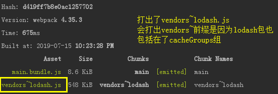

    如上图表述，因为lodash包也算vendors组的，且vendors组没有设置name(这个要注意，下面会示例设置name的情况)
    如果我们将cacheGroups的vendors组去掉，就可以得到我们想要的lodash.js包了:
    
    optimization: {
        splitChunks: {
            cacheGroups: {
                vendors: false, // 去除vendors组
            }
        }
    },
    
    
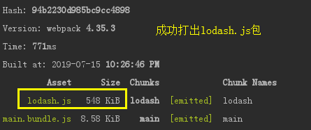

如果匹配的组设置了name，则webpackChunkName就会无效

    optimization: {
        splitChunks: {
            cacheGroups: {
                vendors: {
                    name: 'vendors', // 给vendors组设置了name
                    test: /[\\/]node_modules[\\/]/,
                    priority: -10
                },
            }
        }
    },
    
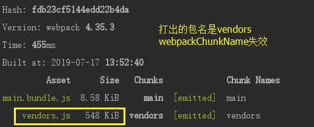

    // 总结
    异步import:
    1、cacheGroups里匹配的组没有设置name，且没有设置webpackChunkName，打出的包会以id为编号，如0.js
    2、cacheGroups里匹配的组没有设置name，但设置webpackChunkName，打出的包以groupKey~webpackChunkName为名
    3、cacheGroups里匹配的组有设置name，且设置webpackChunkName，打出的包以设置cacheGroups的name为主
    
    
### dynamicImport 打包可能会报错的问题

如果打包有报错 **Support for the experimental syntax ‘dynamicImport’ isn't currently enabled** ，这是因为异步加载**dynamicImport**还是实验性的语法，webpack 不支持，需要安装插件来支持

具体可参考[webpack4 动态导入文件 dynamic-import](https://www.cnblogs.com/chaoyueqi/p/9996369.html)

### dynamicImport 打包后打开index.html可能遇到的问题

如果是在编辑器如webstorm打开index.html，打开后可以会发现加载0.js失败

这是因为webstorm打开的html会默认启动端口是63342的服务器，不能去直接访问我们本地磁盘

而0.js的路径前缀是file://E:/XXX，是因为publicPath: __dirname + '/dist/'设置了js的引用路径

我们打开main.bundle.js看它是如何去加载0.js的:

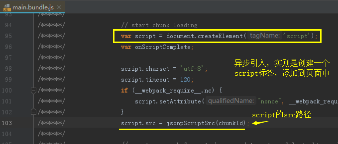

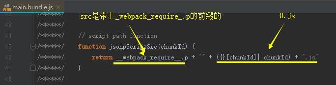

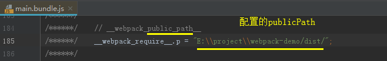

**解决方法:**

方法一: 本地打开html，不在编辑器中用服务器的方式打开

方法二: publicPath修改为./

### 进一步拆分第三方包

现在我们将默认配置拷贝至webpack.config.js中进行分析

    optimization: {
        splitChunks: {
            chunks: 'async',
            minSize: 30000, // 抽取出来的文件在压缩前的最小大小（其实就是超过30Kb才拆分这个包）
            maxSize: 0, // 抽取出来的文件在压缩前的最大大小(默认0，表示不限制最大大小，超过30KB就拆包)
            minChunks: 1, // 被引用次数(分割前必须共享模块的最小块数，注意: 是不同entry引用次数，之后会示例解释)
            maxAsyncRequests: 5, // 最大的异步并行请求数，下面会示例
            maxInitialRequests: 3, // entry文件请求的chunks不应该超过此值，下面会示例
            automaticNameDelimiter: '~', // 名称拼接的符号，如vendors和main合集的包会是vendors~main.bundle.js
            automaticNameMaxLength: 30,
            name: true,
            cacheGroups: {
                vendors: {
                    test: /[\\/]node_modules[\\/]/,
                    priority: -10
                },
                default: {
                    minChunks: 2,
                    priority: -20,
                    reuseExistingChunk: true
                }
            }
        }
    },
    
**webpack代码分割的配置:**

如我们要分割jQuery、lodash第三方库，会先经过**chunks、minSize、maxSize、minChunks**等，满足条件后生成jQuery、lodash两个文件，放入**cacheGroup**中缓存

根据**cacheGroup**配置的组决定将两个文件合并到一个文件打包，还是单独分开打包

例如默认配置中的vendors组，是将**node_modules**中所有第三方库打包都**vendors.js**中

我们也可以继续分割，单独把lodash分割出一个包
    
    // src/index.js
    import('lodash').then(({ default: _ }) => {
        console.log(_.join(['hello', 'world'], '-'));
    })
    
    // webpack.config.js
    cacheGroups: {
        lodash: {
            name: 'lodash',
            test: /[\\/]node_modules[\\/]lodash[\\/]/, // 如果用cnpm install安装的包，可能会有镜像有问题这种test匹配不了的问题，建议用npm安装依赖，有问题可以用下面这种test
            // test: /lodash/,
            priority: 5 // 优先级要大于vendors组，不然会被打入vendors中
        },
        vendors: {
            test: /[\\/]node_modules[\\/]/,
            priority: -10
        },
        default: {
            minChunks: 2,
            priority: -20,
            reuseExistingChunk: true
        }
    }
    
    执行npm run dev
    
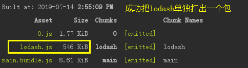

**注意:**

这里打出了一个0.js，网上说这是我们lodash业务部分代码，我觉得不是很正确，我们的业务部分代码console.log(_.join(\['hello', 'world'], '-'))是在main.bundle.js中的

我的理解是这个0.js是因为lodash内部引用了node_modules/lodash/之外的内容，这部分内容与我们test不匹配，导致生成的文件

为了试验，我们将import添加webpackChunkName:

    // src/index.js
    import(/* webpackChunkName: 'lodash-chunk'*/ 'lodash').then(({ default: _ }) => {
        console.log(_.join(['hello', 'world'], '-'));
    })
    
    运行npm run dev

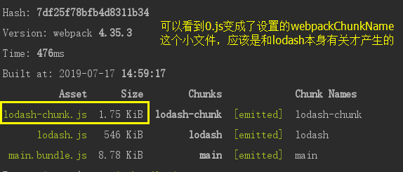

我们换jquery来试验

    执行 npm install jquery --save
    
    // src/index.js
    import(/* webpackChunkName: 'jquery-chunk'*/ 'jquery').then(({ default: $ }) => {
        console.log($);
    })
    
    // webpack.config.js
    cacheGroups: {
        jquery: {
            name: 'jquery',
            test: /[\\/]node_modules[\\/]jquery[\\/]/,
            priority: 5
        },
        vendors: {
            test: /[\\/]node_modules[\\/]/,
            priority: -10
        },
        default: {
            minChunks: 2,
            priority: -20,
            reuseExistingChunk: true
        }
    }
    
    执行 npm run dev
    
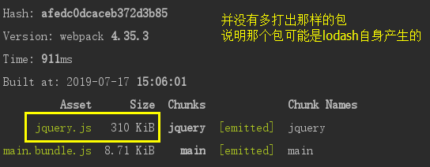

**关于maxAsyncRequests:**

maxAsyncRequests是最大的按需(异步)加载次数，默认为 5

很少需要对maxAsyncRequests和maxInitialRequests进行修改，这里我们稍作了解，以免遇到与之相关的问题

    // 入口文件index.js
    setTimeout(() => {import('./big.js') }, 4000) 
    setTimeout(() => {import('./help1.js') }, 3000)
    setTimeout(() => {import('./help2.js') }, 2000)
    setTimeout(() => {import('./help3.js') }, 1000)
    
    //big.js>30kb
    import s1 from 'help1.js'
    
    //'help1.js >30kb
    import s2 from 'help2.js'
    
    //'help2.js >30kb
    import s3 from 'help3.js'
    
    //'help3.js  >30kb
    
    当maxAsyncRequests: 5时:
    按需加载import('./big.js')时,会并发请求 big.js ,help1.js, help2.js,help3.js 4个文件
    按需加载import('./help1.js')时,会并发请求 help1.js, help2.js,help3.js 3个文件
    按需加载import('./help2.js')时,会并发请求 help2.js,help3.js 2个文件
    按需加载import('./help3.js')时,会并发请求 help3.js 1个文件
    
    当我们设置maxAsyncRequests: 1时:
    按需加载import('./big.js')时,会并发请求 1个文件 (big.js ,help1.js, help2.js,help3.js 合并而成)
    按需加载import('./help1.js')时,会并发请求  1个文件(help1.js, help2.js,help3.js 合并而成)
    按需加载import('./help2.js')时,会并发请求 1个文件 (help2.js,help3.js 合并而成)
    按需加载import('./help3.js')时,会并发请求 1个文件 help3.js 1个文件
    
    maxAsyncRequests起的便是这样的作用:
    当maxAsyncRequests: 1时，公共代码没有分离，虽然只请求了1次，但是重复加载了公共的代码，严重冗余
    当maxAsyncRequests: 5时，代码没有冗余，但请求big.js时发起4次请求，在这个示例中，maxAsyncRequests: 5更优
    
### 拆分Common模块

当同一个模块被多个模块import时，我们可以把它打包成common模块

    
