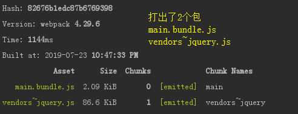
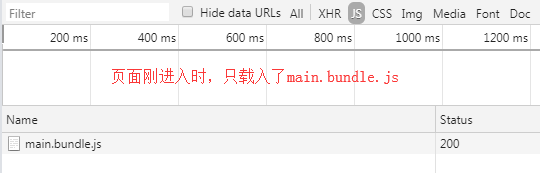
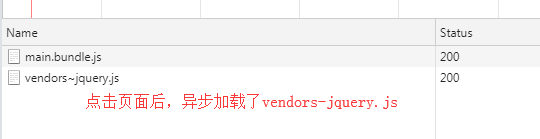
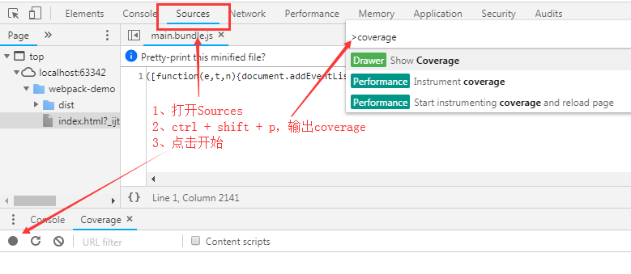
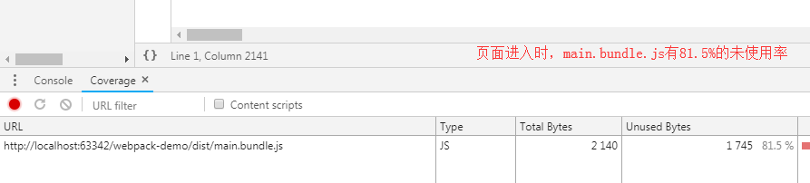
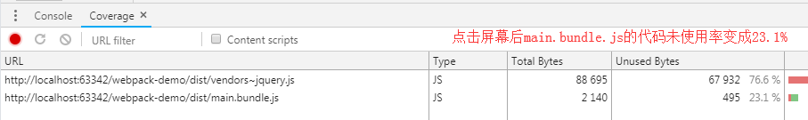

## Lazy Loading懒加载

懒加载就是通过dynamic import去加载一个模块

例如我们页面分为首页、详情页，页面刚打开时，用户看到的只有首页

如果我们将首页与详情页的业务逻辑都打在一个JS中，很明显，详情页那部分代码在首页展示中是多余的，反而延长了渲染时间

如果可以把首页和详情页分为2个JS包，首页只加载首页那部分的JS，点击详情页导航时，再去加载详情页的JS文件，显然是更好的，这便是懒加载，有用过如Vue、React等框架都有接触过路由懒加载

> 懒加载本身不是webpack的一个概念，而是ES6的import语法，webppack只是能识别进行分割

> import返回的是一个Promise对象，可以进行.then操作，一些低端的浏览器不支持 promise，比如 IE ，如果要使用这种异步的代码，就要使用 babel 以及 babel-polyfill 来做转换

    // src/index.js
    document.addEventListener('click', function() {
        import(/* webpackChunkName: 'jquery'*/ 'jquery').then(function({default: $}) {
            console.log($)
        })
    })
    
    执行npm run build，将打出的main.bundle.js在index.html引入
    

    这便是懒加载
    在开发中，我们不仅要考虑缓存，还要考虑代码使用率
    就像首页与详情页，在进入首页时应该将详情页的业务逻辑代码抽离来提高代码使用率
    
    可以F12打开开发者工具，通过coverage查看代码使用率
    

## Prefetch 预加载

缓存一般是**第二次打开网页或者刷新页面**时，懒加载主要提升的是第一次打开网页的性能

**然而这样的异步加载也会产生问题:**

假如我们弹框组件利用懒加载分离了代码，当我们点击按钮弹出模态框时，始终会出现点击没有立即响应(因为点击的那一刻才去加载这个包，需要时间)，有稍许延迟的情况，特别在业务模块较大的情况下，体验可能更为明显

**解决方案:**

webpack的**Prefetching/Preloading**

    // src/index.js
    document.addEventListener('click', function() {
        import(/* webpackPrefetch: true */).then(function({default: $}) {
            console.log($)
        })
    })
    
    webpackPrefetch: true 会等你主JS都加载完了之后，网络带宽空闲的时候，再去进行预加载
    
    执行npm run build，在index.html引入
    
    点击页面后看Network

**Prefetch与Preload的差别:**

上面我们使用的是prefetch，prefetch会等待核心代码加载完后，有空闲再去加载，更推荐使用

而preload会和核心代码并行加载