## Lazy Loading懒加载

懒加载就是通过dynamic import去加载一个模块

例如我们页面分为首页、详情页，页面刚打开时，用户看到的只有首页

如果我们将首页与详情页的业务逻辑都打在一个JS中，很明显，详情页那部分代码在首页展示中是多余的，反而延长了渲染时间

如果可以把首页和详情页分为2个JS包，首页只加载首页那部分的JS，点击详情页导航时，再去加载详情页的JS文件，显然是更好的，这便是懒加载，有用过如Vue、React等框架都有接触过路由懒加载

> 懒加载本身不是webpack的一个概念，而是ES6的import语法，webppack只是能识别进行分割

> import返回的是一个Promise对象，可以进行.then操作，一些低端的浏览器不支持 promise，比如 IE ，如果要使用这种异步的代码，就要使用 babel 以及 babel-polyfill 来做转换

    // src/index.js
    document.addEventListener('click', function() {
        import(/* webpackChunkName: 'jquery'*/ 'jquery').then(function({default: $}) {
            console.log($)
        })
    })
    
    执行npm run build，将打出的main.bundle.js在index.html引入
    

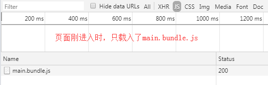

    这便是懒加载
    在开发中，我们不仅要考虑缓存，还要考虑代码使用率
    就像首页与详情页，在进入首页时应该将详情页的业务逻辑代码抽离来提高代码使用率
    
    可以F12打开开发者工具，通过coverage查看代码使用率
    

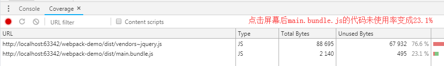

## Prefetch 预加载

缓存一般是**第二次打开网页或者刷新页面**时，懒加载主要提升的是第一次打开网页的性能

**然而这样的异步加载也会产生问题:**

假如我们弹框组件利用懒加载分离了代码，当我们点击按钮弹出模态框时，始终会出现点击没有立即响应(因为点击的那一刻才去加载这个包，需要时间)，有稍许延迟的情况，特别在业务模块较大的情况下，体验可能更为明显

**解决方案:**

webpack的**Prefetching/Preloading**

    // src/index.js
    document.addEventListener('click', function() {
        import(/* webpackPrefetch: true */).then(function({default: $}) {
            console.log($)
        })
    })
    
    webpackPrefetch: true 会等你主JS都加载完了之后，网络带宽空闲的时候，再去进行预加载
    
    执行npm run build，在index.html引入
    
    点击页面后看Network

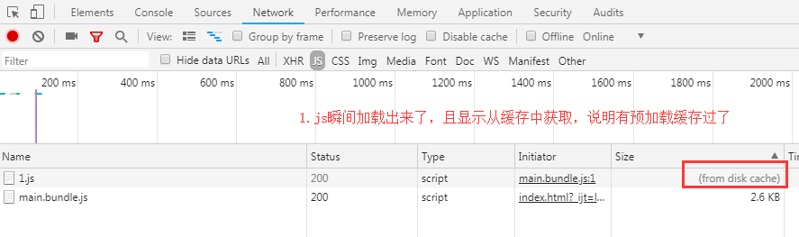

**Prefetch与Preload的差别:**

上面我们使用的是prefetch，prefetch会等待核心代码加载完后，有空闲再去加载，更推荐使用

而preload会和核心代码并行加载

## html-webpack-plugin

在前面的操作中，我们每次都需要手动去index.html中引入打出的js包，非常的不方便

webpack提供了html-webpack-plugin来自动生成html与引入打包后的包

### 常用API

| 配置项 | 说明 | 示例 |
| ------ | ------ | ------ |
| title | 打包后生成 html 的 title | title: 'webpack-demo' |
| filename | 打包后的 html 文件名称 | filename: 'index.html' |
| template | 模板文件 | template: 'index.html'（如根目录下的 index.html） |
| chunks | 和 entry 配置中相匹配，支持多页面、多入口 | chunks: \['app'] |
| minify | 压缩选项 | - |

### 基本用法
    
    // 1、安装依赖
    npm i html-webpack-plugin --save-dev
    
    // 2、在根目录下新建index.html作为模板 (htmlWebpackPlugin.options.title接收之后配置的title)
    <!DOCTYPE html>
    <html lang="en">
    <head>
        <meta charset="UTF-8">
        <title><%= htmlWebpackPlugin.options.title %></title>
    </head>
    <body>
    </body>
    </html>
    
    // 3、配置webpack.config.js
    const path = require('path')
    const { CleanWebpackPlugin } = require('clean-webpack-plugin')
    const HtmlWebpackPlugin = require('html-webpack-plugin')
    
    module.exports = {
        entry: {
            main: './src/index.js',
        },
        output: {
            path: path.resolve(__dirname, 'dist'),
            filename: '[name].bundle.js',
        },
        plugins: [
            new CleanWebpackPlugin(),
            new HtmlWebpackPlugin({
                title: 'webpack-demo', // HTML中的title
                minify: {
                    // 压缩 HTML 文件
                    removeComments: true, // 移除 HTML 中的注释
                    collapseWhitespace: true, // 删除空白符与换行符
                    minifyCSS: true // 压缩内联 css
                },
                filename: 'index.html', // 生成后的文件名
                template: 'index.html' // 根据此模版生成 HTML 文件
            })
        ],
    }
    
    执行npm run build
    
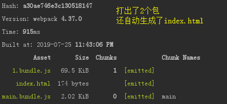

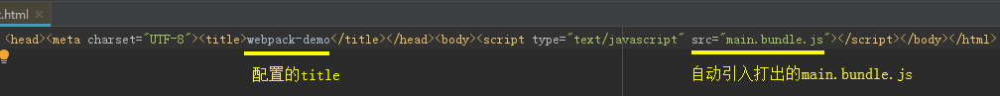

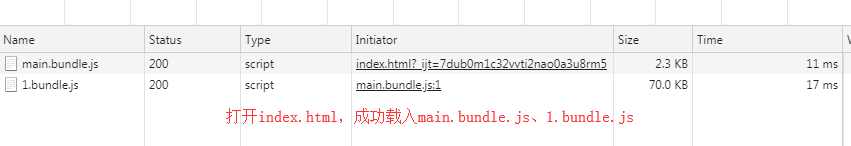

### publicPath

为所有资源指定一个基础路径

在上面的示例中，可以看到打出的包是以当前文件夹的相对路径引入html中的

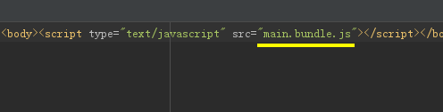

当我们修改output的配置，添加 publicPath: __dirname + '/dist/'

    output: {
        publicPath: __dirname + '/dist/',
        path: path.resolve(__dirname, 'dist'),
        filename: '[name].bundle.js',
    },
    
    执行npm run build
    
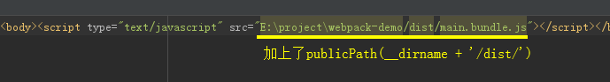

可以看出，publicPath是用来添加基础路径的

**作用:**

一般用在矫正路径和设置CDN路径前缀

### chunks指定入口、多页面

chunks属性用于指定打出的index.html所引入的包

这意味着我们可以利用**多入口**配合**chunks指定入口**来实现多页面

要实现多页面，我们需要配置多个HtmlWebpackPlugin:

    const path = require('path')
    const { CleanWebpackPlugin } = require('clean-webpack-plugin')
    const HtmlWebpackPlugin = require('html-webpack-plugin')
    
    module.exports = {
        entry: {
            a: './src/a.js', // 1、入口a
            b: './src/b.js', // 2、入口b
        },
        output: {
            path: path.resolve(__dirname, 'dist'),
            filename: '[name].bundle.js',
            chunkFilename: '[name].chunk.js',
        },
        plugins: [
            new CleanWebpackPlugin(),
            // 3、页面pageA
            new HtmlWebpackPlugin({
                title: 'webpack-demo',
                minify: {
                    removeComments: true,
                    collapseWhitespace: true,
                    minifyCSS: true,
                },
                filename: 'pageA.html',
                template: 'index.html',
                chunks: ['a'], // 4、配置pageA引入的是入口a打出的包
            }),
            // 5、页面pageB
            new HtmlWebpackPlugin({
                title: 'webpack-demo',
                minify: {
                    // 压缩 HTML 文件
                    removeComments: true,
                    collapseWhitespace: true,
                    minifyCSS: true,
                },
                filename: 'pageB.html',
                template: 'index.html',
                chunks: ['b'], // 6、配置pageB引入的是入口b打出的包
            })
        ],
    }
    
    执行npm run build
    
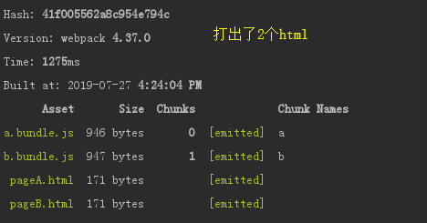

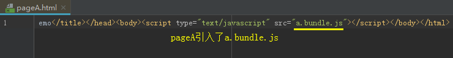

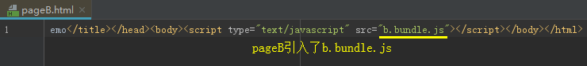

### 内联runtimeChunk

在Code Splitting篇，我们知道分割的runtimeChunk是个很小的文件

但是作为chunk清单，它又经常会改变，我们每次请求它，http耗时远大于它的执行时间，把它单独拆包并不是特别合适

优化的做法，可以将它内联到我们的index.html中(index.html本身每次打包都会变)

这里我们使用 **script-ext-html-webpack-plugin** 来完成内联

    // webpack.config.js
    const path = require('path')
    const { CleanWebpackPlugin } = require('clean-webpack-plugin')
    const HtmlWebpackPlugin = require('html-webpack-plugin')
        // 1、引入script-ext-html-webpack-plugin
    const ScriptExtHtmlWebpackPlugin = require("script-ext-html-webpack-plugin");
    
    module.exports = {
        entry: {
            main: './src/index.js',
        },
        output: {
            path: path.resolve(__dirname, 'dist'),
            filename: '[name].bundle.js',
            chunkFilename: '[name].chunk.js',
        },
        optimization: {
            // 2、配置runtimeChunk
            runtimeChunk: {
                name: 'manifest'
            },
        },
        plugins: [
            new CleanWebpackPlugin(),
            new HtmlWebpackPlugin({
                title: 'webpack-demo',
                minify: {
                    removeComments: true,
                    collapseWhitespace: true,
                    minifyCSS: true,
                },
                filename: 'index.html',
                template: 'index.html',
            }),
            // 3、配置script-ext-html-webpack-plugin
            new ScriptExtHtmlWebpackPlugin({
                //`runtime` must same as runtimeChunk name. default is `runtime`
                inline: /manifest\..*\.js$/
            })
        ],
    }
    
    执行npm run build

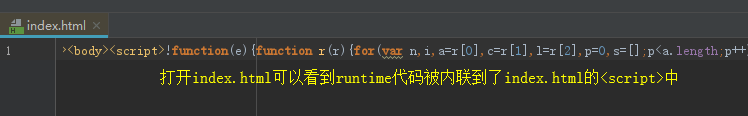
