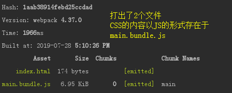
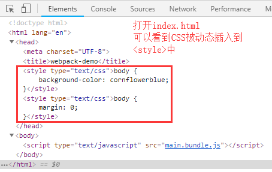
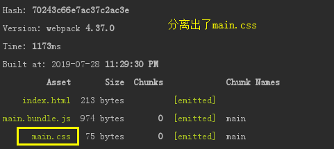
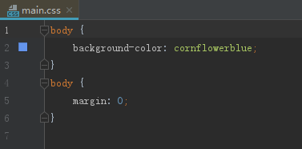
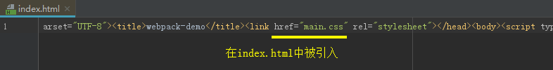
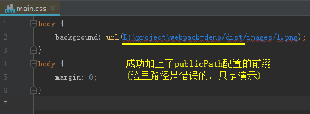

## 处理CSS、SCSS

CSS在HTML中一般使用\<link>标签引入或内联在\<style>标签中

webpack本身是不知道如何去提取CSS的，这时就需要相应的loader来实现

**CSS-loader:** 解析CSS，主要处理CSS依赖，如 @import、url()等引用外部文件的声明

**style-loader:** 将css-loader解析的结果转变为JS代码，运行时**动态插入style标签**

### 处理CSS

    // 1、安装依赖
    npm i css-loader style-loader --save-dev
    
    // 2、配置webpack.config.js
    module.exports = {
        ...
        module: {
            rules: [
                {
                    test: /\.css$/, // 针对 .css 后缀的文件设置 loader
                    use: ['style-loader', 'css-loader']
                }
            ]
        },
        ...
    }
    
    在src下新建style文件夹
    // src/style/1.css
    body {
        background-color: cornflowerblue;
    }
    
    // src/style/base.css
    @import '1.css';
    body {
        margin: 0;
    }
    
    // src/index.js
    import './style/base.css'
    
    执行npm run build
    

### 单独分离CSS

可以看到，style-load、css-loader最终是将样式内联到\<style>标签中

如果我们需要将CSS分离，可以使用**mini-css-extract-plugin**

**注：**

mini-css-extract-plugin分离CSS，一般只在生产环境使用，因为这个插件暂时不支持HMR

    // 1、安装依赖
    npm i mini-css-extract-plugin --save-dev
    
    // 2、配置webpack.config.js
    const MiniCssExtractPlugin = require('mini-css-extract-plugin')
    ...
    
    module.exports = {
        ...
        module: {
            rules: [
                {
                    test: /\.css$/,
                    use: [
                        {
                            loader: MiniCssExtractPlugin.loader, // 'style-loader'替换为MiniCssExtractPlugin
                        },
                        'css-loader'
                    ]
                }
            ]
        },
        ...
        plugins: [
            ...
            new MiniCssExtractPlugin({
                filename: 'style/[name].css', // 在dist文件夹下建立style文件夹放置分离的css
                chunkFilename: 'style/[id].css'
            })
        ],
    }
    
    执行npm run build
    

### publicPath

mini-css-extract-plugin的loader允许配置publicPath，通常作用于background: url引入外部图片的路径矫正

这里我们提前使用下图片处理的loader来演示publicPath

    // 1、安装处理图片的依赖
    npm install url-loader file-loader --save-dev
    
    // 2、配置webpack.config.js
    rules: [
        {
            test: /\.css$/,
            use: [
                {
                    loader: MiniCssExtractPlugin.loader,
                    options: {
                        // 这里可以指定一个 publicPath
                        // 默认使用 webpackOptions.output中的publicPath
                        publicPath: __dirname + '/dist/'
                    },
                },
                'css-loader'
            ]
        },
        {
            test: /\.(png|jpg|jpeg|gif)$/, // 处理图片，此处先不详谈
            use: [
                {
                    loader: 'url-loader',
                    options: {
                        name: '[name].[ext]',
                        outputPath: 'images/', //输出到 images 文件夹
                        limit: 0,
                    }
                }
            ]
        }
    ]
    
    // 3、在1.css中引入图片
    body {
        background: url("../imgs/1.png");
    }
    
    执行npm run build
    

### HMR

mini-css-extract-plugin可以配置hmr功能，一般作用于开发环境开启，此处不演示
    
    {
        test: /\.css$/,
        use: [
            {
                loader: MiniCssExtractPlugin.loader,
                options: {
                    // only enable hot in development
                    hmr: process.env.NODE_ENV === 'development', // development环境开启
                    // if hmr does not work, this is a forceful method.
                    reloadAll: true,
                },
            },
            'css-loader'
        ]
    }
    
### 压缩CSS

可以看到，单独分离出来的CSS文件是没有被压缩的

可以引入**optimize-css-assets-webpack-plugin**来实现CSS的压缩

    // 1、安装依赖
    npm install optimize-css-assets-webpack-plugin --save-dev

