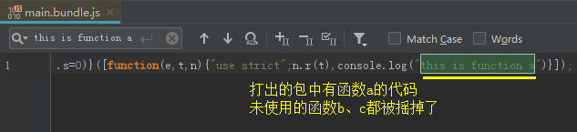
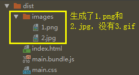
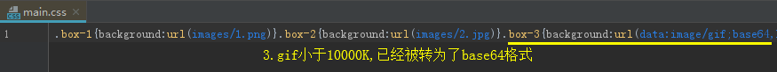

## JS Tree Shaking

### 常规Tree Shaking

Tree Shaking即摇树优化，项目中没有使用的代码会在打包时被去除

**JS Tree Shaking**依赖的是ES6的import、export

    // 1、在src下新建utils.js
    export function a() {
        return 'this is function a'
    }
    
    export function b() {
        return 'this is function b'
    }
    
    export function c() {
        return 'this is function c'
    }
    
    // 2、在入口文件src/index.js引入
    import { a } from "./utils";
    
    console.log(a());
    
    执行npm run build
    

> build生成模式会JS摇树，如果是dev，并不会摇树，打出的包依旧有b、c的代码

### 第三方JS Tree Shaking

对于常用的第三方包，如何进行Tree Shaking

以lodash为例:

    // src/index.js
    import { chunk } from 'lodash'
    
    console.log(chunk([1, 2, 3], 2));
    
    执行npm run build
    

很明显，除了chunk函数，所有无用的代码都被打了进来

**解决：**

前面提到，js tree shaking依赖的是ES模块系统，而lodash.js使用的是CommonJS而不是ES模块写法

所以安装对应的模块系统即可

安装lodash.js的ES版本: **npm install lodash-es --save**

    // 修改src/index.js
    import { chunk } from 'lodash-es'
    
    console.log(chunk([1, 2, 3], 2));
    
    执行npm run build
    

> 尽量选择拥有ES模块系统的第三方库

## CSS Tree Shaking

webpack4的CSS抽取，从extract-text-webpack-plugin改为了MiniCssExtractPlugin

CSS Tree Shaking与JS Tree Shaking不同，需要依赖第三方库PurifyCSS去实现，而这个包又与extract-text-webpack-plugin有关，所以如果使用的MiniCssExtractPlugin，可能不能很好的让PurifyCSS启动作用

可以使用 extract-text-webpack-plugin@next去替代extract-text-webpack-plugin，不过个人还是建议用MiniCssExtractPlugin去分离CSS

以下CSS Tree Shaking以了解为目的即可(个人还是用MiniCssExtractPlugin，这个插件视乎不能很好的配合PurifyCSS)

此处不详谈，可了解 [CSS Tree Shaking](https://juejin.im/post/5cb01ab0e51d456e3428c0ca#heading-1)

## 图片处理

webpack的图片处理主要依赖url-loader与file-loader这2个loader

    // 1、安装依赖
    npm install url-loader file-loader --save-dev
    
    // 2、src下新建imgs文件夹，放入图片
    1.png   363KB
    2.jpg   243KB
    3.gif   2.88KB
    
    // 3、src/style/base.css
    .box-1 {
        background: url("../imgs/1.png");
    }
    .box-2 {
        background: url("../imgs/2.jpg");
    }
    .box-3 {
        background: url("../imgs/3.gif");
    }
    
    // 4、入口文件src/index.js
    import './style/base.css'
    
    // 5、webpack.config.js
    module: {
        rules: [
            ...
            {
                test: /\.(png|jpg|jpeg|gif)$/,
                use: [
                    {
                        loader: 'url-loader',
                        options: {
                            name: '[name].[ext]',
                            outputPath: 'images/', // 输出到 images 文件夹
                            limit: 10000, // 小于10000K的文件会被转为base64格式
                        }
                    }
                ]
            }
        ]
    },
    
    执行npm run build
    

**小图片base64转码的优势:**

如果图片较多，会发出非常多的http请求，降低页面性能

转为base64字符串，可以**节省请求数**

但是如果图片太大，则不适合转为base64，**编码会消耗性能**
    