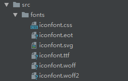
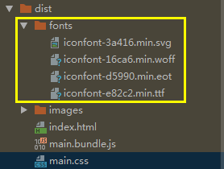
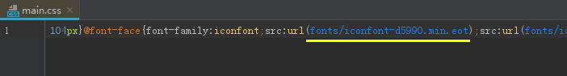

## 文字处理

文字处理一般是指iconfont字体图标，使用url-loader处理eot、woff、woff2、ttf、svg文件

    // 1、src下新建fonts文件夹，放置字体文件
    iconfont.css/eot/woff/woff2/ttf/svg
    这里以阿里iconfont为素材
    

    // 2、src/index.js入口文件引入iconfont
    import './fonts/iconfont.css';
    
    // 3、配置webpack.config.js
    module: {
        rules: [
            ...,
            {
                test: /\.(eot|woff2?|ttf|svg)$/,
                use: [
                    {
                        loader: 'url-loader',
                        options: {
                            name: '[name]-[hash:5].min.[ext]',
                            limit: 1, // base64转码限制大小，与图片处理相同，这里设置1不让它base64转码方便测试
                            publicPath: 'fonts/',
                            outputPath: 'fonts/'
                        }
                    }
                ]
            },
        ]
    },
    
    // 4、index.html加入iconfont测试
    <!DOCTYPE html>
    <html lang="en">
    <head>
        <meta charset="UTF-8">
        <title><%= htmlWebpackPlugin.options.title %></title>
    </head>
    <body>
        <i class="iconfont icon-tianjia"></i>
        <i class="iconfont icon-bianji-01"></i>
        <i class="iconfont icon-shanchu"></i>
    </body>
    </html>
    
    执行npm run build
    

(打开打包后的index.html)

    
    