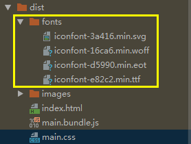
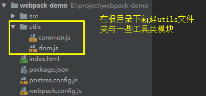
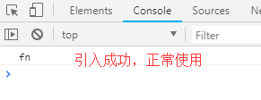
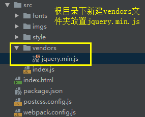

## 文字处理

文字处理一般是指iconfont字体图标，使用url-loader处理eot、woff、woff2、ttf、svg文件

    // 1、src下新建fonts文件夹，放置字体文件
    iconfont.css/eot/woff/woff2/ttf/svg
    这里以阿里iconfont为素材
    


    // 2、src/index.js入口文件引入iconfont
    import './fonts/iconfont.css';
    
    // 3、配置webpack.config.js
    module: {
        rules: [
            ...,
            {
                test: /\.(eot|woff2?|ttf|svg)$/,
                use: [
                    {
                        loader: 'url-loader',
                        options: {
                            name: '[name]-[hash:5].min.[ext]',
                            limit: 1, // base64转码限制大小，与图片处理相同，这里设置1不让它base64转码方便测试
                            publicPath: 'fonts/',
                            outputPath: 'fonts/'
                        }
                    }
                ]
            },
        ]
    },
    
    // 4、index.html加入iconfont测试
    <!DOCTYPE html>
    <html lang="en">
    <head>
        <meta charset="UTF-8">
        <title><%= htmlWebpackPlugin.options.title %></title>
    </head>
    <body>
        <i class="iconfont icon-tianjia"></i>
        <i class="iconfont icon-bianji-01"></i>
        <i class="iconfont icon-shanchu"></i>
    </body>
    </html>
    
    执行npm run build
    



(打开打包后的index.html)

## resolve常用配置

webpack配置文件中，有个非常有用的属性**resolve**

resolve配置告诉webpack如何去寻找对应的模块，默认会使用内置的规则去寻找，可以通过配置按我们的需求进行修改

### alias

配置alias别名，可以大幅度的优化我们对模块引用的写法

例如有个文件的引入非常繁琐: 

import { scrollPosition } from '../../../../utils/dom/scroll.js';

这一连串的路径不仅让我们对模块的引入非常不方便，代码也不美观

使用alias可以解决这个问题



    // utils/common.js
    export function fn() {
        return 'fn';
    }
    
    // 这时在入口文件src/index.js引入common.js的路径是这样的
    import { fn } from '../utils/common.js';
    console.log(fn());
    
    我们可以通过如下配置让引入更为的方便:
    
    // 1、配置webpack.config.js
    module.exports = {
        entry: {
            main: './src/index.js',
        },
        output: {
            path: path.resolve(__dirname, 'dist'),
            filename: '[name].bundle.js',
            chunkFilename: '[name].chunk.js',
        },
        resolve: {
            alias: {
                Common: path.resolve(__dirname, 'utils/common') // 为utils下的common.js设置别名为'Common'
            },
        },
        ...
    }
    
    // 2、修改入口文件src/index.js
    import { fn } from 'Common'; // 直接用别名Common引入即可
    console.log(fn());
    
    执行npm run build


(打开打包后的index.html，可以看到引入是没有出错的)

### extensions

配置extensions，可以让我们引入时省去.js、.css等后缀

例如在index.js中引入base.css:

import from 'base.css'

如果省去了.css后缀(import from 'base')，打包将会报错

配置extensions后，webpack会自动带上配置的后缀去尝试访问文件是否存在，默认是\['js', 'json']

    // 1、入口文件src/index.js
    import './style/base' // 省略.css后缀
    
    // 2、配置webpack.config.js
    module.exports = {
        entry: {
            main: './src/index.js',
        },
        output: {
            path: path.resolve(__dirname, 'dist'),
            filename: '[name].bundle.js',
            chunkFilename: '[name].chunk.js',
        },
        resolve: {
            extensions: ['.js', '.json', '.css'], // 当导入没有后缀时，webpack会依次带上这些后缀查看是否有对应的文件
            alias: {
                Common: path.resolve(__dirname, 'utils/common')
            },
        },
        ...
    }
    
    执行npm run build，可以看到不会报错了
    
### modules

配置modules模块，告诉webpack去哪寻找第三方模块

我们知道，在导入第三方库如: import _ from 'lodash'时，是不需要指定路径为'node_modules/lodash'，因为默认的modules配置就是node_modules

除此之外，我们也可以配置自己模块目录

假如我们有打了的文件引入，都是在/utils下

那我们引入可以是这样的: import { DOMComputedStyle } from '../utils/dom';

通过配置modules，我可以将utils下的引入，变成: import { DOMComputedStyle } from 'dom';

    // 1、配置webpack.config.js
    module.exports = {
        entry: {
            main: './src/index.js',
        },
        output: {
            path: path.resolve(__dirname, 'dist'),
            filename: '[name].bundle.js',
            chunkFilename: '[name].chunk.js',
        },
        resolve: {
            extensions: ['.js', '.json', '.css'],
            alias: {
                Common: path.resolve(__dirname, 'utils/common')
            },
            modules: [
                path.resolve(__dirname, 'utils'), 'node_modules'  // 当有如import ... from 'X'时，告诉webpack去这些地方找
            ],
        },
        ...
    }
    
    // 2、入口文件src/index.js
    import { DOMComputedStyle } from 'dom'; // 只需要'dom'，webpack看到这种会去找extensions的配置路径
    console.log(DOMComputedStyle());

    
    执行npm run build会看到文件引入成功，可以正常使用

## 处理第三方JS库
    
在项目开发中，我们一般更专注于业务逻辑的开发，而功能逻辑更多的是选择使用第三方库

引入第三方库的方式有很多，常用的是:

- 在html用\<script>标签引入，CDN加速

- 安装npm包引入(**最推荐的做法**)

- 引入本地min.js，有些库没有ES模块体系，需要手动下载对应的JS文件在项目中引入

针对第3种引入方式，如果没有webpack，我们需要手动引入import或require来加载文件

但webpack提供了**webpack.ProvidePlugin**，可以让我们**略过手动引入，直接使用**

webpack.ProvidePlugin的参数是键值对形式，**键**是项目使用的**变量名**，**值**是**指向的库**

webpack.ProvidePlugin搜索方式:

- 从npm安装的包查找是否有符合的库

- 从alias查找

下面以jquery.min.js示例



````````
    // 1、配置webpack.config.js
    const path = require('path')
    const webpack = require('webpack')
    ...
    
    module.exports = {
        entry: {
            main: './src/index.js',
        },
        resolve: {
            extensions: ['.js', '.json', '.css'],
            alias: {
                jQuery: path.resolve(__dirname, 'src/vendors/jquery.min.js'), // 设置别名，指向下载的min.js
            },
        },
        ...
        plugins: [
            ...
            new webpack.ProvidePlugin({
                $: 'jQuery' // $对应项目中的变量名，jQuery对应alias的属性
            })
        ],
    }
    
    // 2、入口文件src/index,js
    console.log($); // 不用import引入，直接使用$符号
    
    执行npm run build，打开生成的index.html
````````

