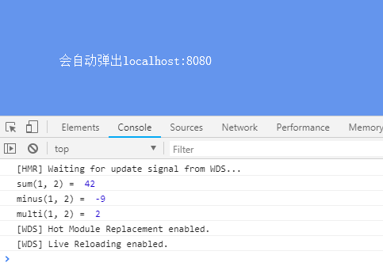
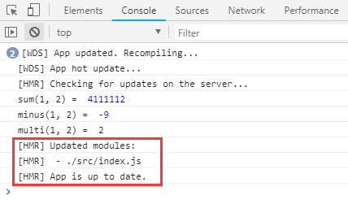

## webpack-dev-server

### 常规配置

前面我们更多的是执行npm run build在dist文件夹下打包项目文件，也就是生产环境

在项目开发中，我们一般是使用**npm run dev**，也就是**开发环境**，对项目代码进行调试

**为什么需要开发模式:**

之前我们没做一次代码的调整，通过都需要重新build项目，生成新的文件。随着项目需求的扩大，打包速度会越来越慢，稍微修改一下代码可能需要花费几十秒去等等打包才能查看结果

开发模式使用**webpack-dev-server**开启一个本地服务器，当代码调整后，可以自动快速的刷新页面，甚至可以做到**热重载、代理请求**等操作，为项目开发提供了很大的便利

    // 1、安装依赖
    npm i webpack-dev-server --save-dev
    
    // 2、配置package.json
    "scripts": {
        "dev": "webpack-dev-server --open --progress", // --open在启动后会自动打开浏览器，--progress会在启动时将进度显示在控制台
        "build": "webpack --mode production"
    },
    
    // 3、src/vendors
    minus.js:
    module.exports = function(a, b) {
        return a - b
    }
    
    multi.js:
    define(function(require, factory) {
        'use strict'
        return function(a, b) {
            return a * b
        }
    })
    
    sum.js:
    export default function(a, b) {
        return a + b
    }
    
    // 4、src/style/base.scss
    body {
        background-color: aquamarine;
    }
    
    
    // 5、入口文件src/index.js
    import './style/base.scss'
    import sum from './vendors/sum'
    console.log('sum(1, 2) = ', sum(1, 41))
    
    var minus = require('./vendors/minus')
    console.log('minus(1, 2) = ', minus(1, 10))
    
    require(['./vendors/multi'], function(multi) {
        console.log('multi(1, 2) = ', multi(1, 2))
    })

    // 6、完整webpack.config.js
    const path = require('path')
    const webpack = require('webpack')
    const { CleanWebpackPlugin } = require('clean-webpack-plugin')
    const HtmlWebpackPlugin = require('html-webpack-plugin')
    
    module.exports = {
        mode: 'development', // 开发模式
        devtool: 'source-map', // 开启调试
        entry: {
            main: './src/index.js', // 需要打包的文件入口
        },
        output: {
            publicPath: '/', // js 引用的路径或者 CDN 地址
            path: path.resolve(__dirname, 'dist'), // 打包文件的输出目录
            filename: '[name].bundle.js', // 代码打包后的文件名
            chunkFilename: '[name].chunk.js', // 代码拆分后的文件名
        },
        resolve: {
            extensions: ['.js', '.json', '.scss', '.css'],
        },
        devServer: {
            contentBase: path.join(__dirname, 'dist'),
            port: 8080, // 本地服务器端口号
            hot: true, // 热重载
            overlay: true, // 如果代码出错，会在浏览器页面弹出“浮动层”。类似于 vue-cli 等脚手架
            proxy: {
                // 跨域代理转发
                '/help': {
                    target: 'https://www.wangsucloud.com/base-portal/frontpages/help/menu/HELP',
                    changeOrigin: true,
                    ws: false,
                    pathRewrite: {
                        [`^/help`]: '/'
                    },
                    logLevel: 'debug',
                    headers: {
                        Cookie: ''
                    }
                }
            },
        },
        module: {
            rules: [
                {
                    test: /\.(scss|css)$/, // 针对 .css 后缀的文件设置 loader
                    use: [
                        'style-loader',
                        'css-loader',
                        {
                            loader: 'postcss-loader',
                            options: {
                                plugins: [require('autoprefixer')]
                            }
                        },
                        'sass-loader' // 使用 sass-loader 将 scss 转为 css
                    ]
                },
                {
                    test: /\.(png|jpg|jpeg|gif)$/,
                    use: [
                        {
                            loader: 'url-loader',
                            options: {
                                name: '[name]-[hash:5].min.[ext]',
                                outputPath: 'images/', // 输出到 images 文件夹
                                limit: 1000, // 小于10000K的文件会被转为base64格式
                            }
                        },
                    ]
                },
                {
                    test: /\.(eot|woff2?|ttf|svg)$/,
                    use: [
                        {
                            loader: 'url-loader',
                            options: {
                                name: '[name]-[hash:5].min.[ext]',
                                // limit: 1, // fonts file size <= 5KB, use 'base64'; else, output svg file
                                publicPath: 'fonts/',
                                outputPath: 'fonts/'
                            }
                        }
                    ]
                },
            ]
        },
        plugins: [
            new CleanWebpackPlugin(), // 默认情况下，此插件将删除 webpack output.path目录中的所有文件，以及每次成功重建后所有未使用的 webpack 资产。
            new HtmlWebpackPlugin({
                title: 'webpack-demo', // HTML中的title
                minify: {
                    // 压缩 HTML 文件
                    removeComments: true, // 移除 HTML 中的注释
                    collapseWhitespace: true, // 删除空白符与换行符
                    minifyCSS: true // 压缩内联 css
                },
                filename: 'index.html', // 生成后的文件名
                template: './index.html', // 根据此模版生成 HTML 文件
            }),
            new webpack.HotModuleReplacementPlugin(), // 热部署模块
            new webpack.NamedModulesPlugin(),
        ],
    }
    
    执行npm run dev
    

修改js/scss文件，会发现**页面自动刷新**

接着我们对上述的配置进行分析

### 模块热更新

模块热更新需要 **HotModuleReplacementPlugin** 和 **NamedModulesPlugin** 这两个插件，并且**顺序不能错**，并且指定 **devServer.hot 为 true**

    const webpack = require('webpack')
    module.exports = {
        ...
        devServer: {
            ...
            hot: true, // 热重载
        },
        plugins: [
            ...
            new webpack.HotModuleReplacementPlugin(),
            new webpack.NamedModulesPlugin()
        ]
    }
    
配置了这2个插件，项目中JS代码**可以针对侦测到变更的文件并且做出相关处理**(注意是JS代码，修改index.html并不会改变)

前言中我们提到，修改文件，会发现页面**自动刷新**,这并不是我们所要说的热更新，只是webpack-dev-server启动的服务自动在我们修改后做页面的刷新

要做到热更新，我们需要在index.js中加入热更新的语句
    
    // --- 热更新 --- start
    if (module.hot) {
        module.hot.accept();
    }
    // --- 热更新 --- end
    import './style/base'
    import sum from './vendors/sum'
    console.log('sum(1, 2) = ', sum(1, 41))
    
    var minus = require('./vendors/minus')
    console.log('minus(1, 2) = ', minus(1, 10))
    
    require(['./vendors/multi'], function(multi) {
        console.log('multi(1, 2) = ', multi(1, 2))
    })
    
这时我们修改代码:

    console.log('sum(1, 2) = ', sum(1, 4111111))
    

会发现页面**没有重新刷新，只更新了我们修改的部分**，达到了热更新的效果

