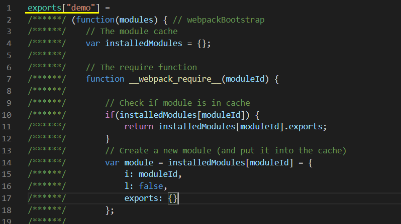
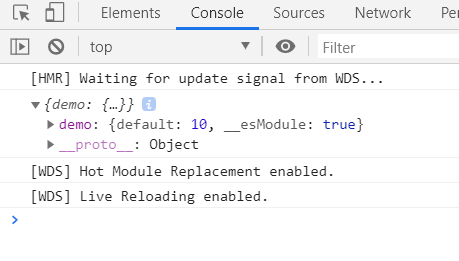
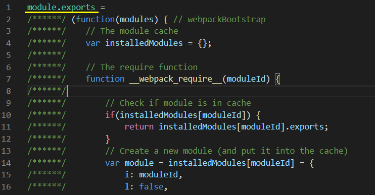

## output.library、output.libraryTarget

正常开发项目时，是用不到这 2 个属性的，但是如果是开发工具库、组件库等，那么这 2 个属性是非常重要的

试想一下，我们发布了一个 npm 包，当用户引入我们开发的库，可能会有哪些方式：

- script 标签引入

```html
<script src="./demo.js"></script>
<script>
    // script 引入 js 后生成全局变量 demo
    demo(...);
</script>
```

- AMD 方式

```js
define(['demo'], function(demo) {
    demo(...);
});
```

- commonjs 方式

```js
const demo = require('demo');

demo(...);
```

- ES Module

```js
import demo from 'demo';

demo(...);
```

为什么这个库可以支持不同的引入方式？亦或如何让这个库支持某一种引入方式？这就需要 output.library、output.libraryTarget 的配置了

### webpack 打包库架构配置

先简单搭建一个 build:lib 架构：

```js
// build/webpack.lib.conf.js
const { CleanWebpackPlugin } = require('clean-webpack-plugin');
const path = require('path');

module.exports = {
    mode: "development", // 使用 development 模式，方便解释打包后的代码
    context: path.resolve(__dirname, '../'),
    entry: './src/index.js', // 入口文件 src/index.js
    output: {
        path: path.resolve(__dirname, '..', 'lib'),
        filename: 'index.js',
    },
    resolve: {
        extensions: ['.js'],
    },
    module: {
        rules: [
            {
                test: /\.js(x?)$/,
                exclude: /node_modules/,
                use: {
                    loader: 'babel-loader', 
                }
            }
        ]
    },
    plugins: [
        new CleanWebpackPlugin(),
    ],
}

```

为了后续一些场景方便模拟，我们连 dev 环境也简单搭建一下：

```js
// build/webpack.base.conf.js
const path = require('path');
const HtmlWebpackPlugin = require('html-webpack-plugin');
const { CleanWebpackPlugin } = require('clean-webpack-plugin');
const CopyWebpackPlugin = require('copy-webpack-plugin');
const HappyPack = require('happypack'); // 开启子线程并发处理任务
const os = require('os');
const HappyPackThreadPool = HappyPack.ThreadPool({ size: os.cpus().length });

module.exports = {
    context: path.resolve(__dirname, '../'), // 配置上下文，当遇到相对路径时，会以context为根目录
    entry: ['./src/entry.js'],
    resolve: {
        extensions: ['.js'],
        alias: {
            '@': path.join(__dirname, '..', 'src'),
        },
    },
    module: {
        rules: [
            {
                test: /\.js(x?)$/, // 使用正则来匹配 js 文件
                exclude: /node_modules/, // 排除依赖包文件夹
                use: [
                    {
                        // 一个loader对应一个id
                        loader: "happypack/loader?id=hpBabel"
                    }
                ]
            }
        ]
    },
    plugins: [
        new CleanWebpackPlugin(),
        new HtmlWebpackPlugin({
            title: 'kealm-react-components', // HTML中的title
            minify: {
                // 压缩 HTML 文件
                removeComments: true, // 移除 HTML 中的注释
                collapseWhitespace: true, // 删除空白符与换行符
                minifyCSS: true // 压缩内联 css
            },
            favicon: path.resolve(__dirname, '..', 'favicon.ico'),
            filename: 'index.html', // 生成后的文件名
            template: path.resolve(__dirname, '..', 'index.html'), // 根据此模版生成 HTML 文件
        }),
        new CopyWebpackPlugin([
            {
                from: path.resolve(__dirname, '..', 'favicon.ico'),
                to: path.resolve(__dirname, '..', 'dist', 'favicon.ico'),
            }
        ]),
        new HappyPack({
            // 用唯一的标识符id，来代表当前的HappyPack是用来处理一类特定的文件
            id:'hpBabel',
            // 如何处理.js文件，用法和Loader配置中一样
            loaders:['babel-loader?cacheDirectory'],
            threadPool: HappyPackThreadPool,
        }),
    ]
}
```

```js
// build/webpack.dev.conf.js
const webpack = require('webpack');
const path = require('path');
const merge = require('webpack-merge');
const baseConfig = require('./webpack.base.conf');

module.exports = merge(baseConfig, {
    mode: "development",
    devtool: 'cheap-module-eval-source-map', // 开启development调试
    output: {
        path: path.resolve(__dirname, '..', 'dev'),
        publicPath: '/',
        filename: '[name].bundle.js',
        chunkFilename: '[name].chunk.js'
    },
    devServer: {
        port: 8080, // 本地服务器端口号
        hot: true, // 热重载
        overlay: true, // 如果代码出错，会在浏览器页面弹出“浮动层”。类似于 vue-cli 等脚手架
        historyApiFallback: true,
    },
    plugins: [
        new webpack.HotModuleReplacementPlugin(), // 热部署模块
        new webpack.NamedModulesPlugin(),
    ]
})
```

```js
// package.json
{
    "scripts": {
        "dev": "cross-env NODE_ENV=dev webpack-dev-server --progress --config build/webpack.dev.conf.js",
        "build:lib": "webpack --progress --config build/webpack.lib.conf.js"
    },
    "devDependencies": {
        "@babel/core": "^7.5.5",
        "@babel/plugin-proposal-class-properties": "^7.5.5",
        "@babel/plugin-transform-modules-umd": "^7.7.4",
        "@babel/plugin-transform-runtime": "^7.5.5",
        "@babel/preset-env": "^7.5.5",
        "babel-loader": "^8.0.6",
        "clean-webpack-plugin": "^3.0.0",
        "copy-webpack-plugin": "^5.0.4",
        "cross-env": "^5.2.0",
        "happypack": "^5.0.1",
        "html-webpack-plugin": "^4.3.0",
        "resolve-url-loader": "^3.1.0",
        "webpack": "^4.29.6",
        "webpack-cli": "^3.3.5",
        "webpack-dev-server": "^3.7.2",
        "webpack-merge": "^4.2.1"
    },
    "dependencies": {
        "@babel/polyfill": "^7.4.4",
        "@babel/runtime": "^7.5.5",
        "@babel/runtime-corejs3": "^7.7.7",
        "core-js": "^3.2.0"
    }
}
```

```js
// .babelrc
{
  "presets": [
    "@babel/preset-env"
  ],
  "plugins": [[
      "@babel/plugin-transform-runtime",{
        "corejs": 3
      }
  ]]
}
```

```js
// 打包文件 src/index.js
const a = 10;
export default a;
```

### output.library

output.library 支持 string 或 object（object 类型限于 libraryTarget: 'umd' 使用）类型的值

output.library 的值被**如何使用**，是根据 output.libraryTarget 的取值不同而不同

下面我们配合 output.libraryTarget 同时了解 output.library

### output.libraryTarget

output.libraryTarget 支持 string 类型的值

此配置的作用是控制 webpack 打包的内容是如何暴露的，通常需要和 output.library 的值一起产生作用

- libraryTarget: 'var'（默认值）

选项需要配合 library 使用，用于将数据暴露给一个指定变量

当配置为 var 时，打包后返回的值，将被绑定到 output.library 指定的变量上，并且 var xx 的形式存在，如下配置：

```js
// build/webpack.lib.conf.js
output: {
    path: path.resolve(__dirname, '..', 'lib'),
    filename: 'index.js',
    library: 'demo',
    libraryTarget: 'var',
},
```

接着执行 npm run build:lib 进行打包

可以看到，打包后文件的输出被放在了一个 demo 变量，以 var 定义：


将这个文件放置随意一个 index.html 旁引入：

```html
<!-- index.html -->
<script src="./lib/index.js"></script>
```


- libraryTarget: 'assign'

选项需要配合 library 使用，用于将数据暴露给一个指定变量

assign 将会把库的返回值分配给一个**没有使用 var 声明的变量**：

```js
output: {
    path: path.resolve(__dirname, '..', 'lib'),
    filename: 'index.js',
    library: 'demo',
    libraryTarget: 'assign',
},
```


同样，对于没有 var 声明的变量，直接在 html 中引入，也会作为全局变量来使用

- libraryTarget: 'this'

将库的返回值分配给 this 对象，由 library 指定属性

当没有设置 library 指定属性时，将直接分配给对象本身

```js
output: {
    path: path.resolve(__dirname, '..', 'lib'),
    filename: 'index.js',
    library: 'demo',
    libraryTarget: 'this',
},
```


如果在 html 中引入改文件，将会在全局作用域下执行 this['demo']，而由于全局环境下 this 是 window，所以同样会在 window 下有一个 demo 属性，结果同 'var' 与 'assign'

- libraryTarget: 'window'

将库的返回值分配给 window 对象，由 library 指定属性

当没有设置 library 指定属性时，将直接分配给对象本身

```js
output: {
    path: path.resolve(__dirname, '..', 'lib'),
    filename: 'index.js',
    library: 'demo',
    libraryTarget: 'window',
},
```


- libraryTarget: 'global'

将库的返回值分配给 global 对象，由 library 指定属性

当没有设置 library 指定属性时，将直接分配给对象本身

这个配置受 target 属性影响，如果 target 为 web（默认）,则会分配给 window，反之 target 为 node，则分配给 global

```js
module.exports = {
    ...
    target: 'node',
    output: {
        path: path.resolve(__dirname, '..', 'lib'),
        filename: 'index.js',
        library: 'demo',
        libraryTarget: 'global',
    },
}
```


- libraryTarget: 'commonjs'

将库的返回值分配给 exports 对象，由 library 指定属性

当没有设置 library 指定属性时，将直接分配给对象本身

```js
output: {
    path: path.resolve(__dirname, '..', 'lib'),
    filename: 'index.js',
    library: 'demo',
    libraryTarget: 'commonjs',
},
```



在入口文件 entry.js 引入打包后的 lib/index.js 测试：

```js
// src/entry.js
const demo = require('../lib/index.js');
console.log(demo);
```

启动开发环境 npm run dev



> 注：在此例中的 dev 模式里，引入打包后的 lib/index.js 是会报错的，这里先不提及，解决方案后面再谈，先当成是可以引入的

- libraryTarget: 'commonjs2'

[What is commonjs2](https://github.com/webpack/webpack/issues/1114)

将库的返回值分配给 module.exports 对象，这个选项**不需要 library**

```js
output: {
    path: path.resolve(__dirname, '..', 'lib'),
    filename: 'index.js',
    libraryTarget: 'commonjs2',
},
```



```js
// src/entry.js
const demo = require('../lib/index.js');
console.log(demo);
```

- libraryTarget: 'amd'

将库作为 AMD 模块导出