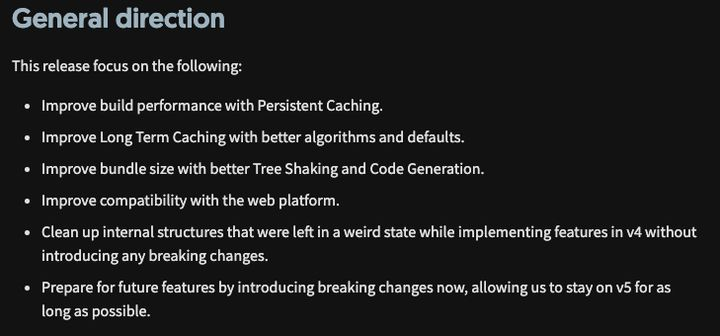

## 官方地址

[Webpack 5 发布 (2020-10-10)](https://webpack.docschina.org/blog/2020-10-10-webpack-5-release/)

## 学习来源

整理自知乎文章 [Webpack5 新特性业务落地实战](https://zhuanlan.zhihu.com/p/348612482)

## Webpack5 方向性变化

 

- 尝试用持久性缓存来提高构建性能

- 尝试用更好的算法和默认值来改进长期缓存

- 尝试用更好的 Tree Shaking 和代码生成来改善包大小

- 尝试改善与网络平台的兼容性

- 尝试在不引入任何破坏性变化的情况下，清理那些在实现 v4 功能时处于奇怪状态的内部结构

- 试图通过现在引入突破性的变化来为未来的功能做准备，使其能够尽可能长时间地保持在 v5 版本上

