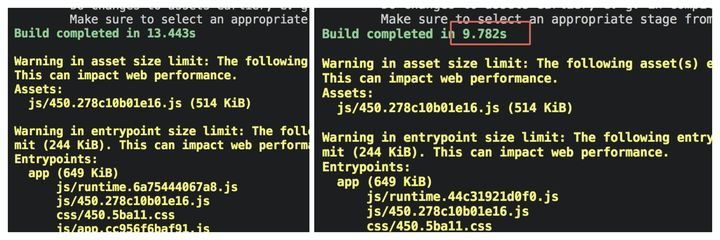
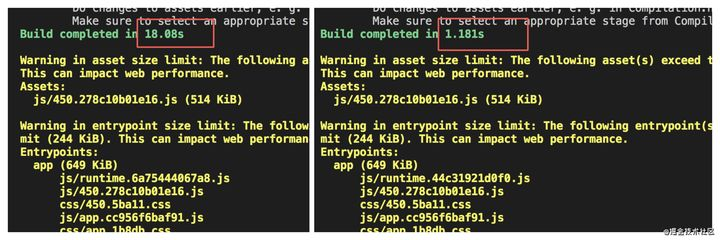
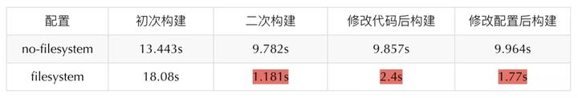

## html-webpack-plugin

```shell
npm install --save-dev html-webpack-plugin
```

## mini-css-extract-plugin

替换为 [css-minimizer-webpack-plugin](https://www.npmjs.com/package/css-minimizer-webpack-plugin)

```js
const CssMinimizerPlugin = require('css-minimizer-webpack-plugin');

module.exports = {
    optimization: {
        minimizer: [
          // For webpack@5 you can use the `...` syntax to extend existing minimizers (i.e. `terser-webpack-plugin`), uncomment the next line
          `...`,
          new CssMinimizerPlugin(),
        ],
    },
}
```

> 上例代码中的那一行 `...` 非常重要，如果没有加入此行，则只有 CssMinimizerPlugin 生效，原本 production 时内置的 terser-webpack-plugin、tree shaking 等将全部失效

## file 资源

在 webpack4 中通常需要安装 loader 处理图片资源

- raw-loader: 允许将文件处理成一个字符串导入

- url-loader: 将文件打包导到输出目录，并在 import 的时候返回一个文件的 uri

- file-loader: 当文件大小达到一定要求的时候，可以将其处理成 base64 的 uri ，内置 file-loader

webpack5 内置的静态资源构建能力，我们不需要安装额外的 loader，仅需要简单的配置就能实现静态资源的打包和分目录存放

```js
module.exports = {
    module: {
        rules: [
            {
                test: /\.(png|jpg|svg|gif)$/,
                type: 'asset/resource',
                generator: {
                    // [ext]前面自带"."
                    filename: 'assets/[hash:8].[name][ext]',
                },
            },
        ],
    },
}
```

```js
// index.js
const img = document.createElement('img');
img.src = require('./assets/images/add-circle.png');
document.body.append(img);
```

其中 [type](https://webpack.docschina.org/guides/asset-modules/) 取值：

- asset/source: 导出资源的源代码，功能相当于 raw-loader

- asset/inline: 导出一个资源的 data URI，功能相当于 url-loader，若想要设置编码规则，可以在 generator 中设置 dataUrl

- asset/resource: 发送一个单独的文件并导出 URL，功能相当于 file-loader。项目中的资源打包统一采用这种方式，得益于团队项目已经完全铺开使用了 HTTP2 多路复用的相关特性，我们可以将资源统一处理成文件的形式，在获取时让它们能够并行传输，避免在通过编码的形式内置到 js 文件中，而造成资源体积的增大进而影响资源的加载

- asset: 默认会根据文件大小来选择使用哪种类型，当文件小于 8 KB 的时候会使用 asset/inline，否则会使用 asset/resource。也可手动进行阈值的设定

## cache 缓存

webpack4 中的缓存处理：

- cache-loader 缓存一些性能开销较大的 loader

- hard-source-webpack-plugin 为模块提供一些中间缓存

webpack5 默认集成了一种自带的缓存能力（对 module 和 chunks 进行缓存），在二次构建时提速

> webpack5 提供了持久性缓存，并优化了算法

```js
// webpack.dev.config.js
module.exports = {
    cache: {
        type: 'filesystem',
        // 可选配置
        buildDependencies: {
            config: [__filename],  // 当构建依赖的 config 文件（通过 require 依赖）内容发生变化时，缓存失效
        },
        name: 'development-cache',  // 配置以 name 为隔离，创建不同的缓存文件，如生成 PC 或 mobile 不同的配置缓存
    },
}

// webpack.prod.config.js
module.exports = {
    cache: {
        type: 'filesystem',
        // 可选配置
        buildDependencies: {
            config: [__filename],
        },
        name: 'production-cache', // 会将缓存放在 node_modules/.cache/webpack/production-cache
    },
}
```

### 构建效率对比

后续的二次构建速度得到了大幅度的提高

- 没有配置时的初次和二次构建：

 

- 配置了缓存的初次构建和二次构建：

 

 


### FAQ

Q: 直接通过调用 Webpack compiler 实例的 run 方法执行定制化构建操作时，遇到构建缓存最终没有生成缓存文件的情况

A: 需要手动调用 compiler.close() 来输出缓存文件