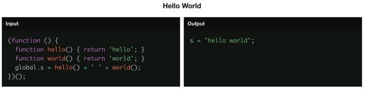

## 内置 Prepack 部分能力

Prepack 是 Facebook 开源的一个 JavaScript 代码优化工具，运行在 “编译” 阶段，生成优化后的代码

当对于任何输入，函数都能得到一个固定输出时，Prepack 就能在编译时 “预计算” 结果

对于一些复杂而固定的计算逻辑而言，具备明显优势：

- 复杂的计算代码打包后替换为固定值，减少包体积

- 减少了计算消耗，加快运行时的速度

Prepack 官方示例图：

 

Webpack5 内置了 Prepack 的部分能力，能够在极致之上，再度优化你的项目产物体积

```js
// index.js
const hello = () => 'hello';
const world = () => 'world';

const a = hello() + ' ' + 'world';
console.log(a);
```

```js
// 打包后的 main-544743f724b236ee60fe.js
console.log("hello world");
```

## Tree Shaking

webpack5 提供了更深度的 tree shaking 支持

> tree shaking + prepack 可以大幅度的减少打包后的代码体积

### 支持深层嵌套的 export

在 webpack4 中，下方代码是可以被 tree shaking 移除多余代码的：

```js
// inner.js
export const a = 1111;
export const b = 2222;

// module.js
export * from './inner';

// index.js
import { a } from './src/module';

console.log(a);
```

打包后 b 将会被移除

然而，在深层嵌套的 export 中，则 tree shaking 将无效：

```js
// inner.js
export const a = 1111;
export const b = 2222;

// module.js
export * as inner from './inner';

// index.js
import * as module from './src/module';

console.log(module.inner.a);
```

打包后 b 不会被移除

而这在 webpack5 中，得到了解决，上例中 b 将会被 tree shaking 作用

### CommonJs Tree shaking

webpack4 中不支持 commonjs 的 tree shaking，这导致了：

- 第三方包通常除了打包 commonjs 语法的代码，还需要额外打包一份 ESM 的代码（如 antd 里可以看到有个 es 文件夹）

- 仅打包 commonjs 语法的第三方包，需要依赖如 babel-plugin-import 的额外插件来实现按需加载

webpack5 增加了对一些 CommonJs 构造的支持，允许消除未使用的 CommonJs 导出，并从 require() 调用中跟踪引用的导出名称

支持以下构造：

- exports|this|module.exports.xxx = ...

- exports|this|module.exports = require("...") (reexport)

- exports|this|module.exports.xxx = require("...").xxx (reexport)

- Object.defineProperty(exports|this|module.exports, "xxx", ...)

- require("abc").xxx

- require("abc").xxx()

- 从 ESM 导入

- require() 一个 ESM 模块（TODO: 试了下这个不太行？export const a、const { a } = require()）

- 被标记的导出类型 (对非严格 ESM 导入做特殊处理):
    - Object.defineProperty(exports|this|module.exports, "__esModule", { value: true|!0 })
    - exports|this|module.exports.__esModule = true|!0

> 注：module.exports = { a: 1, b: 2 }; import { a } from './xxx' 是不能使 tree shaking 作用移除 b 的，需要独立 module.exports.a = 1; module.exports.b = 2;

### 通用 Tree Shaking 改进

- export * 已经得到改进，可以跟踪更多的信息，并且不再将默认导出标记为使用

- export * 现在会在 webpack 确定有冲突的导出时显示警告

- import() 允许通过 /* webpackExports: ["abc", "default"] */ 该魔法注释手动 tree shake 模块

### Long Term Cache

webpack5 之前，文件名称若通过 ID 排序（需自行配置 contenthash 才能解决），一旦后续某个文件改动，也会导致打包后内容没有改变的文件，文件名也发生变化，造成资源缓存失效

webpack5 有着更友好的长期缓存能力，通过 hash 生成算法，为打包后的 modules 和 chunks 计算出一个短的数字 ID ，这样即使中间删除了某一个文件，也不会造成大量的文件缓存失效

> 此外，webpack5 还使用的**真实的 contenthash** 来支持更友好的 Long Term Cache（只是删了下注释或者改了个变量名，本质上代码逻辑是没有发生变化的，压缩后的文件这些内容的变更不会导致 contenthash 变化）

