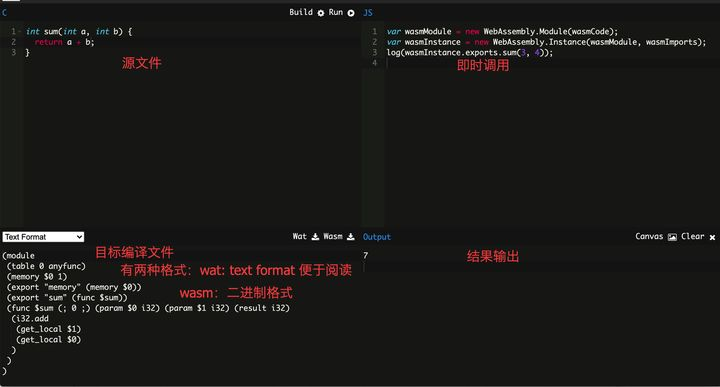

## 移除了 Node.js Polyfill

将会导致一些包变得不可用

Q: 使用 process.evn 报错 process is not defined

A: 如果需要兼容 process 等 Nodejs Polyfill，则要安装相关的 Polyfill：process，并在 Plugin 中显式声明注入

```shell
npm install --save-dev process
```

```js
module.exports = {
    plugins: [
        new webpack.ProvidePlugin({
          process: 'process/browser',
        }),
    ]
}
```

## 内置 WebAssembly 编译及异步加载能力（sync/async）

WebAssembly：

- 被设计为一种面向 web 的二进制的格式文件

- 更接近于机器码而拥有着**更小**的文件体积和**更快速**的执行效率

c/c++ 等高级语言都能直接编译成 .wasm 文件而被 js 调用

可以在 [WasmFiddle](https://wasdk.github.io/WasmFiddle/) 这个在线网站上编写 c/c++ 直接转换为 WebAssembly

 

webpack4 中需要使用 wasm-loader 来进行 WebAssembly 文件的处理，且操作繁琐：

```js
import wasm from '/program.wasm';

wasm().then(instance => {
  const sum = instance.exports.sum;
  console.log(sum(1, 2));
}
```

webpack5 内置了 WebAssembly 构建能力

```js
module.exports = {
    experiments: {
        asyncWebAssembly: true,
    },
    module: {
        rules: [
            {
                test: /\.wasm$/,
                type: 'webassembly/async',
            },
        ],
    },
}
```

```js
// index.js
import { sum } from './program.wasm';
console.log(sum(10, 20));
```

## Web Worker

### 回顾

为 JavaScript 创造多线程环境，允许主线程创建 Worker 线程，将一些任务分配给后者运行

在主线程运行的同时，Worker 线程在后台运行，两者互不干扰

等到 Worker 线程完成计算任务，再把结果返回给主线程

### 优势

一些计算密集型或高延迟的任务，被 Worker 线程负担了，主线程（通常负责 UI 交互）就会很流畅，不会被阻塞或拖慢

### 同源限制

分配给 Worker 线程运行的脚本文件，必须与主线程的脚本文件同源

### 限制

Worker 线程所在的全局对象与主线程不同

无法读取：

- DOM 对象

无法使用：

- document

- window

- parent 等

- alert、confirm

可以使用：

- navigator

- location

- XMLHttpRequest 发起请求

### 文件限制

Worker 线程无法读取本地文件，即不能打开本机的文件系统（file://），它所加载的脚本，必须来自网络

### Webpack 中使用

webpack4 中需要借助 worker-loader 来处理

```js
module.exports = {
    ...,
     module: {
        rules: [
            {
                test: /\.worker\.js$/,
                use: { loader: 'worker-loader' },
            },
        ],
    },
}
```

```js
//  calc.worker.js
let num;
for (let i = 0; i <= 20000000; i++) {
  if (i === 20000000) {
    num = 20000000;
  }
}
postMessage({
  value: num,
});

// index.js
import Worker from './calc.worker.js';
const worker = new Worker();
worker.onmessage = e => {
  console.log(e.data.value);
};
```

webpack5 内置 Web Worker 构建能力，不需要添加 loader 即可实现 worker 创建

```js
// index.js
const worker = new Worker(new URL('./calc.worker.js', import.meta.url), {
    name: 'calc'
    /* webpackEntryOptions: { filename: 'workers/[name].js' } */
});
worker.onmessage = e => {
  console.log('onmessage', e.data.value);
};
```

> 如果同时使用 worker-loader + webpack5 新特性，在 new URL() 中不能使用 .worker.js 命名文件，否则会优先被 worker-loader 解析而导致最终你的 worker 无法正常运行

