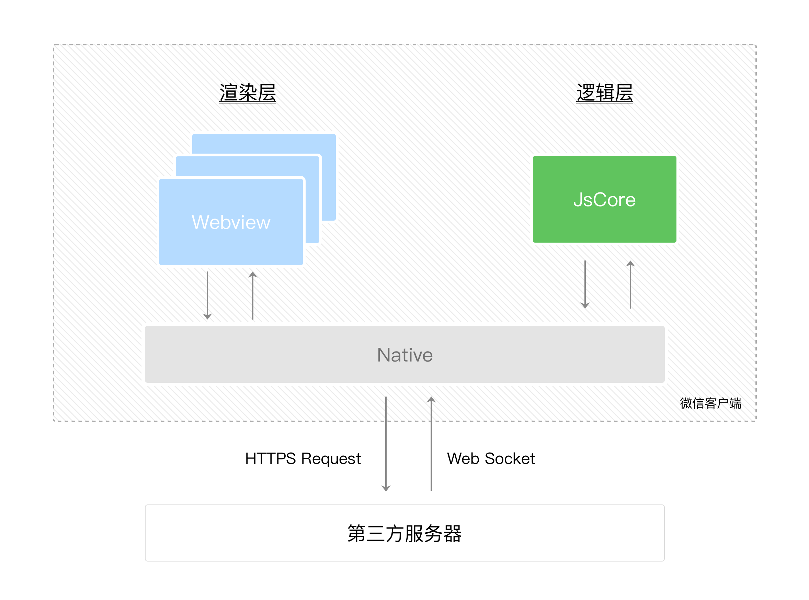

# 起步

## 小程序与 H5 开发内部差异

共同点：

- 使用 JavaScript 作为开发语言

不同点：

- 线程

    - H5 中渲染线程与脚本线程互斥（JS 执行长影响页面响应）
    - 小程序两线程是分开的，分别运行在不同的线程中

- DOM API

    - H5 可以使用浏览器暴露的 DOM、BOM API 等
    - 小程序逻辑层与渲染层分开，逻辑层在 JSCore，没有完整的浏览器对象，缺少相关 DOM、BOM API

- 第三方 Library

    - H5 可以使用一些第三方包，如 jQuery 和一些 npm 库

    - 小程序由于缺少 DOM 相关 API，导致如 jQuery 的 DOM 操作库无法使用，且 JSCore 与 NodeJS 环境也不尽相同，一些 npm 包也无法运行

- 环境

    - H5 在 PC 需要面对 IE、Chrome、QQ浏览器等，移动端需要面对 Safari、Chrome 以及 iOS、Android 系统中的各式 WebView
    - 小程序需要面对 3 大环境：iOS、Android、小程序开发者工具

| **运行环境**     | **逻辑层**     | **渲染层**       |
| ---------------- | -------------- | ---------------- |
| iOS              | JavaScriptCore | WKWebView        |
| 安卓             | V8             | chromium定制内核 |
| 小程序开发者工具 | NWJS           | Chrome WebView   |

> iOS 环境下的 `Promise` 是一个使用 `setTimeout` 模拟的 Polyfill，而非微任务

## 申请账号

[官网文档](https://developers.weixin.qq.com/miniprogram/dev/framework/quickstart/getstart.html#%E7%94%B3%E8%AF%B7%E5%B8%90%E5%8F%B7)

## 安装 Wechat DevTools + 新建项目

[官网文档](https://developers.weixin.qq.com/miniprogram/dev/framework/quickstart/getstart.html#%E5%AE%89%E8%A3%85%E5%BC%80%E5%8F%91%E5%B7%A5%E5%85%B7)

## VSCode 开发小程序

安装插件：

- WXML - Language Services: .wxml文件代码高亮，标签、属性的智能补全

## 小程序代码构成

### JSON

- app.json

小程序的全局配置

包括了小程序的所有页面路径、界面表现、网络超时时间、底部 tab 等

```json
{
	// 当前小程序所有页面路径
    "pages":[
        "pages/index/index",
        "pages/logs/logs"
    ],
    // 小程序所有页面的顶部背景颜色，文字颜色定义等
    "window":{
        "backgroundTextStyle":"light",
        "navigationBarBackgroundColor": "#fff",
        "navigationBarTitleText": "Weixin",
        "navigationBarTextStyle":"black"
    }
}
```

- project.config.json

工程配置，在开发者工具上的配置会被写入这个文件

换电脑后，只要载入同一个项目的代码包，开发者工具会自动恢复项目的这些个性化配置

- page.json

pages/logs 目录下 logs.json 这类配置

通常在 app.json 配置统一的风格，如蓝色顶部，当需要某个页面独自定制时，即可使用 app.json 独立配置

### WXML 模板

类似 Vue template 模板，编写页面结构组成

- 标签

不同于 HTML 的 `div`，`p`，`span`

小程序中的基础标签有 `view`，`button`，`text` 等

此外还提供了许多如地图、视频等组件

- 类似 Vue 的语法

提供了一些如 wx:if 的属性，{{}} 这样表达式，开发模式如同 Vue、React 的 **MVVM**

```html
<text>{{msg}}</text>
<button bindtap="clickMe">点击我</button>
```

```js
Page({
  clickMe: function() {
    this.setData({ msg: "Hello World" })
  }
})
```

### WXSS 样式

`wxss` 具有 `CSS` 大部分的特性，小程序在 `WXSS` 也做了一些扩充和修改

- 新增了尺寸

新的尺寸单位 rpx，750rpx 即设计稿得 750 满宽

> 由于换算采用的浮点数运算，所以运算结果会和预期结果有一点点偏差

- 全局样式、局部样式

与 app.json、page.json 的关系相同

可以实现一个 app.wxss 作为全局样式，页面里的 page.wxss 为局部样式

- 仅支持部分 CSS 选择器

## 小程序环境层与线程

小程序的运行环境分为：

- 渲染层（WXML + WXSS）
- 逻辑层（JS）

渲染层、逻辑层分别的由 2 个线程管理：

- 渲染层采用 WebView 线程做渲染（一个小程序存在多个页面，所以渲染层存在多个 WebView 线程）
- 渲染层采用 JsCore 线程运行 JS 脚本

2 个线程经过微信 Native 客户端做中转，逻辑层发送网络请求也经由 Native 转发



## 程序如何生成页面

- 微信客户端打开小程序前，会把整个代码包下到本地
- 解析 app.json pages 字段，配置的第一个页面为小程序首页，客户端开始装载首页代码
- app.ts 定义 App 实例（整个小程序就一个 App 实例，全页面共享）将会触发 onLaunch（监听小程序初始化） 回调
- 解析首页目录，如 pages/logs，先根据 log.json 配置生成一个界面（顶部颜色、字体等）
- 装载这个页面的 WXML 结构、WXSS 样式
- 装载 logs.ts，将 data 数据与 WXML 渲染出最终结构
- 触发页面实例的 onLoad 回调

## 组件与 API

### 组件

小程序提供了丰富的基础组件给开发者

如地图组件

```html
<map class="userinfo-map" style="width: 200rpx; height: 200rpx;" bindmarkertap="markertap" longitude="广州经度" latitude="广州纬度"></map>
```

[更多组件](https://developers.weixin.qq.com/miniprogram/dev/component/)

### API

小程序提供了许多 API 给开发者去使用，例如：

- 获取用户信息
- 微信支付
- 扫一扫

```ts
// 扫一扫
wx.scanCode({
  success: (res) => {
    console.log(res)
  }
})
```

[更多 API](https://developers.weixin.qq.com/miniprogram/dev/framework/app-service/api.html)

## 版本发布

- 开发版本：使用开发者工具，可将代码上传到开发版本中。 开发版本**只保留每人最新的一份上传的代码**（每个开发者拥有自己对应的一个开发版本，一个开发人员每次提交后会覆盖自己之前的开发版，可以考虑利用这个特点分环境？）。 点击提交审核，可将代码提交审核。开发版本可删除，不影响线上版本和审核中版本的代码
- 体验版本：可以选择**某个开发版本作为体验版**，并且选取一份体验版
- 审核中版本：只能有一份代码处于审核中。有审核结果后可以发布到线上，也可直接重新提交审核，覆盖原审核版本
- 线上版本：线上所有用户使用的代码版本，该版本代码在新版本代码发布后被覆盖更新

### 预览

- 开发者工具预览按钮

- 自动打包当前项目
- 自动上传小程序到微信服务器
- 成功后显示二维码
- 开发者微信扫码

### 上传

- 开发者工具上传按钮
- 填写版本号、备注
- 上传成功后，在 [小程序管理后台](https://mp.weixin.qq.com/wxamp/home/guide?lang=zh_CN&token=398126521) 的**管理 - 版本管理 - 开发管理**可以查看到刚提交的代码
- 可以选择一个版本设置为体验版

以下文件会经过编译，因此上传之后无法直接访问到：

.js、app.json、.wxml、.wxss（其中 wxml 和 wxss 文件仅针对在 app.json 中配置了的页面）

此外，只有后缀在白名单的才可以被上传，白名单列表：

1. wxs
2. png
3. jpg
4. jpeg
5. gif
6. svg
7. json
8. cer
9. mp3
10. aac
11. m4a
12. mp4
13. wav
14. ogg
15. silk
16. wasm
17. br

### 提交审核

在 [小程序管理后台](https://mp.weixin.qq.com/wxamp/home/guide?lang=zh_CN&token=398126521) 的**管理 - 版本管理 - 开发管理**的开发版本列表中，点击提交审核

> 开发者严格测试版本才可提交审核，过多的审核不通过可能影响后续时间

