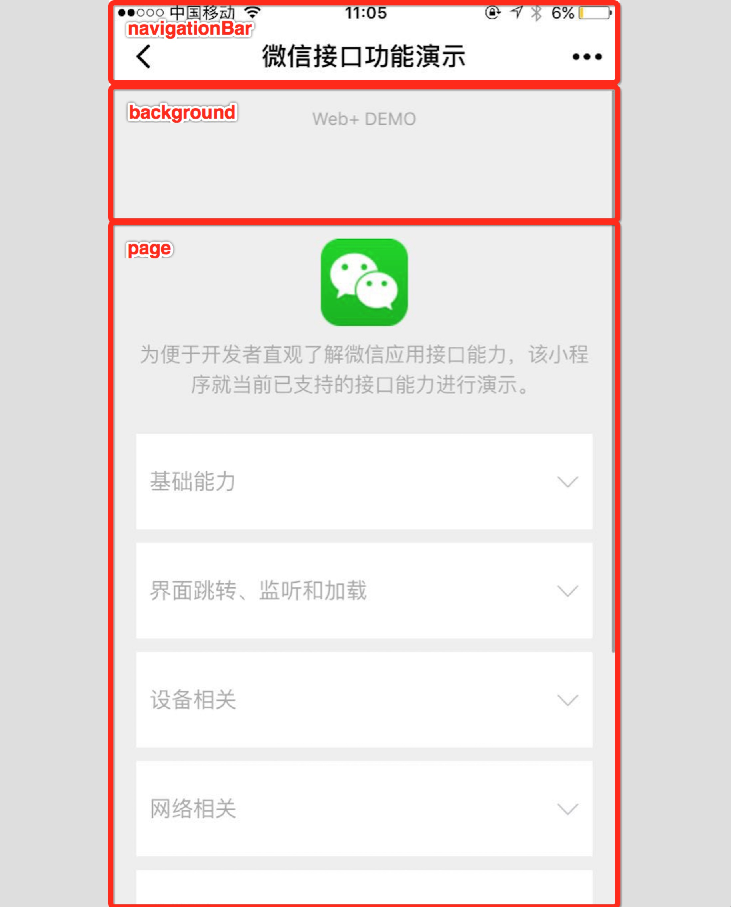
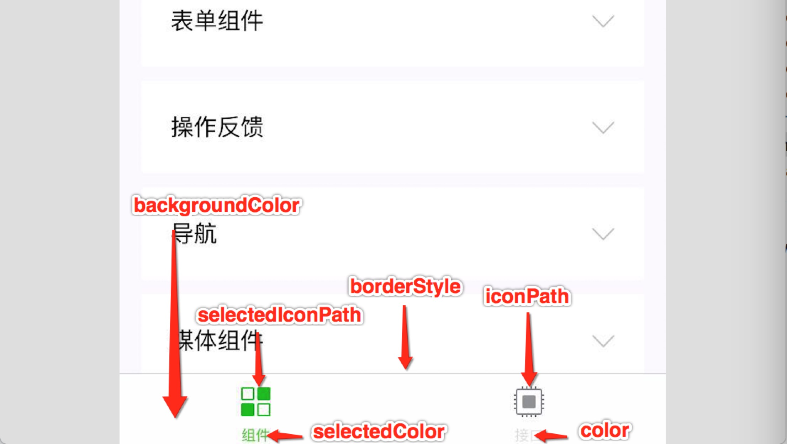

# 配置小程序

## 全局配置

根目录下的 `app.json` 文件对小程序进行全局配置

- 页面文件路径
- 窗口表现
- 网络超时时间
- ...

[完整配置](https://developers.weixin.qq.com/miniprogram/dev/reference/configuration/app.html)

### entryPagePath、pages

默认显示的首页，没有配置会取 pages 里的第一项作为首页

```json
{
    "entryPagePath": "pages/logs/logs",
    "pages": [
        "pages/index/index",
        "pages/logs/logs"
    ],
}
```

### window

全局的默认窗口表现

> 小程序里颜色尽量都用十六进制，有些类型没有特别标注十六进制的，配置如 'yellow' 等颜色没有报错但会无效

- navigationBarBackgroundColor：Nav 导航的背景色，需要是十六进制如 #fff
- navigationBarTextStyle：Nav 导航的字体色
- navigationBarTitleText：Nav 的标题文本
- navigationStyle：`enum('default', 'custom')`，'custom' 时即自定义导航栏，只保留右上角胶囊按钮，具体兼容差异见[文档](https://developers.weixin.qq.com/miniprogram/dev/reference/configuration/app.html#window)
- backgroundColor：窗口背景色，在 iOS 橡皮筋效果拖动可以看到
- backgroundTextStyle：`enum('dark', 'light')`，下拉 loading 的样式，配置 `enablePullDownRefresh` 为 true 后可以看到加载图标的色调差异
- backgroundColorTop：顶部窗口背景色，仅 iOS 支持，iOS 橡皮筋效果拖动可以看到
- backgroundColorBottom：底部窗口背景色，仅 iOS 支持，iOS 橡皮筋效果拖动可以看到
- enablePullDownRefresh：是否开启全局的下拉刷新
- onReachBottomDistance：页面上拉触底事件触发时距页面底部距离，单位为 px
- pageOrientation：`enum('portrait', 'landscape', 'auto')`，屏幕旋转设置（自动、竖屏、横屏）
- visualEffectInBackground：`enum('none', 'hidden')`，切入系统后台时，隐藏页面内容，保护用户隐私



### tabBar

客户端底部或顶部的 tab 选项卡

```json
{
    "tabBar": {
        "list": [
            {"pagePath": "pages/index/index", "text": "首页"},
            {"pagePath": "pages/logs/logs", "text": "日志"}
        ]
    },
}
```

- color：tab 上的文字默认颜色，仅支持十六进制颜色
- selectedColor：tab 上的文字选中时的颜色，仅支持十六进制颜色
- backgroundColor：tab 的背景色，仅支持十六进制颜色
- borderStyle：`enum('black', 'white')`，tabBar 上边框的颜色
- position：`enum('bottom', 'top')`，tabBar 的位置
- custom：默认 false，自定义 tabBar，详情独立章节
- list：tab 的列表，Array，只能配置最少 2 个、最多 5 个 tab，每个项都是一个对象
  - pagePath：页面路径，必须在 pages 中先定义
  - text：tab 上按钮文字
  - iconPath：图片路径，icon 大小限制为 40kb，建议尺寸为 81px * 81px，不支持网络图片。**当 `position` 为 `top` 时，不显示 icon**
  - selectedIconPath：选中时的图片路径，icon 大小限制为 40kb，建议尺寸为 81px * 81px，不支持网络图片。**当 `position` 为 `top` 时，不显示 icon**



### networkTimeout

网络请求的超时时间，单位 ms

- request：默认 60000，[wx.request](https://developers.weixin.qq.com/miniprogram/dev/api/network/request/wx.request.html) 的超时时间
- connectSocket：默认 60000，[wx.connectSocket](https://developers.weixin.qq.com/miniprogram/dev/api/network/websocket/wx.connectSocket.html) 的超时时间
- uploadFile：默认 60000，[wx.uploadFile](https://developers.weixin.qq.com/miniprogram/dev/api/network/upload/wx.uploadFile.html) 的超时时间
- downloadFile：默认 60000，[wx.downloadFile](https://developers.weixin.qq.com/miniprogram/dev/api/network/download/wx.downloadFile.html) 的超时时间

### debug

可在开发者工具开启 `debug` 模式，控制台面板调试信息以 `info` 形式给出

信息包含：Page 的注册，页面路由，数据更新，事件触发等

默认 false

### functionalPages

是否启用插件功能页，默认关闭

```json
{
    // 旧版是 "functionalPages": true，未来将移除
    "functionalPages": {
        "independent": true
    }
}
```

### subpackages

启用[分包加载](https://developers.weixin.qq.com/miniprogram/dev/framework/subpackages.html)时，声明项目分包结构

小程序**按需加载**的一个方案

### workers

使用 [Worker](https://developers.weixin.qq.com/miniprogram/dev/framework/workers.html) 处理多线程任务时，设置 `Worker` 代码放置的目录

### requiredBackgroundModes

申明需要在后台使用的能力，如「音乐播放」，目前支持以下项目：

- `audio`: 后台音乐播放
- `location`: 后台定位

```json
{
    "pages": ["pages/index/index"],
    "requiredBackgroundModes": ["audio", "location"]
}
```

> 在此处申明了后台运行的接口，开发版和体验版上可以直接生效，正式版还需通过审核

### plugins

声明小程序需要使用的[插件](https://developers.weixin.qq.com/miniprogram/dev/framework/plugin/using.html)

### preloadRule

声明[分包预下载](https://developers.weixin.qq.com/miniprogram/dev/framework/subpackages/preload.html)的规则

### resizable

在 iPad 上运行的小程序可以设置支持[屏幕旋转](https://developers.weixin.qq.com/miniprogram/dev/framework/view/resizable.html)。

在 PC 上运行的小程序，用户可以按照任意比例拖动窗口大小，也可以在小程序菜单中最大化窗口

### usingComponents

声明**全局自定义组件**

### permission

小程序[接口权限](https://developers.weixin.qq.com/miniprogram/dev/framework/open-ability/authorize.html)相关设置。字段类型为 `Object`

- scope.userLocation：位置相关权限声明
  - desc：小程序获取权限时展示的接口用途说明。最长 30 个字符

```json
{
    "pages": ["pages/index/index"],
    "permission": {
        "scope.userLocation": {
            "desc": "你的位置信息将用于小程序位置接口的效果展示" // 高速公路行驶持续后台定位
        }
    }
}
```


### sitemapLocation

指明 [sitemap.json](https://developers.weixin.qq.com/miniprogram/dev/reference/configuration/sitemap.html) 的位置

默认为 'sitemap.json' 即在 app.json 同级目录下名字的 `sitemap.json` 文件

### style

指定使用升级后的weui样式

> 微信客户端 7.0 开始，UI 界面进行了大改版。小程序也进行了基础组件的样式升级。app.json 中配置 `"style": "v2"`可表明启用新版的组件样式

### useExtendedLib

指定需要引用的扩展库：

- `kbone`: [多端开发框架](https://developers.weixin.qq.com/miniprogram/dev/extended/kbone/)
- `weui`: [WeUI 组件库](https://developers.weixin.qq.com/miniprogram/dev/extended/weui/)

指定后，相当于引入了对应扩展库相关的最新版本的 npm 包，同时也不占用小程序的包体积，rc工具版本支持分包引用

```json
{
    "useExtendedLib": {
        "kbone": true,
        "weui": true
    }
}
```

### entranceDeclare

> 微信客户端 7.0.9 及以上版本支持，iOS 暂不支持

聊天位置消息用打车类小程序打开，[详情参考](https://developers.weixin.qq.com/miniprogram/dev/framework/open-ability/location-message.html)

### darkmode

表示当前小程序可适配 DarkMode，所有基础组件均会根据系统主题展示不同的默认样式，navigation bar 和 tab bar 也会根据开发者的配置自动切换

配置后，请根据 [DarkMode 适配指南](https://developers.weixin.qq.com/miniprogram/dev/framework/ability/darkmode.html) 自行完成基础样式以外的适配工作

```json
{
  "darkmode": true
}
```

### themeLocation

自定义 [theme.json](https://developers.weixin.qq.com/miniprogram/dev/framework/ability/darkmode.html#变量配置文件-theme-json) 的路径，当配置`"darkmode":true`时，当前配置文件为必填项

```json
{
  "themeLocation": "/path/to/theme.json"
}
```

### lazyCodeLoading

类似异步组件

目前仅支持值 `requiredComponents`，代表开启小程序[「按需注入」](https://developers.weixin.qq.com/miniprogram/dev/framework/ability/lazyload.html#按需注入)特性

```json
{
  "lazyCodeLoading": "requiredComponents"
}
```

### singlePage

目前分享到朋友圈 (Beta) 后打开会进入单页模式

- navigationBarFit：默认自动调整，若原页面是自定义导航栏，则为 float，否则为 squeezed
  - float：导航栏浮在页面上，与页面相交
  - squeezed：页面被导航栏挤压，与页面不相交

### restartStrategy

[重新启动策略](https://developers.weixin.qq.com/miniprogram/dev/framework/runtime/operating-mechanism.html#_2-1-重新启动策略)配置

启动类型：

- 冷启动：从未打开过小程序或者打开过小程序但是已经被销毁了，这种情况下打开就是冷启动
- 热启动：此前使用过小程序且小程序没有被销毁，这种情况再打开小程序就是热启动

配置可选：

- homePage：（默认值）如果从这个页面退出小程序，下次将从首页冷启动
- homePageAndLatestPage：如果从这个页面退出小程序，下次冷启动后立刻加载这个页面，页面的参数保持不变（不可用于 tab 页）

## 页面配置

每个页面都有独立的 json 文件定制独立配置，覆盖 app.json 中的全局配置

页面有以下配置（与全局配置相同，描述略）：

- disableScroll：设置为 `true` 则页面整体不能上下滚动，只在页面配置中有效
- initialRenderingCache：页面[初始渲染缓存](https://developers.weixin.qq.com/miniprogram/dev/framework/view/initial-rendering-cache.html)配置
- navigationBarBackgroundColor
- navigationBarTextStyle
- navigationBarTitleText
- navigationStyle
- backgroundColor
- backgroundTextStyle
- backgroundColorTop
- backgroundColorBottom
- enablePullDownRefresh
- onReachBottomDistance
- pageOrientation
- usingComponents
- style
- singlePage
- restartStrategy

## sitemap 配置

配置小程序页面是否允许微信索引：

- 通过 `sitemap.json` 配置
- 或者管理后台页面收录开关（功能 - 页面内容接入 - 基础设置 - 页面收录）

当允许微信索引时，微信会通过爬虫的形式为小程序的页面内容建立索引

当用户的搜索词条触发该索引时，小程序的页面将可能展示在搜索结果中

爬虫访问小程序页面时，会携带特定的 user-agent：`mpcrawler` 及[场景值](https://developers.weixin.qq.com/miniprogram/dev/reference/scene-list.html)：`1129`

### 调试

> `sitemap` 的索引提示是默认开启的，如需要关闭 `sitemap` 的索引提示，可在小程序项目配置文件 `project.config.json` 的 `setting` 中配置字段 `checkSiteMap` 为 `false`

可在开发者工具控制台上显示当前页面是否被索引的调试信息

### 配置项

- rules：索引规则列表
  - action：`enum('allow', 'disallow')`，命中该规则的页面是否能被索引
  - page：`*` 表示所有页面，不能作为通配符使用
  - params：page 指定页面在规则匹配时使用的参数列表
  - matching：page 指定页面在规则匹配时，说明 params 匹配方式，默认 'inclusive'
    - inclusive：默认值，当小程序页面的参数列表包含 params 时，规则命中
    - exact：当小程序页面的参数列表等于 params 时，规则命中
    - exclusive：当小程序页面的参数列表与 params 交集为空时，规则命中
    - partial：当小程序页面的参数列表与 params 交集不为空时，规则命中
  - priority：优先级，值越大则规则越早被匹配，否则默认从上到下匹配

### 示例

```json
{
    "rules":[{
        "action": "allow",
        "page": "pages/logs/logs",
        "params": ["a", "b"],
        "matching": "inclusive"
    }, {
        "action": "disallow",
        "page": "pages/logs/logs"
    }]
}
```

- pages/logs/logs?a=1&b=2 => 优先检索
- pages/logs/logs?a=1&b=2&c=3 => 优先检索
- pages/logs/logs => 不被检索
- pages/logs/logs?a=1 => 优先检索
- 其他页面都会被索引