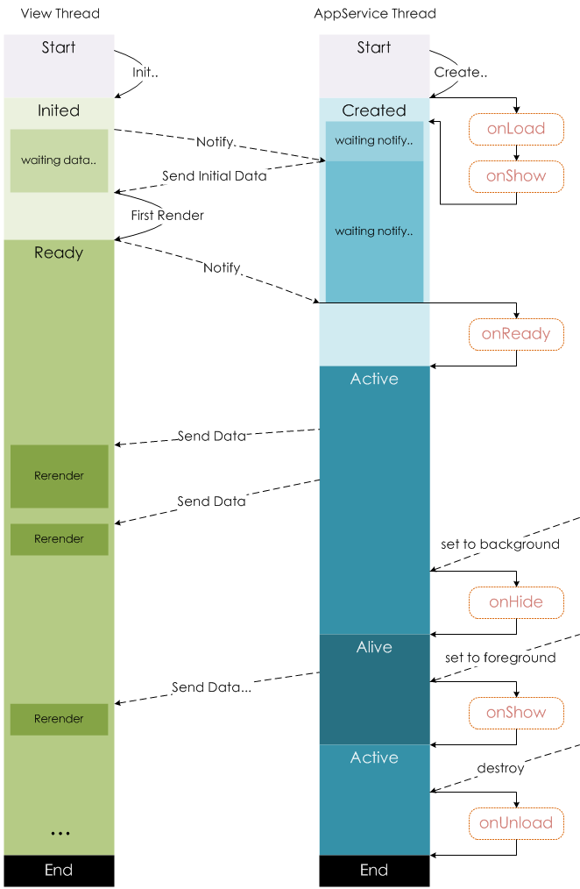

## 生命周期图解



## 路由管理

小程序中所有页面的路由全部由框架进行管理

### 页面路由栈表现

当发生路由切换的时候，页面栈的表现如下：

| 路由方式   | 页面栈表现                        |
| :--------- | :-------------------------------- |
| 初始化     | 新页面入栈                        |
| 打开新页面 | 新页面入栈                        |
| 页面重定向 | 当前页面出栈，新页面入栈          |
| 页面返回   | 页面不断出栈，直到目标返回页      |
| Tab 切换   | 页面全部出栈，只留下新的 Tab 页面 |
| 重加载     | 页面全部出栈，只留下新的页面      |

### 获取当前页面栈

开发者可以使用 `getCurrentPages()` 函数获取当前页面栈

### 路由触发与生命周期

[官方具体示例](https://developers.weixin.qq.com/miniprogram/dev/framework/app-service/route.html)

## API 分类

小程序提供了丰富的微信原生 API，详细介绍请参考 [API 文档](https://developers.weixin.qq.com/miniprogram/dev/api/index.html)

这些 API 一般分为几个类型：

### 事件监听 API

以 `on` 开头的 API 用来监听某个事件是否触发

```js
wx.onCompassChange(function (res) {
    console.log(res.direction);
});
```

### 同步 API

以 `Sync` 结尾的 API 都是同步 API，此外，也有一些其他的同步 API 没有带 Sync 结尾

```js
try {
    // 通过函数返回值直接获取，如果执行出错会抛出异常
    wx.setStorageSync('key', 'value');
} catch (e) {
  	console.error(e);
}
```

### 异步 API

这类 API 接口通常都接受一个 `Object` 类型的参数，通常都有如下约定：

- success：成功回调
- fail：失败回调
- complete：接口调用结束的回调，相当于 Promise 的 finally，成功失败都会走

`success`，`fail`，`complete` 函数调用时会传入一个 `Object` 类型参数，包含以下字段：

- errMsg：错误信息，如果调用成功返回 `${apiName}:ok`
- errCode：错误码，仅部分 API 支持，具体含义请参考对应 API 文档，成功时为 `0`

```js
wx.login({
    success(res) {
        console.log(res.code);
    }
});
```

> 部分异步 API 也会有返回值，可以用来实现更丰富的功能，如 [wx.request](https://developers.weixin.qq.com/miniprogram/dev/api/network/request/wx.request.html)，[wx.connectSocket](https://developers.weixin.qq.com/miniprogram/dev/api/network/websocket/wx.connectSocket.html) 等

### 异步 Promise API

基础库 [2.10.2](https://developers.weixin.qq.com/miniprogram/dev/framework/compatibility.html) 版本起，异步 API 支持 callback & promise 两种调用方式。当接口参数 Object 对象中不包含 success/fail/complete 时将默认返回 promise，否则仍按回调方式执行，无返回值

```js
// callback 形式调用
wx.chooseImage({
    success(res) {
        console.log('res:', res);
    }
});

// promise 形式调用
wx.chooseImage().then(res => console.log('res: ', res));
```

注：

- 部分接口如 `downloadFile`, `request`, `uploadFile`, `connectSocket`, `createCamera`（小游戏）本身就有返回值， 它们的 promisify 需要开发者自行封装
- 当没有回调参数时，异步接口返回 promise。此时若函数调用失败进入 fail 逻辑， 会报错提示 `Uncaught (in promise)`，开发者可通过 catch 来进行捕获
- [wx.onUnhandledRejection](https://developers.weixin.qq.com/miniprogram/dev/api/base/app/app-event/wx.onUnhandledRejection.html) 可以监听未处理的 Promise 拒绝事件
