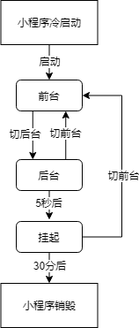

## 动画

### 基本动画形式

小程序的简易动画与 H5 类似：

- CSS transition
- CSS animation

动画过程中，可以监听动画事件：

- transitionend：CSS 渐变结束或 [wx.createAnimation](https://developers.weixin.qq.com/miniprogram/dev/api/ui/animation/wx.createAnimation.html) 结束一个阶段
- animationstart：CSS 动画开始
- animationiteration：CSS 动画结束一个阶段（如 animation 循环了 3 次，每次结束都会触发一次回调）
- animationend：CSS 动画结束（如 animation 循环了 3 次，最后完全结束才会触发一次回调，infinite 则不会触发）

### 关键帧动画

小程序在基础库 [2.9.0](https://developers.weixin.qq.com/miniprogram/dev/framework/compatibility.html) 前使用 [wx.createAnimation](https://developers.weixin.qq.com/miniprogram/dev/api/ui/animation/wx.createAnimation.html) 创建动画

新版使用 `this.animate` 接口：

```ts
this.animate(selector, keyframes, duration, callback)
```

[动画帧 API](https://developers.weixin.qq.com/miniprogram/dev/framework/view/animation.html)

示例：

```ts
this.animate(
    '.animation-wrap', 
    [
        { offset: 0, opacity: 1, rotate: 0, backgroundColor: 'pink' },
        { offset: 0.5, opacity: 0.5, rotate: 45, backgroundColor: 'skyblue' },
        { offset: 1, opacity: 0.0, rotate: 90, backgroundColor: 'yellowgreen' },
    ],
    2000,
    () => {
        // 不一定比 transitionend 晚触发，可以会在最后的多个 transitionend 之间
        console.log('animate end');
    }
);
```

执行后：

- 先在 1s 的时候触发 3 次 `transitionend`
- 在 2s 时触发 3 次 `transitionend`
- 在 2s 时打印 'animate end'

原因：

- 每个动画帧是独立的，且动画属性信息的行为也是独立的
- 在 offset 0 => 0.5 之间触发了一次动画，且 opacity、rotate、backgroundColor 是独立的，触发了前 3 个 `transitionend`
- 在 offset 0.5 => 1 之间触发了第二次动画，同理触发后 3 个 `transitionend`

> 注：'animate end' 不一定比 `transitionend` 早触发，可能在最后动画结束的多个 `transitionend` 之间

通过审查元素可以看到，animate API 是将样式作用到元素的 `style` 上

小程序还提供了 `clearAnimation` 方法清空这些样式（清空的是动画加上去的，原本在 `style` 上的样式不影响）：

```ts
this.animate(
    '.animation-wrap', 
    [
        { offset: 0, opacity: 1, rotate: 0, backgroundColor: 'pink' },
        { offset: 0.5, opacity: 0.5, rotate: 45, backgroundColor: 'skyblue' },
        { offset: 1, opacity: 0.0, rotate: 90, backgroundColor: 'yellowgreen' },
    ],
    2000,
    () => {
        // 示例一：没传第二个指定参数，表示清空全部 style 样式
        /* this.clearAnimation('.animation-wrap', () => {
          console.log('clear animate success');
        }); */
        
        // 示例二：清空 rotate 的 style 样式
        this.clearAnimation('.animation-wrap', { rotate: true }, () => {
          console.log('clear animate success');
        });
    }
);
```

### 滚动驱动动画

有时我们需要在容器滚动时页面上的某些元素跟随做相应的动画，例如 sticky 滚动吸顶布局等

小程序在关键帧的 `this.animate` 方法新增了 `ScrollTimeline` 的参数绑定滚动元素（目前只支持 scroll-view）

```javascript
this.animate(selector, keyframes, duration, ScrollTimeline)
```

示例，滚动时头像大小缩放：

```html
<scroll-view id="scroller" scroll-y throttle="{{false}}">
    <view class="avatar" />
</scroll-view>
```

```ts
Page({
    onReady() {
        this.animate('.avatar', [{
            borderRadius: '0',
            borderColor: 'red',
            transform: 'scale(1) translateY(-20px)',
            offset: 0,
        }, {
            borderRadius: '25%',
            borderColor: 'blue',
            transform: 'scale(.65) translateY(-20px)',
            offset: .5,
        }, {
            borderRadius: '50%',
            borderColor: 'blue',
            transform: `scale(.3) translateY(-20px)`,
            offset: 1
        }], 2000, {
            scrollSource: '#scroller',
            timeRange: 2000, // 与 duration 相同即可，代表起始和结束的滚动范围映射的时间长度
            startScrollOffset: 0, // 从 scroll-view 滚动 0 的位置开始
            endScrollOffset: 85, // 从 scroll-view 滚动 85 的位置开始
        });
    },
});
```

### 高级动画

复杂的场景，可以参考 [WXS 响应事件](https://developers.weixin.qq.com/miniprogram/dev/framework/view/interactive-animation.html) 的方式

## 初始渲染缓存

小程序初始化：

- 逻辑层初始化：载入必要代码，初始化页面 this 对象，将相关数据发送给视图层
- 视图层初始化：载入必要代码，等逻辑层初始化结束接收数据完成最后渲染页面

冷启动时，这个初始化过程较长，可能会给用户白屏体验

### 初始化渲染缓存原理

使视图层不需要等待逻辑层初始化完成，提前将页面初始 data 的渲染结果展示给用户

原理：

- 第一次打开后，将页面初始数据渲染结果记录下来写入持久化缓存区域（小程序更新、基础库更新、储存空间回收等原因会被清除）
- 第二次打开后，检查缓存是否存在上一次初始渲染结果，有则直接展示
- 若展示了缓存结果，等到逻辑层初始化完毕后才能响应用户事件

应用：

- 永不变的部分，如 Nav
- 骨架屏
- loading 加载提示
- 提取展示动态广告

### 支持的组件

在初始渲染缓存阶段中，复杂组件不能被展示或不能响应交互

目前支持的组件：

- `<view />`
- `<text />`
- `<button />`
- `<image />`
- `<scroll-view />`
- `<rich-text />`
- 自定义组件（其内置组件也遵循上述）

### 静态初始化缓存

独立页面在 [page].json 开启：

```json
{
    "initialRenderingCache": "static"
}
```

所有页面在 app.json 开启：

```json
{
    "window": {
        "initialRenderingCache": "static"
    }
}
```

例如，如果想要在页面中展示出“正在加载”几个字，这几个字受到 `loading` 数据字段控制：

```html
<view wx:if="{{loading}}">正在加载</view>
```

```js
// 正确的做法
Page({
    data: {
        loading: true
    }
});
// 错误的做法
Page({
    data: {},
    onLoad: function() {
        // 不能通过 setData
        this.setData({
            loading: true
        })
    }
});
```

### 动态初始化缓存

有时想展示额外可变的内容，如广告图片等

这时就可以配置 “动态” 的方式：

```json
{
    "initialRenderingCache": "dynamic"
}
```

配置后初始化存在不会自动启动，而需要调用 `this.setInitialRenderingCache(dynamicData)` 手动启用：

```js
Page({
    data: {
        loading: true
    },
    onReady: function() {
        this.setInitialRenderingCache({
            loadingHint: '正在加载' // 这一部分数据将被应用于界面上，相当于在初始 data 基础上额外进行一次 setData
        })
    }
});
```

```html
<view wx:if="{{loading}}">{{loadingHint}}</view>
```

注：

- 用时机不能早于 `Page` 的 `onReady` 或 `Component` 的 `ready` 生命周期
- 想禁用初始渲染缓存，调用 `this.setInitialRenderingCache(null)`

## 小程序运行机制

### 小程序生命周期



### 小程序启动

- 冷启动：如果用户首次打开，或小程序销毁后被用户再次打开，此时小程序需要重新加载启动，即冷启动。
- 热启动：如果用户已经打开过某小程序，然后在一定时间内再次打开该小程序，此时小程序并未被销毁，只是从后台状态进入前台状态，这个过程就是热启动

### 前台、后台、挂起、销毁

- 前台：界面被展示给用户

- 后台：未完全关闭小程序，而是进入了「**后台**」状态，此时小程序还可以短暂运行一小段时间，但部分 API 的使用会收到限制

  - 点击右上角胶囊按钮离开小程序
  - iOS 从屏幕左侧右滑离开小程序
  - 安卓点击返回键离开小程序
  - 小程序前台运行时直接把微信切后台（手势或 Home 键）
  - 小程序前台运行时直接锁屏
  - 其他 ...

- 挂起：小程序进入「后台」状态一段时间后（目前是 5 秒），微信会**停止小程序 JS 线程的执行**

  > 当使用了 [后台音乐播放](https://developers.weixin.qq.com/miniprogram/dev/api/media/background-audio/wx.getBackgroundAudioManager.html)、[后台地理位置](https://developers.weixin.qq.com/miniprogram/dev/api/location/wx.startLocationUpdateBackground.html) 等能力时，小程序可以在「后台」持续运行，不会挂起

- 销毁：

  - 进入后台，并被挂起，很长事件（目前 30 分钟）未回到前台
  - 占用系统资源过高，可能被主动回收

### 重新启动策略

默认冷启动场景：

- （A 类）启动的场景中不带 path，默认进入首页
- （B 类）启动的场景中带有 path，则启动进入对应 path 的页面

对于 A 类场景，可以指定 `restartStrategy` 配置项改变默认行为，使得下次冷启动可以回到原页面：

```json
{
    "restartStrategy": "homePage"
}
```

配置可选：

- homePage：（默认值）如果从这个页面退出小程序，下次将从首页冷启动

- homePageAndLatestPage：如果从这个页面退出小程序，下次冷启动后立刻加载这个页面，页面的参数保持不变（不可用于 tab 页）

  > 退出过久（见下方**退出状态**的超时时长，默认 1 天），下次冷启动也会从首页开始

  > 特殊场景，如微信客户端直接被系统杀进程，这个策略也会失效，下次冷启动也会从首页开始

### 保存退出状态

当小程序可能被销毁前，页面回调函数 `onSaveExitState` 会被调用

可以利用这个回调保存一些状态，下次启动通过 `exitState` 获得这些数据

```json
{
    "restartStrategy": "homePageAndLatestPage"
}
```

```js
Page({
    onLoad: function() {
        var prevExitState = this.exitState // 尝试获得上一次退出前 onSaveExitState 保存的数据
        if (prevExitState !== undefined) { // 如果是根据 restartStrategy 配置进行的冷启动，就可以获取到
            prevExitState.myDataField === 'myData' 
        }
    },
    onSaveExitState: function() {
        var exitState = { myDataField: 'myData' } // 需要保存的数据
        return {
            data: exitState,
            expireTimeStamp: Date.now() + 24 * 60 * 60 * 1000 // 超时时刻
        }
    }
});
```

注：

- 超过 `expireTimeStamp` 时长保存的数据会被丢弃（上述有提到，超过时限 `homePageAndLatestPage` 会失效）
- `expireTimeStamp` 在微信客户端清理数据时可能被提前
- 微信客户端被系统**杀进程**，`onSaveExitState` 则不会被调用

## 更新机制

小程序每次**冷启动**时：

- 检查是否有更新版本
- 如果发现有新版本，将会异步下载新版本的代码包，并同时用客户端本地的包进行启动

这意味着**新的版本要下一次冷启动才生效**

如果需要马上使用新版本，可以使用 [wx.getUpdateManager](https://developers.weixin.qq.com/miniprogram/dev/api/base/update/wx.getUpdateManager.html) API 进行处理：

```js
const updateManager = wx.getUpdateManager()

updateManager.onCheckForUpdate(function (res) {
    // 请求完新版本信息的回调
    console.log(res.hasUpdate);
})

updateManager.onUpdateReady(function () {
    wx.showModal({
        title: '更新提示',
        content: '新版本已经准备好，是否重启应用？',
        success(res) {
            if (res.confirm) {
                // 新的版本已经下载好，调用 applyUpdate 应用新版本并重启
                updateManager.applyUpdate();
            }
        }
    });
});

updateManager.onUpdateFailed(function () {
    // 新版本下载失败
});
```

