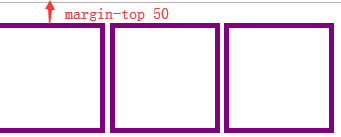
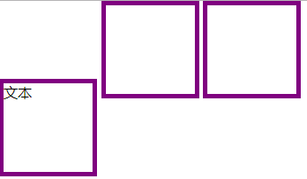

## overflow

- visible（默认值）

- hidden
    
    超出隐藏，经常用于触发BFC

- auto

    内容没有超出则等于visible，超出则scroll滚动条
    
- scroll

    不管有没有超出都有滚动条
    
- inherit
    
    继承父级的overflow（IE不支持）
    
- overflow-x、overflow-y

    水平、垂直方向
    
## 元素类型display

- block 块级元素

    基本特性：独占一行
    
    元素：div、h1-h6、p、ol、ul、li、dl、dt、dd ...
    
    宽高：width默认100%， 可以设置width、height
    
    外边距：默认支持margin
    
    内边距：默认支持padding
    
- inline 行内元素

    基本特性：不会独占一行，会被空格影响（多个空格算一个）
    
    元素：span、a、b、i、strong、em、img、input ...
    
    宽高：默认不可设置width、height
    
    外边距：默认支持水平margin-left/right，不支持margin-top/bottom（**特殊：img虽然算行内标签，但可以设置宽高，支持上下左右margin**），不支持margin: auto
    
    内边距：支持水平padding-left/right，不支持padding-top/bottom（**特殊：img支持上下左右padding**）

> &#9733; 贴士 

其实设置上下padding在视觉上会感觉好像把内容撑开了，其实并没有，也不会对其他元素造成影响

    span {
      padding: 10px;
    }
    .m1 {
      background-color: royalblue;
    }
    .m2{
      background-color: red;
    }
    
    
        padding-top/bottom
    
     
    
        padding-top/bottom
    
      

- inline-block 行内块元素

    基本特性：允许水平布局，同时支持宽高和上下margin、padding，也会有空格问题，需要设置font-size:0清除空格,不支持margin:auto
    
> &#9733; 贴士 
    
**小心使用inline-block**
    
1、基线问题一（一个margin带动整排）

    div {
      display: inline-block;
      width: 100px;
      height: 100px;
      border: 5px solid purple;
    }
    .first {
      margin-top: 20px; //只给第一个元素设置margin-top，其他却跟着往下走了
    }
    
    

      

      

      

2、基线问题二（文本下坠）

    div {
      display: inline-block;
      width: 100px;
      height: 100px;
      border: 5px solid purple;
    }
    
    
文本

    

    

    
 

(文字默认底基线对齐，本例中3个都有文本则会恢复原状)

- none 消失

从页面上直接消失，不占据文档流