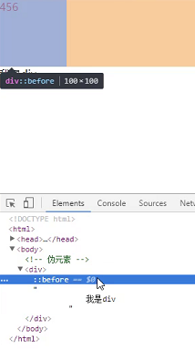

## 高级CSS选择器

### 子代选择器 >
  
    // 兼容性：>= IE7
    
    // #wrap的子元素a，不包括子元素的子元素，只有一层级。
    #wrap > a {
        ....
    }
    
### 兄弟选择器 + 
    
    // 兼容性：>= IE7
    
    // 紧跟着p的span标签
    p + span {
        ...
    }
    
    
....

    ... 这个span有
    <a>....</a>
    ... 这个span无
    
    // 常用于给第2-n个（除了第一个）的li设置间距
    
    li + li {
        margin-top: 10px;
    }

### 属性选择器[attr]

拥有这个属性的元素(**低版本IE也兼容**)
    
    // 兼容性：>= IE7
    div[title] {
        ...
    }
    
    

    // 自定义标签也可以
    [customAttr] {
        ...
    }
    
    

    
### 属性选择器[attr=val]
    
    // 兼容性：>= IE7
    div[title='k'] {
            ...
        }
        
    

    
### 属性选择器[attr*=val]与[attr~=val]

属性**包含**val值
    
    // [attr~=val]兼容性：>= IE7 
    // [attr*=val]兼容性：>= IE8 （*=是CSS3的）
    
    div.box[title*='123'] {
        ...
    }
    
    

    

 // 满足
    

    
[attr*=val]与[attr~=val]区别：

[attr~=val]的包含是**独立的单词**，如：

    [title~=flower]
    可以匹配
    不可以匹配
    
[attr*=val]的包含是能找出这个val即可，上例2个都能被[title*=flower]匹配

### 属性选择器[attr|=val]与[attr^=val]

匹配属性以val开头
    
    // [attr|=val]兼容性：>= IE7 
    // [attr^=val]兼容性：>= IE8 （^=是CSS3的）
    
    [title|='en']
    
    
...

    
[attr|=val]与[attr^=val]区别：

[attr|=val]的以val开头，必须是**完整且唯一**的单词，或**以-分隔开**

    [title|='en']
    可以匹配
...
或
...

    不能匹配
...

    
[attr^=val]的以val开头，只要能找出val即可，上例2个都能被[title^='en']匹配

### 属性选择器[attr$=val]

    与[attr^=val]相反，以val结尾，兼容性 >=IE8（$=是CSS3的）

### 伪类选择器

1、:link 规定所有未被点击的链接

2、:visited 匹配所有已被点击的链接

3、:active 匹配鼠标已经在其上按下，还没有释放的元素

4、:hover 匹配鼠标悬停其上的元素（常用）
    
    // ie6,7只兼容<a>的hover，ie8和以上可以兼容其他标签的

    a:link { 
        ...
    }
    a:hover {
        ...
    }
    a:active {
        ...
    }
    a:visited {
        ...
    }

5、:first-letter 匹配首字母
    
    p:first-letter {
        ...
    }
    
    // 会选中‘这’字
    
这是首字母的选择器

    
6、:first-line 匹配首行

    p:first-line {
        ...
    }
    
    // 假如这个p有3行，会选中它的第一行内容
    
...

    
7、:focus 焦点状态

    <input type='text' id='user' />
    
    // input获得焦点时的样式
    input.user:focus {
        ...
    }
    
 > &#9733; 贴士 
 
对于\<a>、\<area>、\<button>、\<input>、\<select>、\<textarea>等元素是默认可以获得焦点的，如果想让如div有焦点，需要给div设置一个属性
    
    // 这样div就可以获得焦点了，数字越小优先级越高
    

    
8、:first-child 父元素第一个相同子元素

    p:first-child {
        ...
    }
    
    

        
...
 // 会匹配这个p
        
...

    

    
    

        ... // 匹配不了，因为第一个子元素是span
        
...

    

    
9、:last-child 父元素最后一个相同子元素

    与:first-child相反（:last-child是CSS3的）

### 伪元素选择器

不是真的元素，又有元素的特性（如宽高等），经常用于**清除浮动**

**:before和:after只能各有一个，不能多个，会被覆盖**

    div:before {
        content: '' //这个是必须的
        display: block;
        width: 200px;
        height: 200px;
    }
    

### 高级选择器的优先级

1、子代选择器 > 不提高优先级

    div > a {
        ...
    }
    div a {
        ...
    }
    优先级一样
    
2、兄弟选择器 + 不提高优先级

    p + p {
        ...
    }
    body p {
        ...
    }
    优先级一样

3、伪类选择器优先级与class一致

    #wrap:hover {
        background-color: skyblue;
    }
    #wrap.box {
        background-color: greenyellow;
    }
    优先级一致
    
    但是因为#wrap.box写在后面，所以结果会是#wrap.box的背景色，上面:hover无效
    
4、属性选择器优先级与class一致

    #wrap[title='box'] {
        background-color: skyblue;
    }
    #wrap.box {
        background-color: greenyellow;
    }
    
    优先级一致
        
    但是因为#wrap.box写在后面，所以结果会是#wrap.box的背景色，上面[title='box']无效