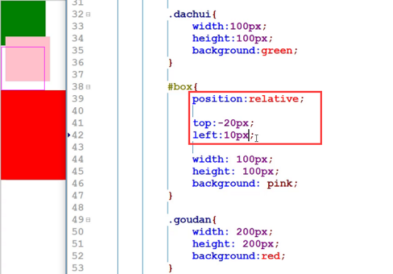
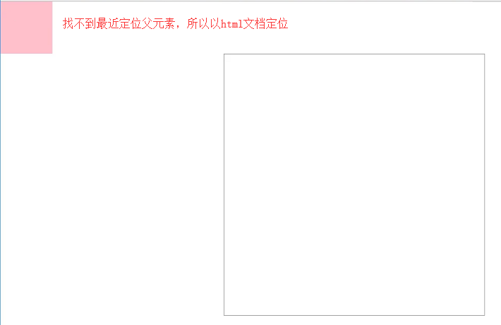

## 先知
类别：position: relative/ absolute / fixed

文档流：absolute、fixed会脱离文档流（层级比float还高，即定位元素会在浮动元素上面，可通过z-index调整）

特性：absolute、fixed定位后行内元素会具有**块级元素属性**的能力（如设宽高，**注：absolute和fixed才可以给行内元素设宽高，relative无效，且元素没设宽高的话由内容撑开**）

## 相对定位relative

**不影响布局**，又可以随意调整位置，参照物是**自己本身**

### 绝对定位absolute

**脱离文档流**，参照物为**最近的有定位的父级**，或者文档（一直往上找，找不到后就相对文档html）

示例一：

    #wrap {
        width: 500px;
        height: 500px;
        border: 1px solid #999;
        margin: 100px auto;
    }
    #wrap .box {
        position: absolute;
        width: 100px;
        height: 100px;
        background-color: pink;
    }
    
