## vertical-align

垂直对齐方式，只对**行内元素inline、inline-block**有效，默认基线对齐，主要用来**处理文字和图片的对齐方式**

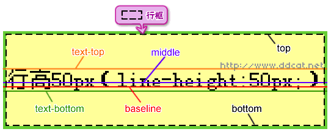

**默认基线对齐：**
    
    #box{
        width: 600px;
        border: 4px solid darkorchid;
        margin:  50px auto;
    }
    #box .item {
        font-size: 40px;
    }
    
    

        行吧
        可以的
    

    
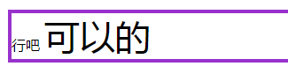

**顶部对齐：**

    #box{
        width: 600px;
        border: 4px solid darkorchid;
        margin:  50px auto;
    }
    #box .item {
        vertical-align: top; // 设置top对齐
        font-size: 40px;
    }
    
    

        行吧
        可以的
    

    
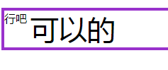

**底部对齐：**

    #box{
        width: 600px;
        border: 4px solid darkorchid;
        margin:  50px auto;
    }
    #box img {
        vertical-align: bottom; // 图片的bottom和文字的基线对齐
    }
    
    

        行吧
        
    

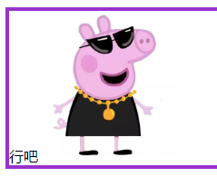

**数值：**

    #box{
        width: 600px;
        border: 4px solid darkorchid;
        margin:  50px auto;
    }
    #box img {
        vertical-align: -50px; // 设置-50px
    }
    
    

        行吧
        
    

    
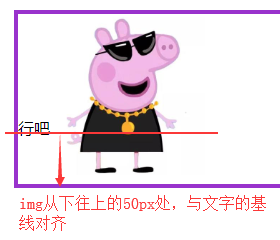

**注：一行里最大的那个设置vertical-align:middle会影响旁边的文本**

> &#9733; 贴士 

**为什么经常会遇到元素设置width、height 100%，height却不能充满父级？**

    #box{
        width: 150px;
        border: 4px solid darkorchid;
        margin:  50px auto;
    }
    #box img {
        height: 100%;
    }
    

        
    

    
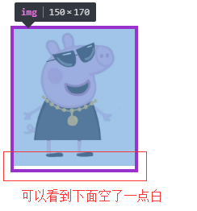

**原因：**
    
    #box{
        width: 200px;
        border: 4px solid darkorchid;
        margin:  50px auto;
    }
    #box img {
        height: 100%;
    }
    

        文字
        
    

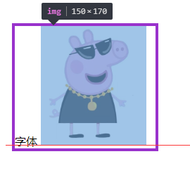

（图片默认基线对齐，而文字的基线离底部略微有些距离，所以会参数空白）

**解决方式：**
    
    #box{
        width: 150px;
        border: 4px solid darkorchid;
        margin:  50px auto;
    }
    #box img {
        height: 100%;
        vertical-align: middle; // 设置垂直对齐方式为middle
    }
    

        
    

    
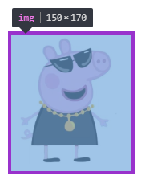

## 元素垂直居中方式

1、行高实现垂直居中

    #wrap {
        width: 800px;
        height: 500px;
        border: 5px solid pink;
        margin: 50px auto;
        
        text-align: center;
        line-height: 500px; // 行高设置和高度一致，让p居中
    }
    #wrap p {
        display: inline-block;
        width: 100px;
        height: 100px;
        background-color: red;
    }
    
    

        

    

    
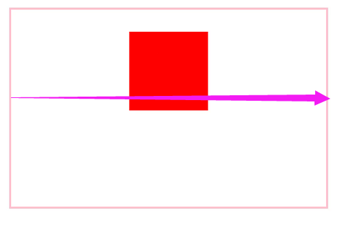

（我们发现其实单单只有是没有垂直居中的）

**原因：p元素默认基线对齐**

**解决方式：**

    #wrap p {
        display: inline-block;
        width: 100px;
        height: 100px;
        background-color: red;
        vertical-align: middle; // 设置对齐方式是middle
    }
    
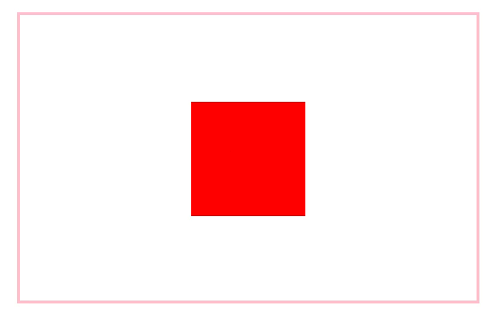

2、伪类:after实现垂直居中

    #wrap {
        width: 800px;
        height: 500px;
        border: 5px solid pink;
        margin: 50px auto;

        text-align: center;
        // 不需要line-height
    }
    #wrap p {
        display: inline-block;
        width: 100px;
        height: 100px;
        background-color: red;
        vertical-align: middle; // p元素对齐方式middle
    }

    #wrap:after {
        content: '';
        display: inline-block; // 伪类:after 设置inline-block
        vertical-align: middle; // 伪类:after 对齐方式middle
        width: 1px;
        height: 100%;
        background-color: green;
    }

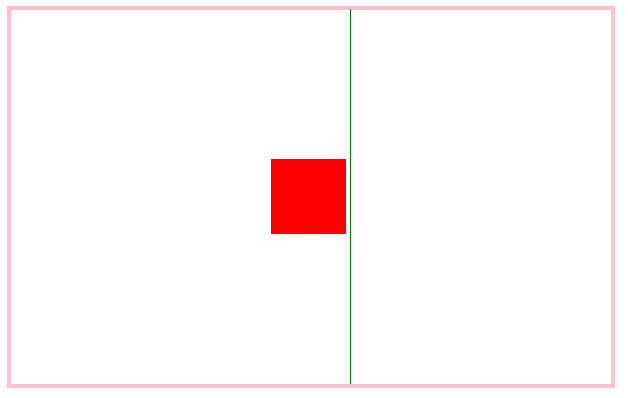

3、定位实现垂直居中（适用所有元素）：

    #wrap {
        position: relative; // 父级relative
        width: 400px;
        height: 400px;
        border: 5px solid pink;
        margin: 50px auto;
    }
    #wrap p {
        position: absolute; // absolute定位
        width: 100px;
        height: 100px;
        left: 0; right: 0; // 上下左右都设置0，margin: auto 
        top: 0; bottom: 0;
        margin: auto;
        background-color: red;
    }
    
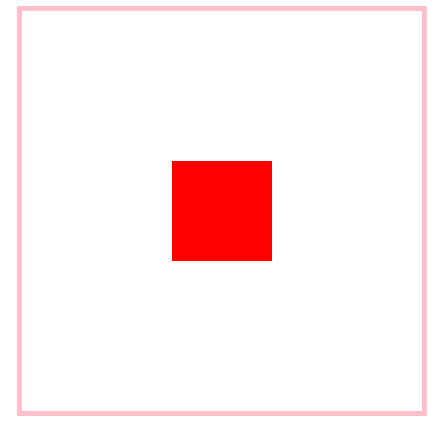

4、定位和margin实现垂直居中：

     #wrap {
        position: relative;
        width: 400px;
        height: 400px;
        border: 5px solid pink;
        margin: 50px auto;
    }
    #wrap p {
        position: absolute;
        width: 100px;
        height: 100px;
        top: 50%; // top设置50%
        margin-top: -50px; // margin为负值且为高度一半
        background-color: red;
    }
    
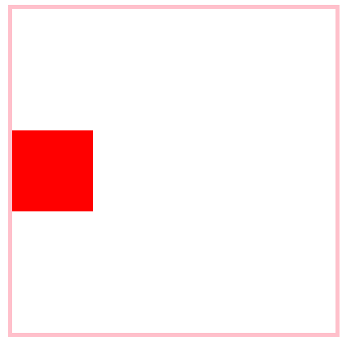

（有局限性：需要知道height，不然没法设置margin-top为负多少）

**注意：不要设置margin-top: -50%，之前提过，margin的百分比是父级宽高比例**

5、定位和translate实现垂直居中：

    #wrap {
        position: relative;
        width: 400px;
        height: 400px;
        border: 5px solid pink;
        margin: 50px auto;
    }
    #wrap p {
        position: absolute;
        width: 100px;
        height: 100px;
        top: 50%;
        // translate的百分比是相对自身高度。设置垂直方向translate -50%
        transform: translateY(-50%);
        background-color: red;
    }
    

（CSS3属性要考虑兼容性问题, >= IE9）

6、flex布局实现垂直居中：

    #wrap {
        display: flex; // 父级 flex布局
        width: 400px;
        height: 400px;
        border: 5px solid pink;
        margin: 50px auto;

        justify-content: center; // 子元素水平方向居中排列
        align-items: center; // 子元素垂直方向居中排列
    }
    #wrap p {
        width: 100px;
        height: 100px;
        background-color: red;
    }
    

（CSS3属性要考虑兼容性问题, >= IE10）