## favicon.ico图标

一般网站的title旁都有自己的图标

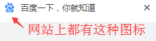

可以通过网站域名 XXX/favicon.ico找到这张图

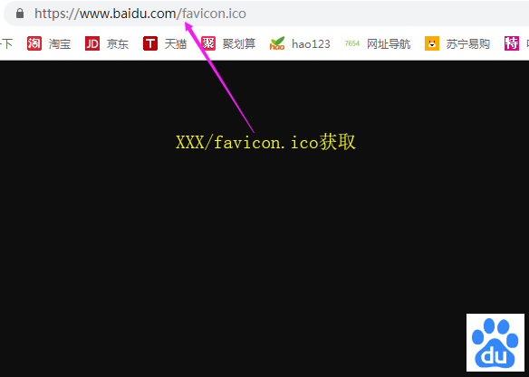

如何为自己的网页添加title图标

    // type可以不写
    <link ref='shortcut icon' href='icon/favicon.ico' type='images/x-icon' />

## form表单

    <form action='XXX.php' method='post'>
        ...
        
        // 使用type是submit的input点击会触发form表单提交
        <input type='submit'> 
    </form>
    
属性：

action 发送的链接，如后端接口

method 发送方式（get、post）

get方式：

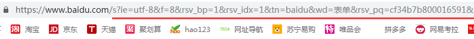

（可以在网址上看到，参数以 ? 带在后面，以&分割每个参数）

post方式：

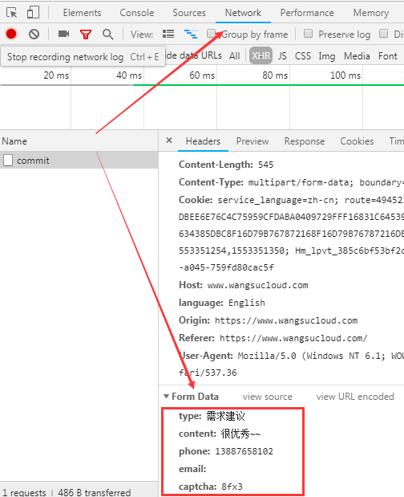

（不会在网址上显示，可以在开发者工具 network看到传递的参数）

### input text文本输入框

    <input type='text' name='user' value='karmiy' placeHolder='请输入' />

属性：

type 类型，不同类型各有各的意义，文本框是type = 'text'
    
value 默认的实际值，如果form submit提交表单，会提取input的value值作为参数值传递

placeHolder 提示文字

name 名称，如果form submit提交表单，会提取input的name值作为参数名传递
    
**注意：**

1、input是有边框高度的，假如设置height: 45px，会发现实际高度是51px，想让input高度与设置一直，需要设置**border: none; padding: 0;**

2、input的默认border-style是inset，如果需要调整边框，需要重新设置如border: 1px solid #bbb

 
## input password密码框

    <input type='password' name='pwd' />
    
##  input radio单选框
    
    // 相同的name被当做同一组radio, 同一组radio只能选一个
    <input type='radio' name='which' value='0' />神羊
    <input type='radio' name='which' value='1' />神犬
    <input type='radio' name='which' value='2' />泡泡
    <input type='radio' name='which' value='3' />神鸡
    
    // 默认选中checked
    <input type='radio' name='which' value='0' checked />神羊
    
    // 禁用
    <input type='radio' name='which' value='0' disabled />神羊
    
## label标签

可以让label里的内容，关联到input
    
    // label的for关联input的id，关联后点击label标签，input也可以选中，一般用于增加用户体验
    <input type='radio' id='sy' name='which' value='0' />
    <label for='sy'>神羊</label>
    
    <input type='radio' id='sq' name='which' value='1' />
    <label for='sq'>神犬</label>
    
## input checkbox多选框
    
    // 可以多选
    <input type='checkbox' name='which' value='0' />神羊
    <input type='checkbox' name='which' value='1' />神犬
    <input type='checkbox' name='which' value='2' />泡泡
    <input type='checkbox' name='which' value='3' />神鸡
    
    // 默认选中checked
    <input type='checkbox' name='which' value='0' checked />神羊
    
    // 禁用
    <input type='checkbox' name='which' value='0' disabled />神羊
        
## input file文件上传

    <input type='file' />
    
## input hidden隐藏文本域

    // 这个元素是看不见的，一般用于设置标识，传递给后端接收
    // 很多公司会把如当前用户的id存在一个input hidden里，这是极其不安全的
    <input type='hidden' name='keycode' value='09782' />
    
## textarea文本域
    
    // cols是列数，rows是行数
    <textarea name='content' cols='30' rows='10'>这里是文本内容</textarea>
    
## select option下拉框
   
    <select name='weeks'>
        <option value='0'>周日</option>
        <option value='1'>周一</option>
        <option value='2'>周二</option>
        <option value='3'>周三</option>
        <option value='4'>周四</option>
        <option value='5'>周五</option>
        <option value='6'>周六</option>
    </select>
    
    // 默认选中
    <select name='weeks'>
        <option value='0'>周日</option>
        <option value='1'>周一</option>
        <option value='2' selected>周二</option>
        <option value='3'>周三</option>
        <option value='4'>周四</option>
        <option value='5'>周五</option>
        <option value='6'>周六</option>
    </select>
    
    // 显示的大小
    <select name='weeks' size='3'> 高度显示3条的高度，其他用滚动条
        <option value='0'>周日</option>
        <option value='1'>周一</option>
        <option value='2'>周二</option>
        <option value='3'>周三</option>
        <option value='4'>周四</option>
        <option value='5'>周五</option>
        <option value='6'>周六</option>
    </select>
    
    // 多选
    <select name='weeks' multiple>
        <option value='0'>周日</option>
        <option value='1'>周一</option>
        <option value='2'>周二</option>
        <option value='3'>周三</option>
        <option value='4'>周四</option>
        <option value='5'>周五</option>
        <option value='6'>周六</option>
    </select>
    
## table

结构：

table 定义标签表格

thead 定义标签表格头

tbody 定义表格主体

tfoot 定义表格尾

th 定义表头单元格

tr  定义表格行

属性：
    
    // 宽、高、边框
    <table width='200' height='200' border='1'>
        ...
    </table>
    
    table {
        border-spacing: X Y; 单元格边界之间的水平和垂直间距
        border-collapse: collapse; 表格边框合并为一个单一边框，会忽略border-spacing
    }

基本写法：
    
    // th 文字默认加粗，居中；可以不写tbody，页面会自动帮补上
    <table border='1'>
        <tr>
            <th>姓名</th>
            <th>编号</th>
        </tr>
        <tr>
            <td>神羊羊羊羊羊羊</td>
            <td>01</td>
        </tr>
        <tr>
            <td>神犬</td>
            <td>02</td>
        </tr>
    </table>
    
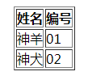

**table不设置宽高：**

1、table不设定宽度时，一列的表格元素宽度以最宽的那个为准

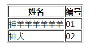

2、table不设定高度时，一行的表格元素高度以最高的那个为准
    
    <tr>
        <td style="height: 50px">神羊羊羊羊羊羊</td>
        <td>01</td>
    </tr>
    
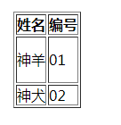

**border-collapse边框合并**

    table{
        border-collapse:collapse;
    }

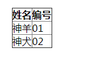

**table定宽、定高**
    
    // table定宽高200， 第2行定高20px，剩下的2行会把剩余高度平分（宽度亦同）
    <table border='1' width="200" height="200">
        <tr>
            <th>姓名</th>
            <th>编号</th>
        </tr>
        <tr>
            <td style="height: 20px">神羊</td>
            <td>01</td>
        </tr>
        <tr>
            <td>神犬</td>
            <td>02</td>
        </tr>
    </table>
    

（会按各列没加宽度时的**比例去分配**宽度、 会按各行没加高度时的**比例去分配**高度）

**合并单元格colspan、rowspan**

colspan列合并：

    <table border='1' width="200" height="200">
        <tr>
            <th>姓名</th>
            <th>编号</th>
            <th>编号</th>
            <th>编号</th>
        </tr>
        <tr>
            <td>神羊</td>
            <td colspan="3">01</td> // 合并3列
        </tr>
        <tr>
            <td>神犬</td>
            <td colspan="3">02</td> // 合并3列
        </tr>
    </table>
    
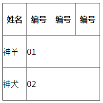

rowspan行合并:

    <table border='1' width="200" height="200">
        <tr>
            <th>姓名</th>
            <th>编号</th>
        </tr>
        <tr>
            <td rowspan="2">神羊</td> // 合并2行
            <td>01</td>
        </tr>
        <tr>
            <td>02</td>
        </tr>
    </table>
    
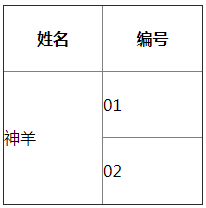

**table标题caption**

    <table border='1' width="200" height="200">
        <caption>这是表格标题</caption>
        <tr>
            <th>姓名</th>
            <th>编号</th>
        </tr>
        <tr>
            <td>神羊</td>
            <td>01</td>
        </tr>
        <tr>
            <td>神犬</td>
            <td>02</td>
        </tr>
    </table>
    
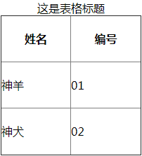