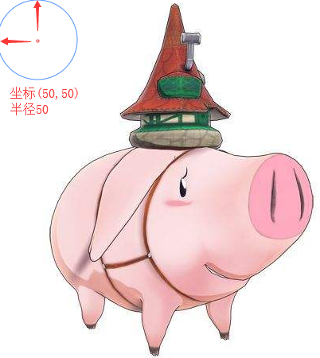
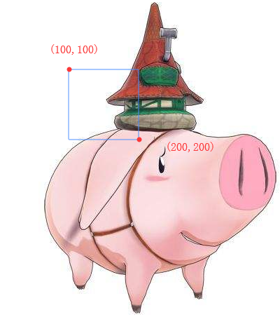

## 热点图\<map>

描述：

我们有时在如淘宝这样的网页，会发现有些图片的某些区域，是可以点击的，点击后链接到另一个网址，这就是热点图的作用
    
    // img的usemap属性，与map的name对应
    
    
    <map name="hk">
        <area shape="circle" coords="50,50,50" href="https://www.baidu.com" alt="" />
        <area shape="rect" coords="100,100,200,200" href="https://github.com/" alt="" />
    </map>
    
    // area为热点区域，shape可以设置区域为 圆circle、矩形react
    // circle： coords有3个值，分别为原点x、原点y、半径r
    // rect: coords有4个值，分别为矩形左上角x、左上角y，右下角x、右下角y
    

    // 点击后会出现蓝色边框，如果不想要它，可以CSS去除
    
    area {
        outline: none;
    }
    
## H5标签

H5的新标签，更主要是让标签更加**语义化**，如\<header>标签，其实就是个div而已，主要传达语义化思想，见名知意

### 结构型标签

其实都是div，只是更语义化

#### \<header>头部
    
页眉，头部

    <header>这是头部header</header>