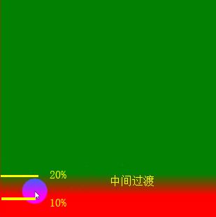
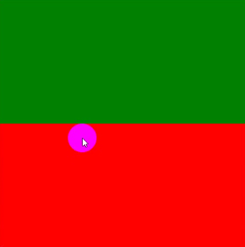
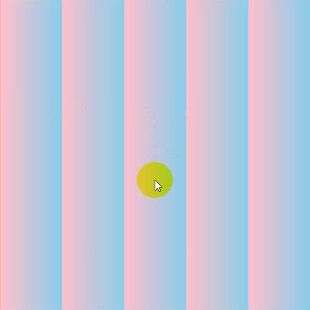
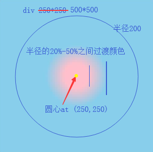
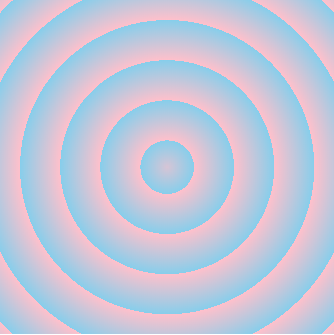
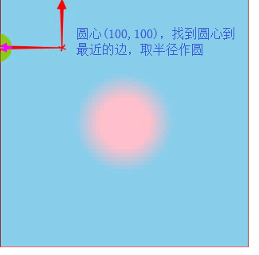
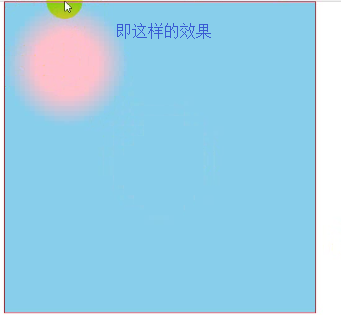
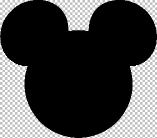
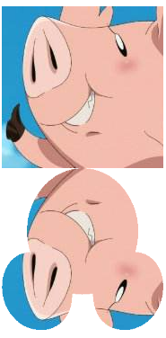

## 渐变

渐变色是归属background-image的

### 线性渐变linear-gradient

    // 基本用法
    background-image: linear-gradient(direction, color1 value1, color2 value2);
    // 以角度0°方向，从0% - 100%（百分比也可以换px）由红渐变到绿
    background-image: linear-gradient(0deg, red 0%, green 100%);
    
    // 方向：
    1、to left   = 270deg = 右 -> 左   
    2、to right  = 90deg  = 左 -> 右   
    3、to top    = 0deg   = 下 -> 上   
    4、to bottom = 180deg = 上 -> 下
    5、对角渐变：
        to top left / to top right / to bottom right / to bottom left
        
    // 示例
    background-image: linear-gradient(0deg, red 10%, green 20%); 
     

（从10%开始渐变，到20%，之前和之后还是纯色）

    // 如果前面的值比后面的大
    background-image: linear-gradient(0deg, red 50%, green 10%); 

（便会没有效果）

    // 平铺
    background-image: repeating-linear-gradient(0deg, pink 0%, skyblue 20%); 
    background-image: -webkit-repeating-linear-gradient(0deg, pink 0%, skyblue 20%);
    

 
 ### 径向渐变radial-gradient
 
    // 基本用法
    // shape（圆、椭圆）、radius半径、xy圆心坐标、color value（颜色，渐变位置）
    background-image: radial-gradient(shape radius at x y, color1 value, color2 value)
    // 以半径100px的圆形，在(100, 100)的位置径向渐变，从10% - 20%由红渐变为绿
    background-image: radial-gradient(circle 100px at 100px 100px, red 10%, green 20%)
    
    // shape
    circle圆形、ellipse椭圆
    
    // 半径 （注：2-4点下面有案例）
    1、数值（圆有1个半径、椭圆2个半径）
    2、closest-side 圆心到最近的边的距离为半径
    3、closest-corner 圆心到最近的角的距离为半径
    4、farthest-side 圆心到最远的边的距离为半径
    5、farthest-corner 圆心到最远的角的距离为半径
    
    // 圆心（记得前面有个at）
    只写一个值，第二个就默认居中
    1、数值（px %）
    2、x（left center right）
    3、y（top center bottom）
    
    // 示例
    background-image: radial-gradient(circle 200px at 250px 250px, pink 20%, skyblue 50%)
    
 

    // 平铺
    background-image: repeating-radial-gradient(circle 200px at 250px 250px, pink 20%, skyblue 50%)
    background-image: -webkit-repeating-radial-gradient(circle 200px at 250px 250px, pink 20%, skyblue 50%)
    
 

    // 关于半径closest-side
    // 在(100,100)的位置，找到最近的边的距离为半径
    background-image: radial-gradient(circle closest-side at 100px 100px, pink 20%, skyblue 50%)
    
 

 

### 背景图与渐变色共用（多背景）

    background: url('...') np-repeat, linear-gradient(to right, red 0%, green 100%)
    
    注：背景图写在渐变色前面的话，背景图在上面，反之，渐变色在上面
    
## 倒影box-reflect

可以在元素的某个位置形成一个倒影（倒影不会占据空间）

    // 基本用法
    -webkit-box-reflect: below 0px;
    
    // 第一个值为倒影方向
    1、below 下
    2、above 上
    3、left 左
    4、right 右
    
    // 第二个值为倒影距离
    数值（可为负值）
    
    // 示例
    #main {
        ...
        background: url("./2.png") no-repeat center/cover;
        -webkit-box-reflect: below 0;
    }
    
 

    // 自定义倒影蒙版
    img {
        width: 180px;
        -webkit-box-reflect: below 0 url('5.png');
    }
    
 

（一张周围是透明的png图）

 

（效果）

    // 倒影配合渐变色
    img {
        width: 180px;
        -webkit-box-reflect: below 5px -webkit-gradient(linear, left top,left bottom,from(transparent),color-stop(50%, transparent),to(white));
    }
    
 

    

    
    
    
    
