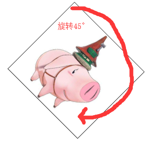
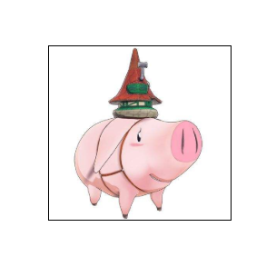
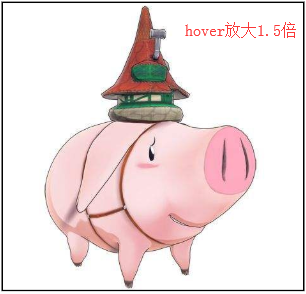
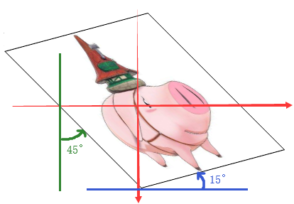

## transform 2D变换

### rotate旋转

    // 取值
    deg角度 / rad弧度 / turn圈 / grad梯度
    
    img {
        display: block;
        width: 200px;
        margin: 100px auto;
        transform: rotate(45deg);
    }
    
 

### scale、scaleX、scaleY缩放
    
    // 基本用法
    transform: scale(x,y)
        x轴缩放比例
        y轴缩放比例
        只写1个值则x,y比例一样
        数值0-1缩小，>1放大
        
    // 单独写法
    transform: scaleX();
    transform: scaleY();
    
    // 示例
    img {
        ...
    }
    img:hover {
        transform: scale(1.5);
    }

 
 

### translate、translateX、translateY位移

    // 基本用法
    transform: translate(x,y);
        x轴方向上移动
        y轴方向上移动
        只写一个只相当于x
        
    // 单独写法
    transform: translateX();
    transform: translateY();
    
    // 示例
    img {
        ...
    }
    img:hover {
        transform: translate(50px);
    }
    
 
 

### skew、skewX、skewY倾斜

    // 基本用法
    transform: skew(x,y);
        x轴方向倾斜
        y轴方向倾斜
    // 单独写法
    transform: skewX(0deg);
    transform: skewY(0deg);
    
    // 示例
    img {
        display: block;
        width: 200px;
        transform: skew(45deg, -15deg);
    }
    
 

## transform 3D变换

### transform-origin变换基点

默认基点是Z轴（Z轴方向与我们看屏幕的视线反向，即从屏幕垂直向外）

    // 取值：
    1、默认中心点
    2、关键词：
        left top
        left bottom
        right top
        right bottom
    3、数值
    4、只给第一个值，第二个默认中点
    
 

    img {
        transform-origin: right bottom; // 改变基点
    }

 