## transform 2D变换

兼容性：>= IE9

### rotate旋转

    // 取值
    deg角度 / rad弧度 / turn圈 / grad梯度
    
    img {
        display: block;
        width: 200px;
        margin: 100px auto;
        transform: rotate(45deg);
    }
    
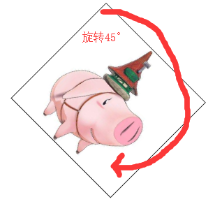 

### scale、scaleX、scaleY缩放
    
    // 基本用法
    transform: scale(x,y)
        x轴缩放比例
        y轴缩放比例
        只写1个值则x,y比例一样
        数值0-1缩小，>1放大
        
    // 单独写法
    transform: scaleX();
    transform: scaleY();
    
    // 示例
    img {
        ...
    }
    img:hover {
        transform: scale(1.5);
    }

 
 

### translate、translateX、translateY位移

    // 基本用法
    transform: translate(x,y);
        x轴方向上移动
        y轴方向上移动
        只写一个只相当于x
        
    // 单独写法
    transform: translateX();
    transform: translateY();
    
    // 示例
    img {
        ...
    }
    img:hover {
        transform: translate(50px);
    }
    
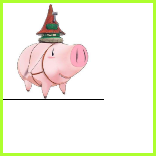 
 

### skew、skewX、skewY倾斜

    // 基本用法
    transform: skew(x,y);
        x轴方向倾斜
        y轴方向倾斜
    // 单独写法
    transform: skewX(0deg);
    transform: skewY(0deg);
    
    // 示例
    img {
        display: block;
        width: 200px;
        transform: skew(45deg, -15deg);
    }
    
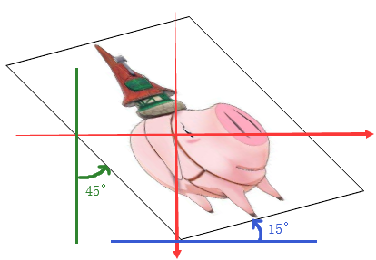 

## transform 3D变换

### transform-origin变换基点

默认基点是Z轴（Z轴方向与我们看屏幕的视线反向，即从屏幕垂直向外）
    
    // 兼容性
    >=IE9
    
    // 取值：
    1、默认中心点
    2、关键词：
        left / top / right / bottom / center
        如 left bottom（x方向left，y方向bottom）
    3、数值
    4、只给第一个值，第二个默认中点
    
 

    img {
        transform-origin: right bottom; // 改变基点
    }

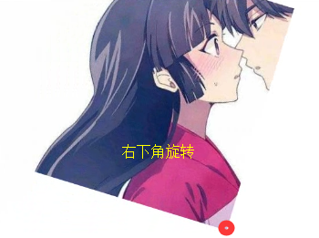 

    // 3个值，x、y、z 3个方向偏移100px的点为基点
    img {
        transform-origin: 100px 100px 100px;
    }
    
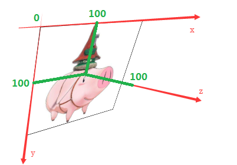 

### rotateX、rotateY、rotateZ

    // 兼容性
    >= IE10
    // 写法
    img {
        ...
        transform: rotateX(10deg) rotateY(10deg) rotateZ(10deg);
    }
    
    // 3个轴线如何判断旋转方法？
    以左手拇指为箭头方向，4指蜷缩方向为角度正值，方向为负值
    
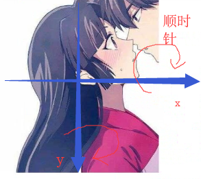 

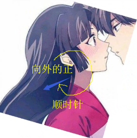 

### perspective景深

用来设置用户与元素3D空间Z平面的距离，能实现3D立体效果，**给3D元素的父级添加，不会出现梯形效果，给3D元素添加景深，会出现梯形效果**

一般设置500 - 1000
    
    // 兼容性
    >= IE10
    
    // 示例
    

        

            
            
            
            
            
        

    

    
    #main {
        ...
        width: 200px;
        height: 200px;
        perspective: 500px; // 父级设置景深
    }
    .child {
        position: relative;
        width: 100%;
        height: 100%;
        transform-style: preserve-3d; // 设置让子元素呈3D控件（下文会提到）
    }
    img {
        ...
        position: absolute;
        width: 100%;
        height: 100%;
    }
    img.k2 {
        transform-origin: center top;
        transform: rotateX(90deg);
    }
    img.k3 {
        transform-origin: left center;
        transform: rotateY(-90deg);
    }
    img.k4 {
        transform-origin: right center;
        transform: rotateY(90deg);
    }
    img.k5 {
        transform-origin: center bottom;
        transform: rotateX(-90deg);
    }
    
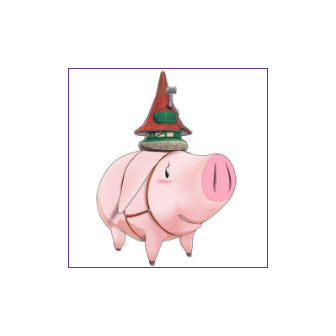 

（未设置景深，看不到3D效果）

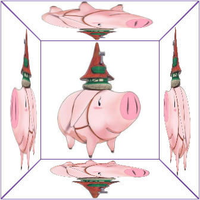 

（设置景深，可以看到3D效果）

**注：一般把景深设置在父级上。** 把景深设置给谁，可以将其假想为浩瀚的宇宙去看里面的东西。景深不能设在自己身上，这样就犹如自己在看自己一般，达不到近大远小的效果

### transform-style

transform-style: preserve-3d，相当于一个舞台，提供一个子元素可以在这此呈现3D效果的环境
    
    // 兼容性
    IE不兼容
    
    // 示例
    #main {
        width: 150px;
        height: 150px;
        ...
        perspective: 500px;
    }
    .child {
        position: relative;
        ...
        transform: rotateY(45deg); // 旋转45°
        transform-style: preserve-3d; // 设置3D舞台
    }
    img {
        position: absolute;
        ...
    }
    img.k2 {
        top: -150px;
        left: 0;
    }
    img.k3 {
        transform-origin: right center;
        transform: rotateY(-80deg); // 旋转.k3的img看效果
        top: 0;
        left: -150px;
    }
    img.k4 {
        top: 0;
        right: -150px;
    }
    img.k5 {
        top: 150px;
        left: 0;
    }

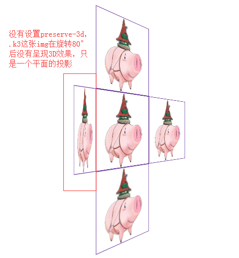 

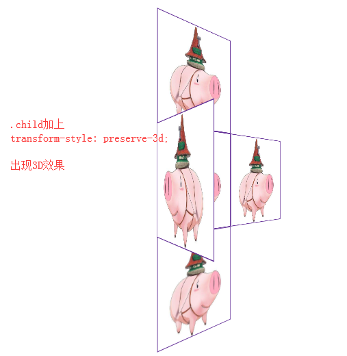 

## 怪异盒模型box-sizing

    // W3C标准盒子模型：content-box （默认）
        content + padding = 宽高
        
    // 传统IE盒子模型：border-box
        content + padding + border = 宽高
        
    // 示例
    li {
        width: 200px;
        height: 200px;
        padding: 50px;
        border: 10px solid red;
        background-color: blue;
    }
    li:nth-child(1) {
        ...
        box-sizing: content-box;
    }
    li:nth-child(2) {
        ...
        box-sizing: border-box;
    }
    
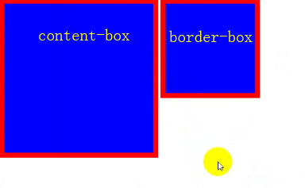 

## CSS calc运算

用来指定元素的长度，给元素border、margin、padding、font-size、width等属性设置动态值
    
    // 兼容性
    >= IE9
    
    // 注：
        1、表达式中有 + 和 - ，符号两边必须有空格
        2、表达式中有 * 和 / ，符号两边可以没有空格，建议保留
        
    // 示例
    .wrap {
        ...
        width: calc(20% - 10px);
        height: calc(200px + 50px);
        margin-left: calc(45px / 3);
        padding-right: calc(15px * 2);
    }