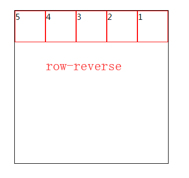

## flex弹性盒模型

    // 兼容性
    >=IE10
    注意兼容前缀display: -webkit-flex等
    
    // 注
    弹性盒子模型最适合一个应用程序的组件，或者小规模布局;
    flex将对象作为块级弹性盒子对象;
    inline-flex将对象作为内联块级弹性盒子显示;
    flex布局后，子级的float、clear、vertical-align都失效;
    
    // 基本示例
    ul {
        display: flex; // 父级设置flex布局
        width: 500px;
        height: 500px;
        margin: auto;
        border: 1px solid #000;
    }
    li {
        width:100px;
        height: 100px;
        border: 1px solid red;
    }
    
 

## flex父级特性

设置在父容器上的属性

### flex-direction设置子元素在父容器的位置

    取值：
    1、row 横向从左往右排列（默认）
    2、row-reverse 反横向排列，从右往左（第一个元素跑到最后一个）
    3、column 纵向排列（从上往下）
    4、column-reverse 反纵向排列（从下往上，第一个跑到最下面）
    
    注：
    如果子元素没有设置宽高
    横向排列时：宽度由内容撑开，高度100%；
    纵向排列时，高度由内容撑开，宽度100%；
    
 
 

 
 

### flex-wrap设置子元素横排超出是否换行

    取值：
    1、nowrap 子元素溢出父级容器不换行，而是被挤压（默认）
    2、wrap 子元素溢出父级容器时换行
    3、wrap-reverse 子元素溢出父级容器时，反纵向排列，第一行会换到最后一行
    
    注：
    如果nowrap，即使子元素我们写了width，也被无视掉被挤压