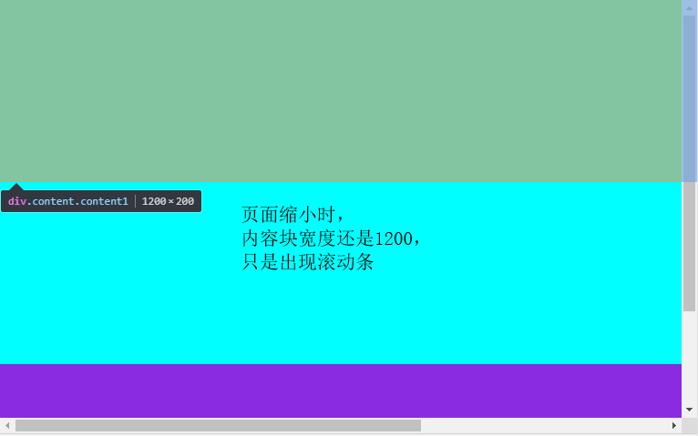

## 项目布局模板

大多数项目里的页面，最外层布局结构都是可以统一的：

一般都会设置内部最小宽度1200PX，超出出现滚动条或横轴隐藏；

**优点：**

样式统一精简，更多项目PC端以这种排版布局，Mobile移动端再单独一套样式

**缺点：**

视觉效果不敌响应式

    // 模板代码一
    html, body {
        height: 100%; // 视项目情况，是否需要body高度为窗口高度
        overflow-x: hidden; // 视项目情况，是否水平滚动条要隐藏（淘宝做了这个操作）
    }
    #wrap {
        min-width: 1200px; // 1、内容排版外用wrap包住，最小宽度1200
        background-color: bisque;
        overflow: hidden;
    }
    .content {
        max-width: 1200px; // 2、内容排版最大宽度1200
        height: 200px;
        margin: 0 auto; // 3、内容排版水平居中
    }
    .content1 {
        background-color: greenyellow;
    }
    .content2 {
        background-color: aqua;
    }
    .content3 {
        background-color: blueviolet;
    }
    ...
    
    <body>
        

            
...

            
...

            
...

        

    </body>
    
 

 

    // 模板代码二（效果同上，只是模板一更灵活）
    .content {
        width: 1200px; // 1、内容排版固定宽1200px
        margin: 0 auto; // 2、内容排版水平居中
        ...
    }
    <body>
        
...

        
...

        
...

    </body>
    
## 响应式

很多网站，会在1200px，768px等宽度下，呈现不同的布局以达到更优的视觉效果

**优点：**

多样化的视觉体验

**缺点：**

大量的CSS样式文件，不易于管理，可能扭曲代码结构（为了适应响应式，实现的代码混乱）

### 媒体查询@media all/screen/print

    // 定义
    all 所有设备
    screen 彩屏设备
    print 打印机设备
    speech 屏幕阅读器设备
    
    // 用法
    @media all {
        body {
            background-color: pink;
        }
    }
    @media screen {
        body {
            background-color: pink;
        }
    }
    @media print {
        body {
            background-color: pink;
        }
    }
    
### 关键词and、not、only

    // 用法
    // and
    @media print and (min-width: 700px) {
        ...
    }
    
    // not
    示例一：
    @media not all and (min-width: 500px) {
        ...
    }
    等价于
    @media not (all and (min-width: 500px)) {
        ...
    }
    
    示例2：
    @media not screen and (min-width: 500px), print and (min-width: 600px) {
        ...
    }
    等价于
    @media (not (screen and (min-width: 500px))), print and (min-width: 600px) {
        ...
    }
    
    // only（用来指定某种特定的媒体类型）
    @media only screen and (min-width: 500px) {
        ...
    }
    
### 媒体特性@media (width: 768px)

    // 定义
    1、width
    2、max-width
    3、min-width
    4、orientation: portrait 竖屏
    5、orientation: landscape 横屏
    
    // 示例
    @media (width: 800px) { // width === 800时生效此样式
        div:nth-child(2n) {
            ...
        }
    }
    
    @media (min-width: 800px) and (max-width:1000px) { // width 在800~1000时生效此样式
        div:nth-child(2n) {
            ...
        }
    }
    
    @media (orientation: landscape) { // 横屏时生效（浏览器宽度比高度大是横屏）
        div:nth-child(2n) {
            ...
        }
    }
    
    
    // 通常项目响应式做法
    768px为分界线，在其左右各一种响应