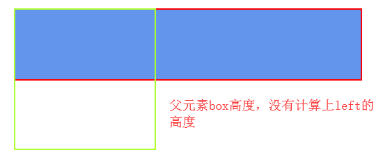
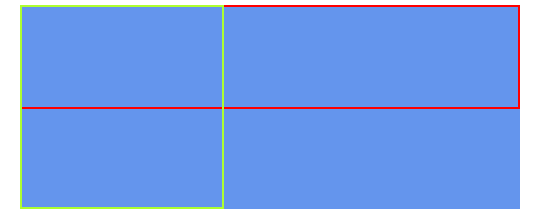
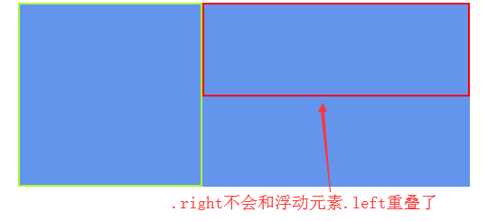
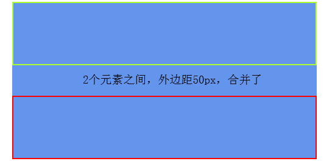
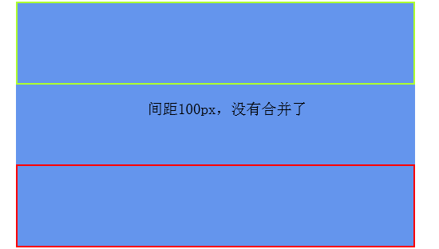
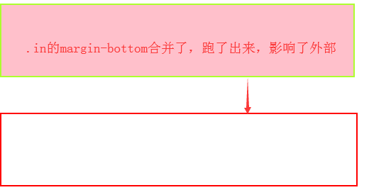
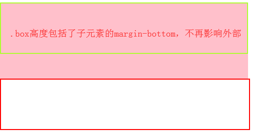

## BFC

### 定义

BFC是 (Block Formatting context)的简称，即块格式化上下文

触发了BFC的元素，其里面的元素和外部元素完全隔离，即子元素布局不会影响外部元素，反之亦然

### 特性

1、BFC的元素高度在计算时，会包括浮动元素

2、BFC块不会和浮动元素重叠

3、属于同一个BFC下的两个相邻元素，垂直margin会发生重叠

4、BFC元素是独立的容器，里面的元素和外部元素完全隔离互不影响

### 触发BFC

1、float不为none

2、overflow: auto、scroll、hidden

3、display: inline-block、table-cell、table-caption

4、position: absolute、fixed

注：\<html>本身就是BFC元素

### 案例

#### 特性一：BFC的元素高度在计算时，会包括浮动元素
    
    // DOM结构
    

        

        

    

    
    // 样式
    .box {
        width: 500px;
        ...
    }
    .left {
        width: 200px;
        height: 200px;
        float: left;
        border: 2px solid greenyellow;
    }
    .right {
        height: 100px;
        border: 2px solid red;
    }
    
 

    // 解决
    .box {
        width: 500px;
        ...
        overflow: hidden; // overflow hidden触发BFC，使其高度计算浮动元素
    }
    
 

（这样便实现了清除浮动）

#### 特征二：BFC块不会和浮动元素重叠

    // 调整上例代码
    .right {
        height: 100px;
        border: 2px solid red;
        overflow: hidden; // 给.rigth触发BFC
    }
    
 

（这样便实现了自适应两栏布局）

#### 特征三：属于同一个BFC下的两个相邻元素，垂直margin会发生重叠
    
    // DOM结构
    <body>
        

            

            

        

    </body>
    
    // 样式
    .box {
        width: 500px;
        overflow: hidden;
        ...
    }
    .top {
        height: 100px;
        margin-bottom: 50px; // 1、垂直方向margin-bottom: 50px
        border: 2px solid greenyellow;
    }
    .bottom {
        height: 100px;
        margin-top: 50px; // 2、垂直方向margin-top: 50px
        border: 2px solid red;
    }
    
 

    // 2个元素，都属于同一个BFC即.box之下，所以根据特性，我们只要让它们不在同一个BFC之下即可
    
    // 调整代码
    // DOM结构
    

        

        <!-- 给.bottom套一层父级，并触发它的BFC -->
        

            

        

    

    
    // 样式
    .box {
        ...
    }
    .container {
        overflow: hidden; // 触发BFC，这样.bottom就是属于这个BFC之下，和.top分隔开了
    }
    .top {
        ...
    }
    .bottom {
        ...
    }
    
 

#### 特性四：BFC元素是独立的容器，里面的元素和外部元素完全隔离互不影响

    // 上面案例也已经提现了这个特性了
    
    // DOM结构
    

        

    

    

    
    // 样式
    .box {
        width: 500px;
        background-color: pink;
    }
    .in {
        height: 100px;
        margin-bottom: 50px; // 1、内部.in元素有下外边距50px
        border: 2px solid greenyellow;
    }
    .out {
        width: 500px;
        height: 100px;
        border: 2px solid red;
    }
    
 

    // 调整代码
    .box {
        ...
        overflow: hidden; // 1、给.box触发BFC，内部元素不再影响外部
    }
    
 