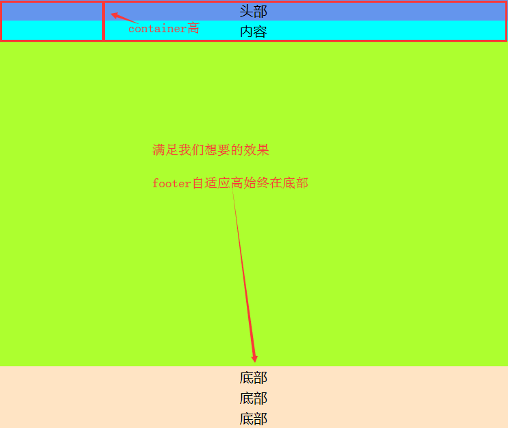

# 项目场景中布局案例分析

以下整理了一些项目会遇到或有意思的布局方式的**如何实现**，如何从**前端细节上逆天改命**

## 如何实现
以文本最长的一行为准居中，行文本靠左对齐？

    
    // 样式
    #main {
        ...
        text-align: center;
    }
    ul {
        display: inline-block;
        max-width: 100%;
    }
    li {
        ...
        text-align: left;
        white-space: normal;
        word-break: break-all;
    }
    
    // DOM结构
    

        <ul>
            <li>测试11</li>
            <li>测试1111</li>
            <li>测试111111</li>
            <li>测试11111111</li>
        </ul>
    

    

## 如何实现
一侧固定宽，点击后展开导航栏宽度始终占满剩余宽

    
    // 方法一
    .container {
        position: relative;
        ...
    }
    .aside {
        width: 250px;
        ...
    }
    .nav {
        position: absolute;
        left: 250px;
        width: calc(100% - 250px); // 使用calc计算属性
        ...
    }
    
    // 方法二
    注：absolute、fixed元素未设置宽度时，可以同时设置left和right来拉开
    .nav {
        position: absolute;
        left: 250px;
        right: 0; // 同时设置left和right来拉开定位元素宽度
    }
    
## 如何实现
父级固定宽

子元素一次排列且固定宽

一排最多5个

5个以内居中排列

第6个在下一行的最左侧而不是居中

**注：** 这是页面开发中非常常见的商品列表排列方式，效果如下：

    // 实现代码
    

        <!-- 给子元素多一层父级包裹 -->
        

            

            

        

    

    
    #main {
        width: 800px;
        ...
        // 1、触发BFC，防止内部有浮动元素导致没宽度
        // 2、
        overflow: hidden;
    }
    .float {
        // 3、设置浮动（为了父元素宽度随子元素撑开）
        float: left;
        // 4、左margin设置50%（margin-left的百分比是父级宽度的50%，不是自身！！！）
        margin-left: 50%;
        // 5、translate(-50%)，再往左回去自身宽50%（translate百分比是自身宽，不是父级宽！！！）
        transform: translate(-50%);
        // 6、font-size设置0，防止子元素inline-block空格影响间距
        font-size: 0;
    }
    .item {
        box-sizing: border-box;
        display: inline-block;
        width: 160px;
        height: 120px;
        margin-bottom: 20px;
        border: 3px solid green;
    }
    
    // 思考：为什么这样这样实现我们一行内居中，多行靠左？
    假设父元素#main宽 W ，子元素总宽（即包裹的.float父级宽）U，首先给.float设置margin-left: 50%，
    则现在它距离父元素的左侧距离为 W/2 ，再设置translate(-50%)，则往左回去 U/2，此时它距离父元素
    #main左侧距离 (W-U)/2 ，刚好居中，因为左间距(W-U)/2 + 自身宽U + 右间距(W-U)/2 = W = 父元素#main的宽
    
    效果如下：
    

    // 原因
    .float设置了margin-left: 50%，足够它放在同一行的空间只有#main 800px的一半，400px，只够放2个，所以第3个
    放下去时，就到了下一行，因为对.float而已，父级能放的空间只剩每行400px
    
    // 解决
    既然是因为.float一行不够放800px导致的，只要我们能让.float有一个800px的父级即可
    
    // 实现代码
    

        <!-- 多一层.container包裹.float -->
       

            

                

                

                

            

        

    

    
    .container {
        // 1、container宽度100%，让其等于父级宽度，这样.float每行就有足够空间
        width: 100%;
        // 2、将margin-left从.float提升到.container
        margin-left: 50%;
    }
    .float {
        float: left;
        transform: translate(-50%);
        font-size: 0;
    }
    

    // 升级：我们想要item有左右间距呢？
    
    // 实现代码
    .item {
        ...
        // 非常简单，设个下左右margin，让左右margin + width = 原来160px 即可
        width: 120px;
        margin: 0 20px 20px;
    }
    

    // 升级：我们不想要第1个item的左侧和第5个item的右侧有空隙呢？
    
    // 效果预览：
    

    // 从图例可以看出，一行应该是5个item的宽 + 间距4个margin
    
    // 思路
    解法一：
    每个item 120px宽，如果每个item都有margin-right: 50px，5个120 + 4个margin-right = 800刚好一行
    但是第5个也有margin-right导致一行放不下
    我们可以给.container加宽，原本.container宽100%即800px，我们为了让其可以放满一行800px加第5个item
    的margin-right，我们可以设置.container宽度是100% + 50px
    
    //实现代码
    .container {
        // 1、设置container的宽度多50px弥补第5个的margin-right
        width: calc(100% + 50px);
        margin-left: 50%;
    }
    .float {
        float: left;
        transform: translate(-50%);
        font-size: 0;
    }
    .item {
        width: 120px;
        margin-right: 50px; // 2、每个item margin-right 50px
        ...
    }
    

       

            

                

                

                

            

        

    

    
    // 然而仅仅这样是不行的！！！！！看这样操作的效果：
    

    // 如何解决？
    多了一个margin-right:50px导致左偏移，我们再补回去让它往右走一段就可以了
    需要往右走多少呢？
    走margin-right: 50px的一半25px
    
    // 代码调整
    .float {
        float: left;
        // 1、补25px的translate
        transform: translate(calc(-50% + 25px));
        font-size: 0;
    }
    

    // 除了上面这种方式，还有一种更好理解的
    解法二：
    前面说到是因为第5个多一个margin-right:50px才掉下来，所以我们补了.container宽度 + 50px。
    因为最后一个item的margin-right: 50px，到时.float多了一点宽度，所以translate -50%不对，要补一个回去。
    那我们只要让第5个且最后一个item都没有margin-right不就好了吗，这样也不需要补container宽，也不需要微调translate
    
    // 代码调整
    .container {
        // 1、宽度不需要再加50px了，恢复原来100%
        width: 100%;
        margin-left: 50%;
    }
    .float {
        float: left;
        // 2、translate不需要弥补25px，恢复原来-50%
        transform: translate(-50%);
        font-size: 0;
    }
    // 3、给第5个和最后一个item的margin-right清空
    .item:nth-child(5n), .item:last-child {
        margin-right: 0;
    }
    
    // 这样也可以实现上例的效果
    

    // 升级：我们之前为了在垂直方向每行有间距，设置了margin-bottom，导致最后一行有留白
    

    // 存在的问题？
    主要是因为#main设置了overflow: hidden，触发了BFC导致垂直margin不能合并导致的
    但是我们又需要这样做（让#main触发BFC），不然#main会没有高度
    
    // 换位思考下
    既然只能这样做，又因为最后一行的margin-bottm导致.float高度多了20px，
    我们让.float的高度缩回去-20px不就好了吗？
    
    // 实现代码
    .float {
        float: left;
        transform: translate(-50%);
        // 1、给.float设置margin-bottom -20px，让它高度缩回去
        margin-bottom: -20px;
        font-size: 0;
    }
    
    // 效果如下
    

    
**前端在细节上的重要性**

不仅仅在这个案例，了解margin百分比、translate百分比、margin负值的含义尤为重要，是解决很多问题的关键

## 如何实现

居左横向排列

一行5个子元素

每个子元素之间有边距

效果如下：

    // 思路
    这个效果和我们前一个案例相似，只是居左依次排列，不需要考虑那么麻烦
    我们一般会这样做，子元素都有margin-right，再多一层元素包裹，宽度100% + 多出来的一个margin-right
    
    
    // 实现代码
    #main {
        width: 800px;
        border: 1px solid cornflowerblue;
        overflow: hidden; // 1、超出隐藏，防止子元素溢出的宽度占空间
        ..
    }
    .container {
        width: calc(100% + 50px); // 2、多一层container包裹，宽度补上多出来的一个margin-right
    }
    .item {
        box-sizing: border-box;
        float: left;
        width: 120px;
        height: 100px;
        margin-right: 50px; // 3、每个item都有margin-right
        border: 1px solid red;
    }
    
    

        

            

            

            

            

            

        

    

    

    // 升级：如果item宽度是百分比怎么办？
    
    如果改成item width 16%，margin-right: 5%，一行5个item + 4个margin = 100%很优秀
    
    // 然而真的是这样吗？
    现在item的父级不是800px，是850px，这样算出来的100%会是850px显然就不对了，我们想要的是100%是#main的宽800
    
    // 如何解决？
    #main {
        width: 800px;
        border: 1px solid cornflowerblue;
        overflow: hidden;
        ...
    }
    .container {
        width: calc(100% + 5%); // 1、因为item margin-right: 5%，.container宽度设置105%
    }
    .item {
        box-sizing: border-box;
        float: left;
        width: calc(16% * 100 / 105); // 2、现在的16%已经不对了，需要调整回来，既然放大了1.05倍，我们在缩回来即可
        height: 100px;
        margin-right: calc(5% * 100 / 105); // 3、margin-right的5%也一样做比例调整
        border: 1px solid red;
    }
    

## 如何实现

页面上\<footer>始终处于底部

而不会出现当内容过少时，footer不能保持在窗口底部，如下：

    // 解决方法：
    // DOM结构
    <body>
        

            <header>头部</header>
            
内容

            <footer>底部</footer>
        

    </body>
    
    // 样式
    html, body {
        height: 100%; // 1、html和body充满窗口高
    }
    #app {
        position: relative;
        box-sizing: border-box; // 2、怪异盒模型
        min-height: 100%; // 3、最小高度100%，至少能充满浏览器高
        padding-bottom: 50px; // 4、padding-bottom等于footer高度
        background-color: greenyellow;
    }
    header, .content, footer {
        line-height: 30px;
        text-align: center;
        font-size: 20px;
    }
    header {
        background-color: cornflowerblue;
    }
    .content {
        background-color: aqua;
    }
    footer {
        position:absolute; // 5、footer绝对定位在底部
        width: 100%;
        height: 50px; // 6、footer固定高
        left:0;
        bottom: 0;
        background-color: bisque;
    }
    
    // 效果如下：

    // 升级：假如footer不定高怎么办？
    有时底部可能是内容撑开的高度，这样不定高的footer，无法知悉需要给#app的padding-bottom设置多少
    
    // 如何解决？
    巧妙利用flex布局
    
    // DOM结构
    

        <!-- 用container包裹header和content -->
        

            <header>头部</header>
            
内容

        

        <footer>底部 底部 底部</footer>
    

    
    // 解法一（IE下有时会有BUG，需要在设置overflow: hidden才能解决，原因未知）
    html, body {
        height: 100%;
    }
    #app {
        display: flex; // 1、flex布局
        flex-direction: column; // 2、纵向排列
        min-height: 100%; // 3、最小高100%至少充满浏览器高度
        background-color: greenyellow;
    }
    .container { 
        flex-grow: 1; // 4、container设置flex-grow: 1来占据剩余的所有高度
        width: 100%;
    }
    header, .content, footer {
        line-height: 30px;
        text-align: center;
        font-size: 20px;
    }
    header {
        background-color: cornflowerblue;
    }
    .content {
        background-color: aqua;
    }
    footer {
        width: 100%;
        flex-grow: 0; // 5、footer设置flex-grow: 0不占据剩余高度，高度仅由自身撑开
        background-color: bisque;
    }
    

    // 解法二（更简单更好）
    html, body {
        height: 100%;
    }
    #app {
        display: flex; // 1、flex布局
        flex-wrap: wrap; // 2、flex-wrap: wrap元素可换行
        align-content: space-between; // 3、纵向两端对齐
        min-height: 100%; // 4、最小高100%至少充满浏览器高度
        background-color: greenyellow;
    }
    header, .content, footer {
        line-height: 30px;
        text-align: center;
        font-size: 20px;
    }
    .container {
        width: 100%; // 5、container设置宽度100%，比如flex布局下默认自适应宽
    }
    header {
        background-color: cornflowerblue;
    }
    .content {
        background-color: aqua;
    }
    footer {
        width: 100%; // 6、footer设置宽度100%，比如flex布局下默认自适应宽
        background-color: bisque;
    }
    
