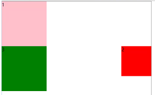

## 浮动float

### 定义

使元素脱离文档流，按指定（左右）方向移动，遇到**父级边界或相邻浮动元素**停下来

### 文档流

默认贴着左边，贴着上面显示，能放则放的排布方式

### 浮动

让元素**脱离文档流**（跳出文档规则）

取值：
left、right

    .div1 {
        width: 150px;
        height: 150px;
        background-color: pink;
    }
    .div2 {
        float: left; // div2设置左浮动
        width: 100px;
        height: 100px;
        background-color: red;
    }
    .div3 {
        width: 100px;
        height: 100px;
        background-color: green;
    }
    

（2浮动，原来的位置被3替代，3被2盖住了，不过3的文本会环绕）

（3放大宽高后，就可以看到了，3的文字还是环绕）

**3的文字环绕原因：**

浮动**影响文档流，不影响文字流**（有元素就挤开），会影响文字的排布

    .div2 {
        float: right; // 改右浮动
        width: 100px;
        height: 100px;
        background-color: red;
    }

### 多个元素浮动

    .div1 {
        float: left;
        width: 150px;
        height: 150px;
        background-color: pink;
    }
    .div2 {
        float: left;
        width: 100px;
        height: 100px;
        background-color: red;
    }
    .div3 {
        width: 150px;
        height: 150px;
        background-color: green;
    }

### 父级宽度不够时

当多个浮动元素时，父级宽度不够，横排显示不了（**尽可能的横排显示**）的元素会往下掉
    
    // 3个都float: left
    
    .div1 {
        float: left;
        width: 150px;
        height: 150px;
        background-color: pink;
    }
    .div2 {
        float: left;
        width: 100px;
        height: 100px;
        background-color: red;
    }
    .div3 {
        float: left;
        width: 150px;
        height: 150px;
        background-color: green;
    }
    
    

        
1

        
2

        
3

    

    
以下展示父元素width不断缩小后3个div的变化

### float特性

1、宽高：

可以设置宽高。没有设置宽高的div浮动后，内容多宽多高就多宽多高

2、对于行内元素：

行内元素的空格问题不在了，还可以设置宽高

3、外边距margin水平方向：

支持margin（朝左时，margin-left让自己位移，margin-right让右边的元素位移，所以右浮动则相反，margin-right让自己位移，margin-left让左边的元素位移）

**特殊点**：设置margin-left/right为负值，后面的元素会跟着移动过来

4、外边距margin垂直方向：

    div {
        float: left;
        width: 150px;
        height: 150px;
    }
    .....

#### 关于margin-top

**margin-top为正值：**

会影响下方浮动元素的排列：
    

不会影响同行别的元素排列，即使空出一个位置后面的浮动元素也不会跟上来：

margin-top为负值：

超出自身高度，后面的浮动元素会跟上补空

不过往上过程中不会影响上方的浮动元素

**关于margin-bottom**

margin-bottom为正值：

会影响下方浮动元素

**margin-bottom为负值：**

在负值数值小于自己高度时，不会有什么变化

在负值数值等于自己高度时，如果这个浮动元素是在属于第一行，会消失

如果浮动元素不从属于第一行，margin-bottom负值看似没有任何影响

5、浮动可以触发BFC,不会发生垂直外边距合并

6、浮动后不支持margin: auto

### 清除浮动

定义：clear 属性规定元素的哪一侧不允许其他浮动元素，相当于一条**分割线**

取值：clear:left、right、both（清除左、右、左右的浮动）

### 案例：

    .p1, .p2, .p3 {
        float: left;
        width: 150px;
        height: 100px;
    }
    .p4 {
        width: 150px;
        height: 150px;
    }

(第4个元素因为前3个浮动，被覆盖住了)

解决方法：

1、加一个拥有clear: both的元素

    #wrap .clear {
        clear: both;
    }
    
    

        

        

        

        

        

    

2、给浮动元素套父元素，设置overflow: hidden，触发BFC。或者给父元素设置和子元素一样的高度
    
    
    #box {
        //没有设置overflow: hidden触发BFC的话，box高度为0，因为子元素都浮动了没人撑开它
        overflow: hidden; 
        // 或设置height: 100px;
    }
    
    

        

            

            

            

        

        

    

    
3、给浮动元素套父元素，且放一个clear: both的元素在里面，清除浮动，使父元素有高度

    

        

            

            

            

            

        

        

    

    
4、给浮动元素套父元素，并设置伪类 :after清除浮动（**常用**）
    
    #box:after {
        clear: both;
    }
    

        

            

            

            

        

        

    

 
 > &#9733; 贴士 
    
元素margin-right导致一行放不下的解决方法：

场景：

假如父元素宽度1000px，有n个子元素div1、2、3 ...宽度为200px，想要排列出如下效果

**我们可能会怎么做？**
        
    // 父元素
    .wrap {
        width: 1000px;
    }
    // 子元素
    .item {
        width: 200px;
        margin-right: 200px;
    }
    
    

        

        

        

        

        ...
    

特别在vue之类的框架，我们会设置全部元素margin-right: 200px，并设置每 3n 个div，如第3，6，9...个div的margin-right设为0。这是可行的，但是却要浪费计算

**如何纯CSS做到？**

    .wrap {
        width: 1000px;
        overflow: hidden; // 1、wrap超出隐藏
    }
    // 多一层父元素包子元素
    .container {
        // 2、container宽度设置120%，主要需要超出1000px + 1个margin-right，不超过1个item宽度 + 2个margin-right（因为会导致第4个也上去）
        width: 120%; 
    }
    .item {
        width: 200px;
        margin-right: 200px;
    }
    
    

        
 多用一个container包起来
            

            

            

            

            ...
        

    

