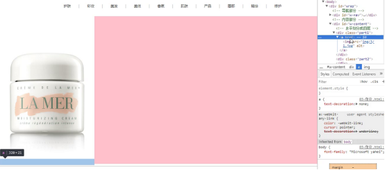

## 常用标签

### 1、标题h1~h6:

``````
<h1>一级标题</h1>
<h2>二级标题</h2>
<h3>三级标题</h3>
<h4>四级标题</h4>
<h5>五级标题</h5>
<h6>六级标题</h6>
``````

### 2、段落\<p>:

放文字，可以用来**分行**

### 3、\<span>:

一小块，没有默认样式，不影响文字显示的主体结构，**通常组合一小段需要特殊样式的文字来修改样式而不影响段落其他文字**

### 4、加粗\<b>\</b>或\<strong>\</strong>:

展示形式2个标签没有区别，基于SEO考虑，**strong里的关键词会被搜索引擎检索到**；b标签还可以放小图标，阿里字体等

### 5、斜体\<i>\</i>或\<em>\</em>:

展示形式2个标签没有区别，基于SEO考虑，**em里的关键词会被搜索引擎检索到**；i标签还可以放小图标，阿里字体等

### 6、上标\<sup>\</sup>、下标\<sub>\</sub>、删除线\<del>\</del>:

    <p>x<sup>2</sup></p>
    <p>H<sub>2</sub></p>
    <p>只需要<del>8999</del>元</p>

效果:

<p>x<sup>2</sup></p>
<p>H<sub>2</sub></p>
<p>只需要<del>8999</del>元</p>

### 7、预格式化\<pre>\</pre>:

什么样的布局，就按什么格式显示

``````
<pre>
p
    r 
        e
</pre>
``````

## 功能标签:

### 1、\<div>:

区块，**结合CSS做网页整体结构，很重要的标签**

### 2、超链接\<a>:

    <a href='https://www.baidu.com/' target='_blank'>链接到百度</a>

属性:

1、 href链接地址:

- 链接到某个网址

- 锚点

``````
<a href='#nav'>点击跳转</a>

.....

<div id='nav'>跳转到这</div>
<a name='nav'>跳转到这</a>
``````
**注:**

&ensp;&ensp;&ensp;&ensp;只有id、name可以锚点跳转，# + id / name，但有些元素没有name，同时有id与name会跳转id处;

&ensp;&ensp;&ensp;&ensp;跳转后url后会加#哈希值，如 https://test.html#nav ，直接输入这样的网址，也会跳转到对应锚点位置;

- 下载

    将href指向一个文件，并配合**download**标签属性，就会下载，download属性为下载的文件名（但是会受浏览器限制，可能会改名无效，不过一定要有download属性才会下载）

``````
<a href='https://.....png' download='bgPng'>点击下载背景图</a>
``````


2、target打开位置:

选项：**_blank**新标签打开、**_self (默认值)**当前标签页打开、**_new**新标签打开 (与_blank不同的是，**只会打开一个新标签页，所有共用一个标签页**)


> &#9733; 贴士:

- 链接需要带上http://，否则会被当做相对文件路径;

- a标签包裹img时，高度会变得很小（行内元素会包不住块级元素，不过并不影响效果，也可以将a设置成display:block 宽高100%解决）




### 3、特殊符号>、<、空格等:

<符号: \&lt;

\>符号: \&gt;

空格符号: \&nbsp;

### 4、图片img:

**四要素**:

- src: 

    图片路径

- alt:

    1、路径错误时(破图)显示的内容

    2、有益于SEO搜索引擎

- width、height:

    这个宽高一般设置图片的**真实宽高**（**否则可能会失帧**，而且加上真实宽高，可以防止图片破图后影响到后面内容，即保留自己的布局；而且因为图片不是一下子加载好的，所以可以让在加载完全钱，浏览器给它保留空间），要调整一般在CSS样式处（不会让它失帧）调整

- title:

    鼠标移上去的时候显示的提示文字（**所有标签都能有title**）

**常见图片格式**:

jpg（高清晰的，像照相机拍的几百兆的图片都是jpg）、png（通常是背景透明的）、gif（通常是动态图）、webp（Chrome独有，这种格式的图片非常的小，比如就10几K）

### 5、无序列表标签\<ul>:

规范上只能往\<ul>里放\<li>

    <ul>
        <li>列表1</li>
        <li>列表2</li>
        <li>列表3</li>
    </ul>

type属性：

**disc实心圆（默认）、circle空心圆、square方块、none（都没有）**。可以通过\<ul type=”circle”>，在ul上设置type属性来设置，会设置全部li，也可以\<li type=”cirlce”>，单独给一个li加

### 6、无序列表\<ol>:

    <ol>
        <li>列表1</li>
        <li>列表2</li>
        <li>列表3</li>
    </ol>

type属性：

1（默认值）、a（a,b,c.....z,aa....az,ba...bz....zz）、A、I（I、II、III、IV、V）、i

star属性：

star=”5”，则从5开始

### 7、定义列表\<dl>:

    <dl>
        <dt>标题</dt>
        <dd>描述</dd>

        <dt>标题</dt>
        <dd>描述</dd>
    </dl>

