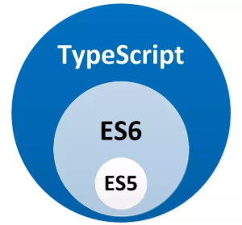
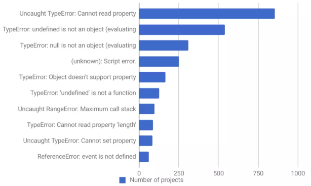
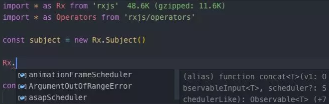

## 学习来源

学习自来掘金小册 [深入浅出TypeScript](https://juejin.im/book/5da08714518825520e6bb810)

## Why TypeScript ?

### JavaScript的超集

JavaScript 与 TypeScript 的关系就如同下图:

TypeScript 可以使用一些尚在提案阶段的语法特性

TypeScript 是一门静态语言

### 什么是静态类型

简单而言，一门语言**在编译时报错**，那么是**静态语言**，如果在运行时报错，那么是动态语言

TypeScript 是**静态弱类型语言**，并不是所谓的强类型，所以 TypeScript 几乎不限制 JavaScript 中原有的隐式类型转换，它对类型的隐式转换是有容忍度的。

真正的静态强类型语言（Java、C#）是不会容忍隐式类型转换的

### 为什么静态类型是 TypeScript 的杀手锏

#### 错误提示：

先看看在 JavaScript 项目中**最常见的十大错误**：

这些低级错误占用了大量 debug 和 google 的时间

而使用 TypeScript，在编译过程中就可以自动提示错误，从而规避这些低级报错

#### 类型提示

在项目开发中，尤其是大型项目，如何保证多人的协作？

通常人员之间开发的工具库可能需要大量的文档与注释，而 TypeScript 提供的**类型提示**功能可以使我们非常舒适的调用同伴的代码

由于 TypeScript 的存在我们可以节省大量沟通成本、代码阅读成本等等

> 有人会问「谷歌、Facebook 不都还在用 js、php、Python吗？」

其实不是的，这些大厂用的 php、Python、js 跟普通人用的不一样，比如 Facebook 的 js 背后有一个叫做 FlowType 的静态类型检查器，React 和 Vue 2.x 就是用的这个类型检查器，再比如 Facebook 的 Python，他背后也有一个叫做pyre-check 的静态类型检查器，实际上是虽然他们在用动态语言，但是大厂养活着一个庞大的团队来开发各种静态分析工具把动态语言变成静态的

### 严谨不失灵活

TypeScript 是否会丧失 JavaScript 的灵活性？ 其实并不会

TypeScript 由于兼容 JavaScript 所以其灵活度可以媲美 JavaScript

例如将类型定义为any，把 TypeScript 变为 AnyScript 即可保持它的灵活性

TypeScript 对类型的检查严格程度可以通过 **tsconfig.json** 来配置

即使在开启 strict（严格模式） 下的 TypeScript 依然是严格的，为了兼容 JavaScript， TypeScript 采用了 Structural Type System（结构类型系统）

因此 TypeScript 并不是类型定义本身，而是类型定义的 **Shape** （形状）：

    class Foo {
      method(input: string): number { ... }
    }
    
    class Bar {
      method(input: string): number { ... }
    }
    
    const foo: Foo = new Foo(); // Okay.
    const bar: Bar = new Foo(); // Okay.
    
以上代码是不会报错的，因为它们的「形状」是一样的，而类型的代码在 Java 或 C# 是会报错的

### TypeScript 的缺点

TypeScript 的缺点相比与其的生产力提升而言是可以忽略不计的，而除了学习成本，更多的缺点在于与其他技术的结合上

- 在框架中运用 TypeScript 的时候会花大量的时间在踩坑上，因为我们需要额外学习框架定义的 d.ts

- 配置学习成本高，目前前端脚手架基本以 JavaScript 为主，比如同样是用 ESLint 做语法检查，其配置方式跟JavaScript完全不同，需要额外学习成本，配置 TypeScript 的 tsconfig.json ，用 ts-plugin-import 进行按需引入等等

- TypeScript 的类型系统其实比较复杂，额外的学习成本

### 小结

TypeScript 的优势总结：

1. 规避大量低级错误，避免时间浪费，省时

2. 减少多人协作项目的成本，大型项目友好，省力

3. 良好代码提示，不用反复文件跳转或者翻文档，省心
