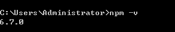
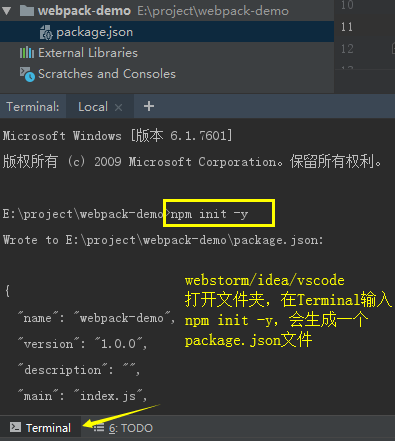
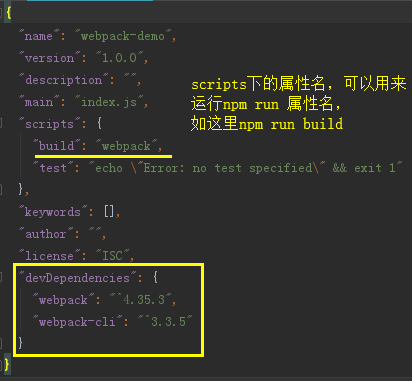
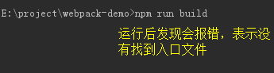
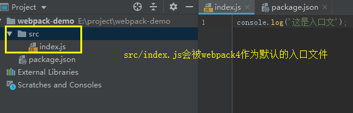
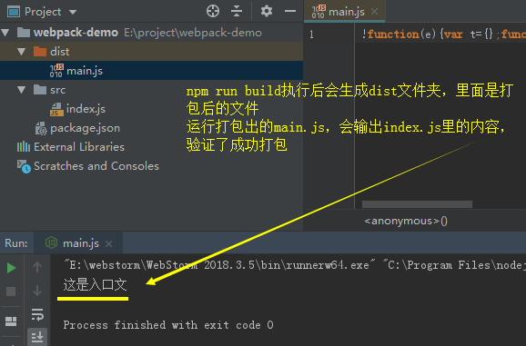

## 学习来源

整理至掘金文章 [24 个实例入门并掌握「Webpack4」](https://juejin.im/post/5cae0f616fb9a068a93f0613)

## webpack基本搭建与打包

### 环境

下载并安装[node环境](https://nodejs.org/zh-cn/)，会自动装上npm

可以在电脑cmd中输入**npm -v**查看npm版本

 

### 初始化package.json配置文件
    
    新建一个空文件夹，进入后运行以下命令初始化一个package.json文件：
    npm init
    
    输入后控制台会有一系列配置提问，一般一路回车就行，或者直接输入：
    npm init -y直接生成
    
 

    再执行npm i webpack webpack-cli --save-dev安装webpack4
    安装后package.json会出现devDependencies的配置项
    在scripts处加上build命令来运行webpack
    
    运行npm run build

    webpack4默认会以src下的index.js作为入口，我们在项目下新建src/index.js后再重新执行npm run build
    

    
     

